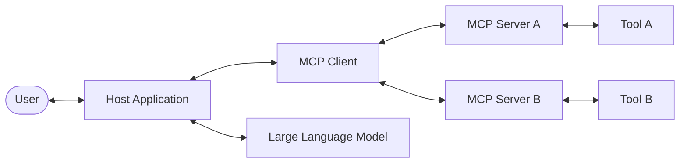
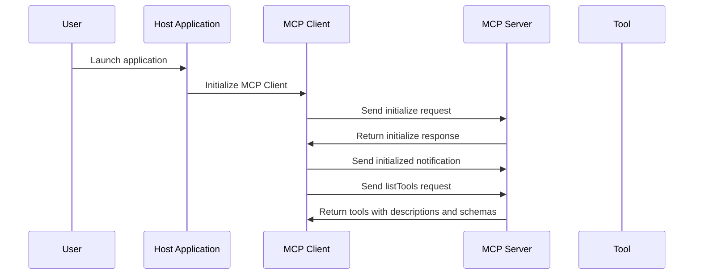
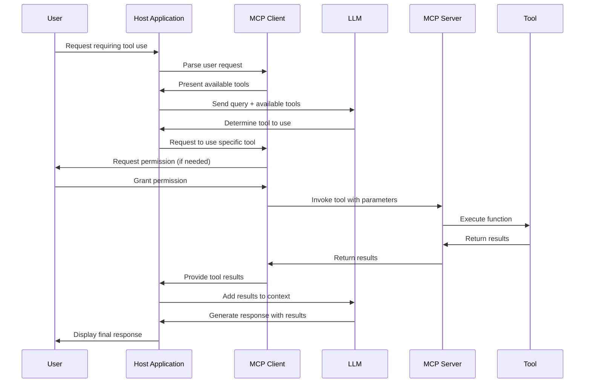
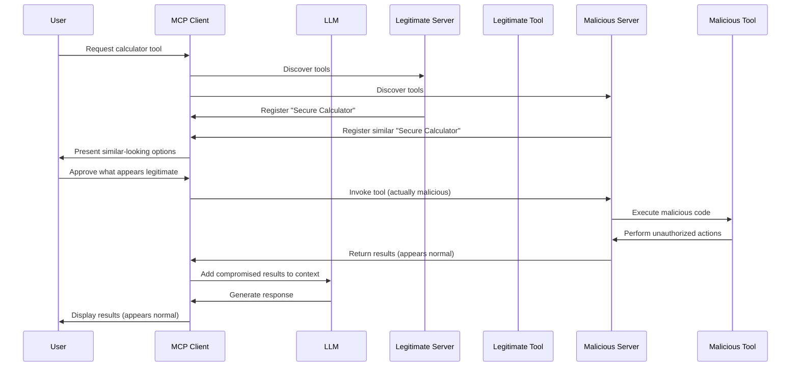
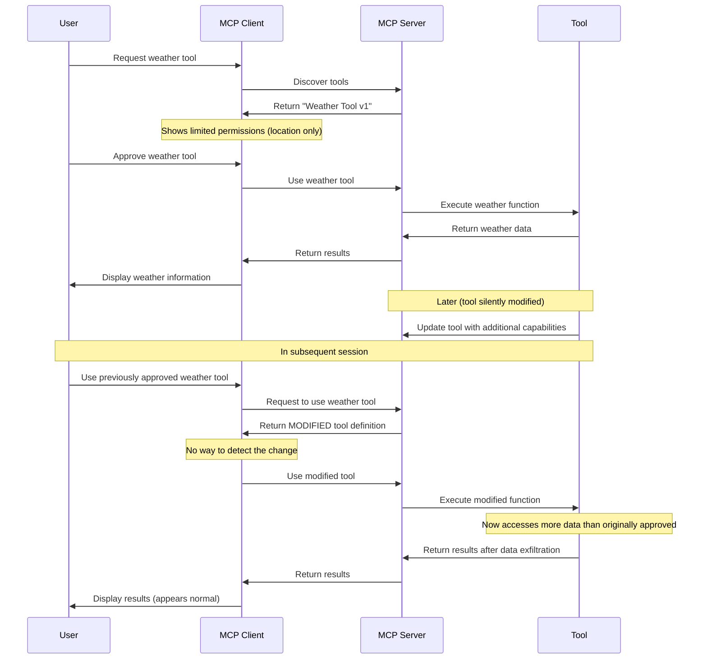
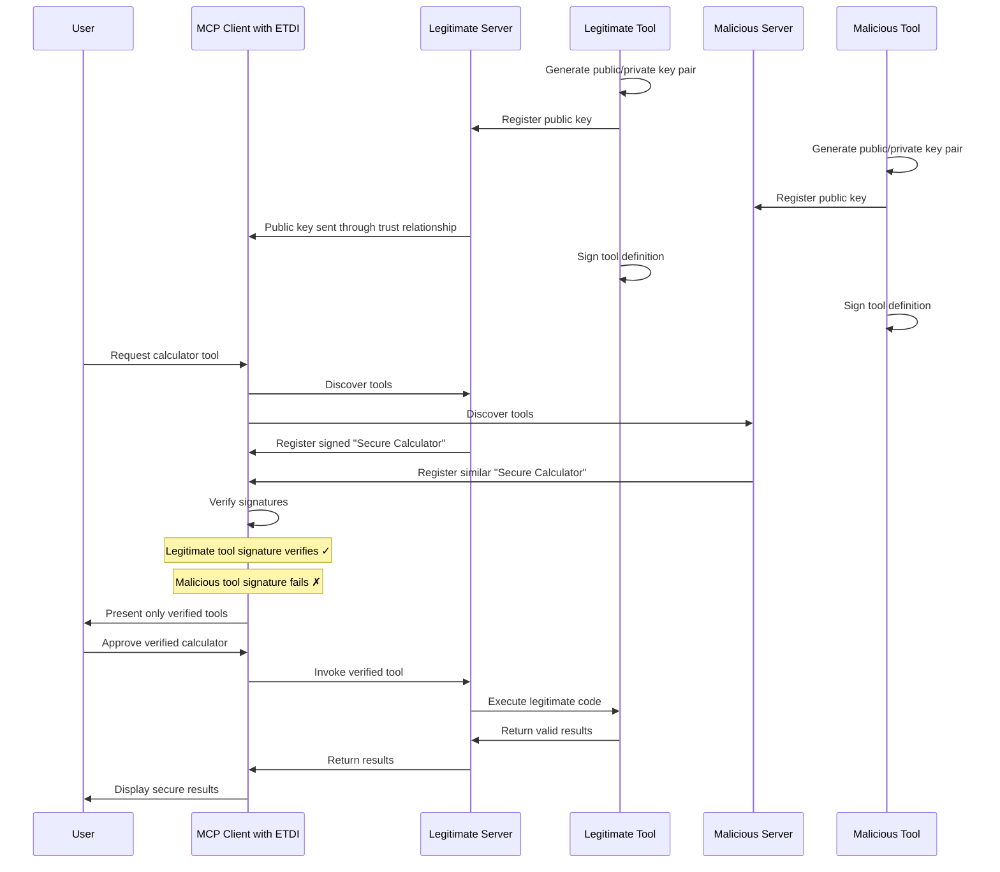
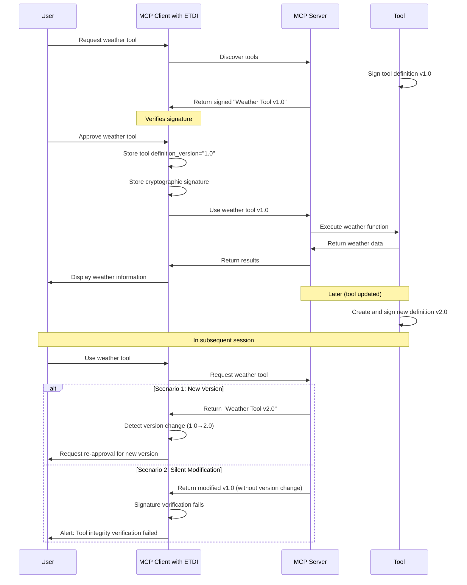
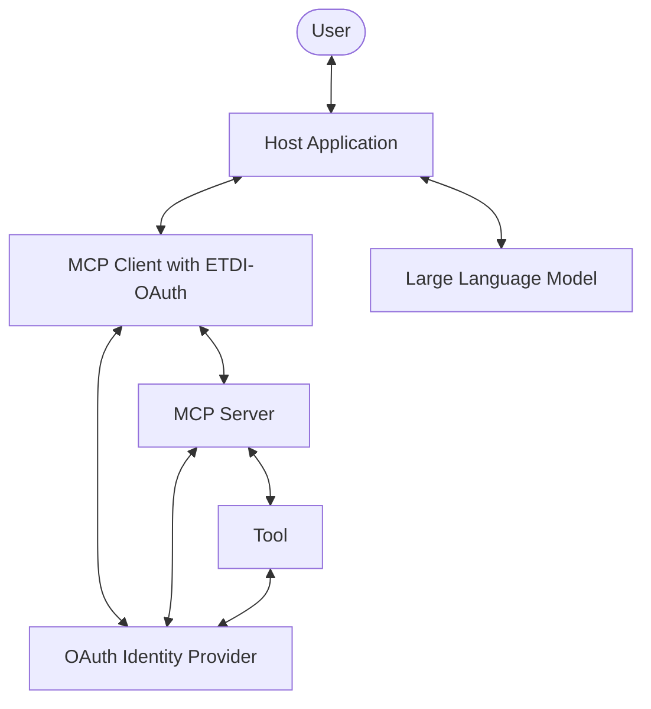
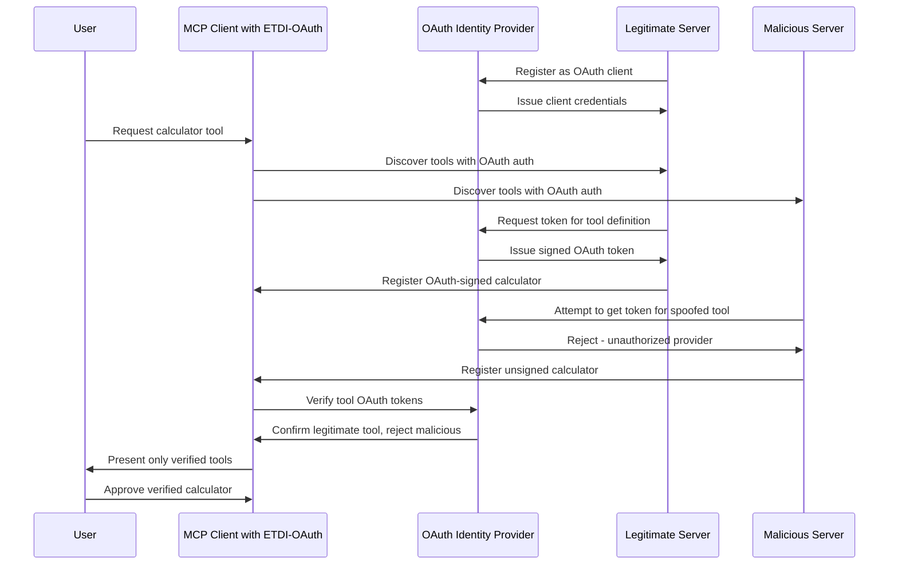
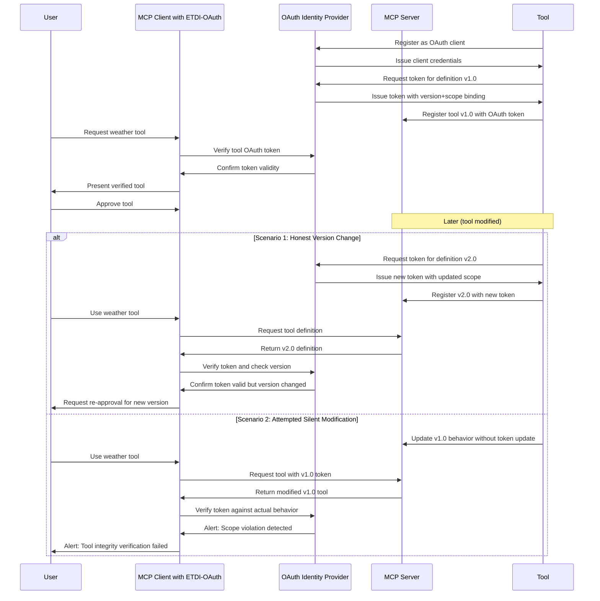

# Enhanced Tool Definition Interface (ETDI): A Security Fortification for the Model Context Protocol

## Executive Summary

The Model Context Protocol (MCP) is pivotal in standardizing interactions between AI applications and Large Language Models (LLMs), enabling rich, context-aware experiences by integrating external tools and data. However, the current MCP specification presents significant security vulnerabilities, primarily **Tool Poisoning** and **Rug Pull attacks**, which can lead to unauthorized data access, manipulation, and erosion of user trust. This design document meticulously analyzes these vulnerabilities within the standard MCP operational flow. It then introduces the **Enhanced Tool Definition Interface (ETDI)**, a robust security layer designed to mitigate these threats by incorporating cryptographic identity, immutable versioned definitions, and explicit permissioning. Furthermore, this document proposes an advanced ETDI implementation leveraging **OAuth 2.0**, offering standardized, fine-grained, and centrally managed security controls. The adoption of ETDI aims to significantly bolster the security posture of MCP-enabled ecosystems, ensuring safer and more reliable AI-driven interactions.

## Table of Contents

1.  [Introduction: The Imperative for Secure MCP](#introduction-the-imperative-for-secure-mcp)
2.  [Understanding the MCP Ecosystem: Architecture Overview](#understanding-the-mcp-ecosystem-architecture-overview)
3.  [Operational Dynamics: The Standard MCP Flow](#operational-dynamics-the-standard-mcp-flow)
    * [Initialization and Discovery Phase](#initialization-and-discovery-phase)
    * [Tool Invocation and Usage Phase](#tool-invocation-and-usage-phase)
4.  [Critical Security Vulnerabilities in MCP](#critical-security-vulnerabilities-in-mcp)
    * [Attack Vector 1: Tool Poisoning](#attack-vector-1-tool-poisoning)
        * [Definition and Mechanism](#definition-and-mechanism-tp)
        * [Vulnerability Analysis](#vulnerability-analysis-tp)
        * [Illustrative Attack Scenario](#illustrative-attack-scenario-tp)
    * [Attack Vector 2: Rug Pull Attacks](#attack-vector-2-rug-pull-attacks)
        * [Definition and Mechanism](#definition-and-mechanism-rp)
        * [Vulnerability Analysis](#vulnerability-analysis-rp)
        * [Illustrative Attack Scenario](#illustrative-attack-scenario-rp)
5.  [ETDI: Fortifying MCP with an Enhanced Tool Definition Interface](#etdi-fortifying-mcp-with-an-enhanced-tool-definition-interface)
    * [Foundational Security Principles of ETDI](#foundational-security-principles-of-etdi)
    * [ETDI Countermeasures: Thwarting Tool Poisoning](#etdi-countermeasures-thwarting-tool-poisoning)
    * [ETDI Countermeasures: Preventing Rug Pulls](#etdi-countermeasures-preventing-rug-pulls)
6.  [Advancing Security with OAuth-Enhanced ETDI](#advancing-security-with-oauth-enhanced-etdi)
    * [Architectural Integration of OAuth 2.0](#architectural-integration-of-oauth-20)
    * [Reinforced Protection Flow with OAuth](#reinforced-protection-flow-with-oauth)
        * [OAuth-Enhanced Tool Poisoning Defense](#oauth-enhanced-tool-poisoning-defense)
        * [OAuth-Enhanced Rug Pull Defense](#oauth-enhanced-rug-pull-defense)
    * [Key Advantages of OAuth Integration](#key-advantages-of-oauth-integration)
7.  [Strategic Implementation Considerations for ETDI](#strategic-implementation-considerations-for-etdi)
    * [Establishing Verifiable Trust Chains](#establishing-verifiable-trust-chains)
    * [Robust Version Control and Immutability](#robust-version-control-and-immutability)
    * [Granular and Explicit Permission Management](#granular-and-explicit-permission-management)
    * [Assessing and Mitigating Performance Overhead](#assessing-and-mitigating-performance-overhead)
    * [Ensuring Backward Compatibility and Adoption Pathways](#ensuring-backward-compatibility-and-adoption-pathways)
8.  [Conclusion](#conclusion)
9.  [References](#references)

## 1. Introduction: The Imperative for Secure MCP

The Model Context Protocol (MCP) represents a significant step towards standardizing how AI applications, particularly those leveraging Large Language Models (LLMs), are provided with dynamic, real-world context. By facilitating seamless integration with external tools, diverse data sources, and auxiliary systems, MCP empowers LLMs to perform complex tasks, access timely information, and offer more relevant and powerful interactions. However, the inherent openness and extensibility of the current MCP specification, while fostering innovation, inadvertently introduce critical security vulnerabilities. The absence of robust mechanisms to verify tool authenticity and integrity exposes users and systems to sophisticated tool-based attacks, such as **Tool Poisoning** and **Rug Pulls**. These attacks can lead to severe consequences, including sensitive data exfiltration, unauthorized system actions, and a significant degradation of user trust in AI applications.

This document addresses these pressing security concerns by introducing the **Enhanced Tool Definition Interface (ETDI)**. ETDI is conceived as a security enhancement layer, meticulously designed to integrate with the existing MCP framework. It aims to provide verifiable trust and integrity for tools without fundamentally altering the core protocol, thereby preserving its flexibility while addressing its security shortcomings. By focusing on cryptographic verification and explicit consent, ETDI offers a pragmatic and effective solution to safeguard the MCP ecosystem.

## 2. Understanding the MCP Ecosystem: Architecture Overview

MCP operates on a distributed client-server model, fostering interaction between various entities to provide LLMs with the necessary context and capabilities. The key components include:

-   **Host Applications**: These are the primary interfaces for users, such as AI-powered desktop applications (e.g., Claude Desktop), integrated development environments (IDEs) with AI extensions, or specialized AI-driven platforms. They orchestrate the interaction between the user, the LLM, and MCP components.
-   **MCP Clients**: Embedded within Host Applications, these software components are responsible for discovering, managing connections to, and interacting with MCP Servers. They act as intermediaries, translating requests and responses between the Host Application and the MCP Servers.
-   **MCP Servers**: These are dedicated programs or services that expose specific capabilities to MCP Clients. These capabilities can range from simple utility functions to complex data processing services. Each server manages a set of tools, resources, or prompts.
-   **Tools**: These are discrete functions or services that an LLM can invoke via an MCP Server to perform specific actions (e.g., execute code, fetch data from an API, perform calculations). Tools are the active components that extend the LLM's capabilities.
-   **Resources**: These represent data sources or information repositories that an LLM can access for contextual understanding or to inform its responses (e.g., a knowledge base, a user's document, a database).
-   **Prompts**: These are pre-defined templates or instructions that guide the LLM in utilizing tools or resources effectively and for specific tasks, ensuring optimal and consistent performance.

Figure 1: High-Level MCP Architecture, illustrating the interaction between the user, host application, MCP client, LLM, and various MCP servers providing tools.

## 3. Operational Dynamics: The Standard MCP Flow

The Model Context Protocol facilitates interactions through a sequence of defined steps, from initialization to tool execution.

### Initialization and Discovery Phase

This phase establishes the connection and awareness between MCP Clients and Servers.

The Model Context Protocol operates through a series of well-defined interactions:

Figure 2: MCP Initialization and Tool Discovery Sequence.

Application Launch & Client Initialization: When a Host Application starts, it initializes its embedded MCP Client(s).

Server Handshake: MCP Clients perform a handshake with known or discoverable MCP Servers. This typically involves an initialize request and response, where servers might share their capabilities, supported protocol versions, and other metadata.

Tool Listing: Clients request a list of available tools from connected MCP Servers using a listTools (or similar) command.

Tool Definition Exchange: Servers respond with definitions for their available tools. These definitions usually include a human-readable description, a machine-readable name or ID, and a JSON schema defining the expected input parameters and output format for each tool.

### Tool Invocation and Usage Phase

This phase describes how a tool is selected and executed in response to a user's request.

Figure 3: MCP Tool Usage and Invocation Sequence.

User Request: The user interacts with the Host Application, making a request that may necessitate the use of an external tool (e.g., "Find flights to Paris," "Summarize this document").

Tool Selection by LLM: The Host Application, often in conjunction with the LLM, processes the user's request. The LLM, provided with the descriptions and schemas of available tools, determines which tool (if any) is appropriate and what parameters are needed.

Permission Request (Conditional): If the selected tool requires specific permissions (e.g., access to location, contacts, or performing actions with cost implications) or if it's the first time a user is encountering this tool, the MCP Client (via the Host Application) may prompt the user for explicit approval.

Tool Invocation: Once approved (if necessary), the MCP Client sends an invokeTool (or similar) request to the relevant MCP Server, specifying the tool ID and the parameters identified by the LLM.

Tool Execution: The MCP Server delegates the request to the actual tool, which executes its function.

Result Propagation: The tool returns its output (or an error message) to the MCP Server, which then relays it back to the MCP Client.

Context Augmentation and Response Generation: The MCP Client provides the tool's results to the Host Application. These results are then typically added to the LLM's context. The LLM uses this augmented context to generate a final, informed response to the user's original query.

## 4. Critical Security Vulnerabilities in MCP

The standard MCP flow, while functional, harbors significant security weaknesses due to the lack of robust mechanisms for verifying tool identity and integrity. Two primary attack vectors emerge:

### Attack Vector 1: Tool Poisoning

#### Definition and Mechanism (TP)

Tool Poisoning occurs when a malicious actor deploys a tool that masquerades as a legitimate, trusted, or innocuous tool. The attacker aims to deceive the user or the LLM into selecting and approving the malicious tool, thereby gaining unauthorized access or capabilities.

Figure 4: Tool Poisoning Attack Sequence.

#### Vulnerability Analysis (TP)

Lack of Authenticity Verification: Users and MCP Clients have no reliable method to verify the true origin or authenticity of a tool. Tool names, descriptions, and even provider names can be easily spoofed.

Indistinguishable Duplicates: If a malicious tool perfectly mimics the metadata (name, description, schema) of a legitimate tool, it becomes virtually impossible for the user or LLM to differentiate between them during the selection process.

Exploitation of Trust: Attackers exploit the user's trust in familiar tool names or reputable provider names.

Unverifiable Claims: A tool can claim to be "secure" or "official" in its description without any mechanism to validate this claim.

Impact: Successful tool poisoning can lead to data theft, installation of malware, unauthorized system access, financial loss, or manipulation of LLM outputs for nefarious purposes.

#### Illustrative Attack Scenario (TP)

Legitimate Tool: A well-known company, "TrustedSoft Inc.", offers a legitimate MCP tool called "SecureDocs Scanner" designed to scan documents for PII and report findings.

Malicious Mimicry: An attacker deploys a malicious MCP server hosting a tool also named "SecureDocs Scanner." They meticulously copy the description, JSON schema, and even claim "TrustedSoft Inc." as the provider in the tool's metadata.

Discovery: The user's MCP Client discovers both the legitimate and the malicious "SecureDocs Scanner" tools. Due to identical presentation, they appear as duplicates or the client might even de-duplicate them, potentially favoring the malicious one based on arbitrary factors like discovery order.

User Deception: The user, intending to use the trusted tool, selects the entry that corresponds to the malicious version, or the LLM selects it based on the matching description.

Malicious Action: Upon invocation, the malicious "SecureDocs Scanner" does not scan for PII. Instead, it silently exfiltrates the entire content of any document processed through it to an attacker-controlled server, while possibly returning a fake "No PII found" message to maintain appearances.

### Attack Vector 2: Rug Pull Attacks

#### Definition and Mechanism (RP)

Rug Pull attacks (also known as "bait-and-switch" in this context) occur when the functionality or permission requirements of an already approved tool are maliciously altered after the initial user approval. The tool initially presents benign behavior to gain trust and approval, then later changes to perform unauthorized actions without re-triggering a consent request.

Figure 5: Rug Pull Attack Sequence.

#### Vulnerability Analysis (RP)

Post-Approval Modification: The core issue is that a tool's behavior or data access permissions can change on the server-side after the user has granted initial approval.

Lack of Integrity Check: Standard MCP Clients typically do not re-verify the tool's definition or hash on every use once it's been approved, especially if the tool's name/version string remains unchanged.

No Re-Approval Trigger: If the tool's identifier (like its name or version string) doesn't change, or if the client isn't designed to detect subtle changes in its schema or description, no re-approval prompt is shown to the user.

Exploitation of Existing Trust: The attack leverages the trust established during the initial, benign approval.

Impact: Rug pulls can lead to unauthorized access to sensitive data (e.g., conversations, files, personal information) that the user never consented to share with that tool, effectively bypassing the initial permission model. It erodes user trust significantly once discovered.

#### Illustrative Attack Scenario (RP)

Initial Benign Tool: A user installs and approves a "Daily Wallpaper" tool. Version 1.0 of this tool simply fetches a new wallpaper image from a public API and sets it as the desktop background. It requests permission only to "access the internet" and "modify desktop wallpaper."

Post-Approval Modification: Weeks later, the provider of "Daily Wallpaper" (or an attacker who has compromised the server) updates the tool's server-side logic. The tool, still identified as "Daily Wallpaper v1.0" to avoid re-approval, is now modified to also scan the user's Documents folder for files containing financial keywords and upload them.

Silent Exploitation: The next time the "Daily Wallpaper" tool runs (e.g., on system startup or its daily schedule), it fetches and sets the wallpaper as usual. However, in the background, it also executes the new malicious code, exfiltrating sensitive documents.

User Unawareness: The user remains unaware of this change because the tool's primary function still works as expected, and no new permission prompts were triggered, as the tool's identifier and initially declared permissions (from the client's perspective if it doesn't re-fetch and deeply compare definitions) haven't changed.

## 5. ETDI: Fortifying MCP with an Enhanced Tool Definition Interface

The Enhanced Tool Definition Interface (ETDI) is proposed as a security layer extension to MCP, specifically designed to address the vulnerabilities of Tool Poisoning and Rug Pulls. ETDI achieves this by introducing verifiable identity and integrity for tool definitions.

### Foundational Security Principles of ETDI

ETDI is built upon three core security principles:

Cryptographic Identity and Authenticity: Tools must possess a verifiable identity, established through cryptographic signatures. This ensures that a tool's claimed origin and authorship can be authenticated, preventing impersonation.

Immutable and Versioned Definitions: Each distinct version of a tool must have a unique, cryptographically signed, and immutable definition. This means any change to a tool's functionality, description, or permission requirements necessitates a new version with a new signature, making unauthorized modifications detectable.

Explicit and Verifiable Permissions: A tool's capabilities and the permissions it requires must be explicitly defined within its signed definition. The MCP Client can then reliably present these to the user and enforce them.

### ETDI Countermeasures: Thwarting Tool Poisoning

ETDI effectively mitigates Tool Poisoning by making it computationally infeasible for malicious tools to impersonate legitimate ones.

Figure 6: ETDI Preventing Tool Poisoning through Cryptographic Signatures.

How ETDI Prevents Tool Poisoning:

Provider Keys: Legitimate tool providers generate a public/private cryptographic key pair. The public key is made available to MCP Clients, potentially through a trusted registry or distributed with the Host Application.

Signed Definitions: When a provider defines a tool (or a new version of it), they sign the complete tool definition (including its name, description, schema, version, and permission requirements) with their private key.

Client Verification: When an MCP Client (equipped with ETDI logic) discovers tools, it receives these signed definitions. The client then uses the claimed provider's public key to verify the signature.

Filtering Unverified Tools: If a signature is invalid (i.e., it wasn't signed by the claimed provider's private key) or missing, the tool is flagged as unverified or potentially malicious. The client can then choose to hide such tools, warn the user, or prevent their usage entirely.

Authenticity Assured: Users are only presented with tools whose authenticity and integrity have been cryptographically verified. A malicious actor cannot forge a valid signature for a tool they don't own without access to the legitimate provider's private key.

### ETDI Countermeasures: Preventing Rug Pulls

ETDI prevents Rug Pulls by ensuring that any change to a tool's definition is detectable, forcing re-evaluation and re-approval if necessary.

Figure 7: ETDI Preventing Rug Pulls through Versioning and Signature Verification.

How ETDI Prevents Rug Pulls:

Immutable Signed Definitions: Each version of a tool has a unique, complete definition that is cryptographically signed by the provider. This signature covers the tool's name, version string, description, schema, and explicit permission list.

Client Stores Approved State: When a user approves a tool (e.g., "WeatherReporter v1.0" with signature S1), the ETDI-enabled MCP Client securely stores not just the approval, but also the specific version identifier and the signature (or a hash of the signed definition) of the approved tool.

Verification on Subsequent Use:

Version Change Detection: If an MCP Server returns a tool definition with a new version number (e.g., "WeatherReporter v2.0" with signature S2), the client detects the version change by comparing it to the stored approved version ("v1.0"). This automatically triggers a re-approval process, presenting the new definition (and any changed permissions) to the user.

Integrity Violation Detection: If a server attempts to return a modified tool definition without changing the version number (i.e., it still claims to be "WeatherReporter v1.0" but the underlying definition or its signature has changed), the client's verification will fail. It will either detect that the signature no longer matches the definition, or that the current definition's signature/hash does not match the stored signature/hash for the approved "v1.0".

User Empowerment: In either case—a legitimate version upgrade or a malicious modification—the user is alerted and/or prompted for re-approval before the modified tool can be used. Silent modifications are thus prevented.

## 6. Advancing Security with OAuth-Enhanced ETDI

While ETDI with direct cryptographic signatures provides a strong foundation, integrating it with an established authorization framework like OAuth 2.0 can offer significant advantages in terms of standardization, ecosystem interoperability, and centralized trust management.

The core idea is to use OAuth tokens, typically JSON Web Tokens (JWTs) signed by an Identity Provider (IdP), as the carriers for tool definitions or as attestations of a tool's validity and its provider's identity.

### Architectural Integration of OAuth 2.0

This enhanced architecture introduces an OAuth Identity Provider (IdP) as a central trust anchor.

Figure 8: OAuth-Enhanced ETDI Architecture, introducing an Identity Provider.

In this model:

Tool Providers register as OAuth clients with the IdP.

The IdP authenticates tool providers and issues signed OAuth tokens (e.g., JWTs). These tokens can either directly contain the tool definition or reference a securely stored definition, along with metadata like provider ID, tool ID, version, and authorized scopes (permissions).

MCP Servers obtain these OAuth tokens for the tools they host and present them to MCP Clients.

MCP Clients validate these tokens with the IdP (or using the IdP's public keys) to verify the tool's authenticity, integrity, and authorized permissions.

### Reinforced Protection Flow with OAuth

#### OAuth-Enhanced Tool Poisoning Defense

Figure 9: OAuth-Enhanced ETDI Preventing Tool Poisoning.

The IdP acts as a central authority. A malicious server cannot obtain a valid OAuth token from the trusted IdP for a tool it doesn't legitimately own or isn't authorized to provide. Clients only trust tools whose definitions are backed by tokens from recognized IdPs.

#### OAuth-Enhanced Rug Pull Defense

Figure 10: OAuth-Enhanced ETDI Preventing Rug Pulls.

OAuth tokens intrinsically bind tool definitions (or references to them) with specific versions and permission scopes.

Version and Scope Binding: The IdP issues tokens that specify the tool version and the precise OAuth scopes (permissions) granted for that version.

Client Verification: The MCP Client validates the token and compares the version and scopes within the token against the stored approved version and scopes.

**Detection of Changes:**

If the version in the token is newer, re-approval is sought.

If the scopes in the token have changed (e.g., expanded), re-approval is sought.

If a server tries to return an old token for a tool whose definition has actually changed on the server in a way that would require new scopes, this discrepancy can be caught if the client/IdP can verify the invoked operation against the token's scopes.

Centralized Revocation: If a tool provider's key is compromised or a tool is found to be malicious, the IdP can revoke the associated tokens or client credentials, centrally disabling the tool across the ecosystem.

### Key Advantages of OAuth Integration

Standardized Authentication & Authorization: Leverages a widely adopted, industry-standard framework (OAuth 2.0/2.1), promoting interoperability and reducing the need for custom cryptographic solutions.

Fine-Grained Permission Control: OAuth scopes provide a robust mechanism for defining and enforcing granular permissions for tools, moving beyond simple binary approval.

Centralized Trust Management: The IdP acts as a central point for managing trust relationships, tool provider identities, and policies. This simplifies trust configuration for clients.

Simplified Implementation for Providers & Clients: Tool providers and client developers can leverage existing OAuth libraries and infrastructure, potentially reducing development effort and complexity.

Enhanced Revocation Capabilities: OAuth provides mechanisms for token revocation, allowing for quicker and more effective response to compromised tools or providers.

Ecosystem Scalability: Easier to manage a large ecosystem of tools and providers through a federated identity model if multiple IdPs are supported.

## 9. References

- Model Context Protocol Specification: (e.g., https://modelcontextprotocol.io/specification - replace with actual URL if available)
- OAuth 2.1 Authorization Framework: https://oauth.net/2.1/
- JSON Web Signatures (JWS) RFC 7515: https://datatracker.ietf.org/doc/html/rfc7515
- JSON Web Token (JWT) RFC 7519: https://datatracker.ietf.org/doc/html/rfc7519
