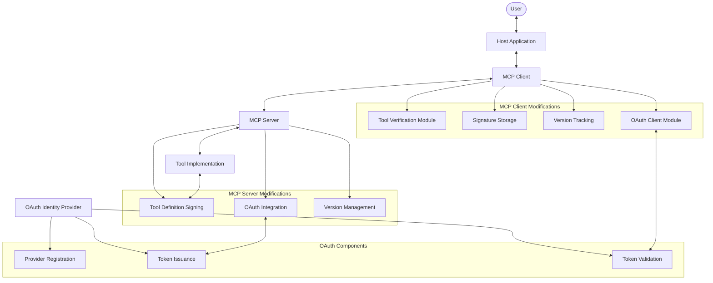

# Enhanced Tool Definition Interface (ETDI) - Low-Level Design Document

## 1. Introduction

This Low-Level Design (LLD) document specifies the technical implementation details for the Enhanced Tool Definition Interface (ETDI), a security extension to the Model Context Protocol (MCP). ETDI addresses critical security vulnerabilities in MCP, specifically Tool Poisoning and Rug Pull attacks, by implementing cryptographic verification, immutable versioned definitions, and explicit permission management.

### 1.1 Document Purpose

This document provides developers with specific implementation guidance for modifying MCP Clients, MCP Servers, and integrating OAuth 2.0 authorization to create a secure MCP ecosystem. It serves as a technical blueprint for ETDI adoption.

### 1.2 Scope

This design covers:
- Detailed modifications to MCP Client components
- Required changes to MCP Server implementations
- OAuth 2.0 integration specifics
- Key management infrastructure
- Security implementation details
- Backward compatibility considerations

## 2. System Component Modifications

### 2.1 Modified Component Architecture




## 3. MCP Client Implementation Details

The client-side implementation of ETDI represents a critical security boundary responsible for validating tool authenticity and managing user approval workflows. This section details the technical implementation required to integrate OAuth-based security verification into MCP clients.

### 3.1 Core Data Structures

The foundation of ETDI client implementation relies on several key data structures that extend the existing MCP schema while maintaining backward compatibility.

```typescript
// Tool definition with security extensions
interface ETDIToolDefinition {
    id: string;                 // Unique identifier for the tool
    name: string;               // Human-readable name
    version: string;            // Semantic version (MAJOR.MINOR.PATCH)
    description: string;        // Human-readable description
    provider: {
        id: string;             // Unique identifier for the provider
        name: string;           // Human-readable provider name
    };
    schema: JSONSchema;         // JSON Schema defining input/output
    permissions: Permission[];  // Required permissions
    security: {
        oauth: {
            token: string;      // JWT token from OAuth provider
            provider: string;   // OAuth provider identifier (e.g., "auth0.com")
        };
    };
}

// Stored approval record
interface ToolApprovalRecord {
    toolId: string;            // Tool identifier
    providerId: string;        // OAuth provider identifier
    approvedVersion: string;   // Version that was approved
    permissions: Permission[]; // Permissions that were approved
    approvalDate: Date;        // When the approval was granted
    expiryDate?: Date;         // Optional expiration of approval
}
```

The `ETDIToolDefinition` extends the standard MCP tool definition with an OAuth security section. This approach enables the client to verify the tool's authenticity through the OAuth token while preserving all essential metadata. The OAuth token serves as the cornerstone of the security model, replacing traditional signature-based verification with the more standardized OAuth protocol.

The `ToolApprovalRecord` structure maintains a history of user approvals, enabling clients to detect changes in tool versions, permissions, or providers that would necessitate re-approval. By storing the approved version and permissions, the client can present meaningful comparisons to users when a tool is updated, highlighting specific changes in capabilities or access requirements.

### 3.2 Tool Discovery Enhancement

Tool discovery represents the first point where security verification is applied in the client workflow. The enhanced discovery process must filter and verify tools based on their OAuth credentials.

```typescript
class ETDIClient extends MCPClient {
    // Override the standard tool discovery method
    async discoverTools(): Promise<ETDIToolDefinition[]> {
        // Get tools from all connected servers using standard MCP
        const tools = await super.discoverTools();
        
        // Filter and verify each tool
        const verifiedTools = [];
        for (const tool of tools) {
            // Skip tools without ETDI OAuth tokens if in strict mode
            if (!this.hasOAuthToken(tool)) {
                if (this.config.allowNonETDITools) {
                    tool.verificationStatus = 'UNVERIFIED';
                    verifiedTools.push(tool);
                }
                continue;
            }
            
            // Verify tool OAuth token
            const isVerified = await this.verifyToolOAuth(tool);
            if (isVerified) {
                tool.verificationStatus = 'VERIFIED';
                verifiedTools.push(tool);
            } else if (this.config.showUnverifiedTools) {
                tool.verificationStatus = 'TOKEN_INVALID';
                verifiedTools.push(tool);
            }
        }
        
        return verifiedTools;
    }
}
```

This implementation introduces several security enhancements to the discovery process:

1. **Verification Status Flagging**: Each tool is tagged with its verification status, enabling the client to visually distinguish between verified and unverified tools in the user interface.

2. **Configurable Security Levels**: The implementation supports different security modes through configuration options:
   - `allowNonETDITools`: When true, allows tools without OAuth tokens to be displayed, but clearly marked as unverified.
   - `showUnverifiedTools`: When true, shows tools with invalid OAuth tokens, enabling users to see failed verification attempts.

3. **Early Filtering**: By filtering out unverified tools during discovery, the client provides a defense-in-depth approach, preventing potential security issues before tools can be invoked.

The discovery enhancement ensures that only properly authenticated tools are presented to the user by default, while providing flexibility for environments that require backward compatibility with non-ETDI tools.

### 3.3 OAuth Token Verification

OAuth token verification forms the cornerstone of the ETDI security model on the client side. This process validates the authenticity and integrity of a tool's claimed identity and permissions.

```typescript
class ETDIClient extends MCPClient {
    async verifyToolOAuth(tool: ETDIToolDefinition): Promise<boolean> {
        // Extract OAuth token and provider
        const oauth = tool.security?.oauth;
        if (!oauth || !oauth.token || !oauth.provider) {
            console.warn(`No OAuth information for tool: ${tool.id}`);
            return false;
        }
        
        try {
            // Get OAuth verifier for the specified provider
            const verifier = await this.oauthVerifierRegistry.getVerifier(
                oauth.provider
            );
            
            if (!verifier) {
                console.warn(`No verifier available for provider: ${oauth.provider}`);
                return false;
            }
            
            // Verify the token against expected tool properties and permissions
            const verificationResult = await verifier.verifyToken(
                oauth.token,
                {
                    toolId: tool.id,
                    toolVersion: tool.version,
                    requiredPermissions: tool.permissions || []
                }
            );
            
            // Store detailed verification result for debugging
            tool._verificationDetails = verificationResult;
            
            return verificationResult.valid;
        } catch (error) {
            console.error(`OAuth verification error: ${error.message}`);
            tool._verificationDetails = {
                valid: false,
                error: error.message
            };
            return false;
        }
    }
}
```

The verification process encompasses several critical security checks:

1. **Provider-Specific Verification**: The implementation supports multiple OAuth providers through a verifier registry, allowing different verification strategies depending on the provider (Auth0, Okta, Azure AD, etc.).

2. **Deep Token Inspection**: The verifier performs comprehensive validation including:
   - JWT signature verification against the provider's JWKS
   - Expiration and issuance time validation
   - Issuer and audience validation
   - Scope verification against the tool's claimed permissions
   - Tool-specific claim validation (tool ID, version)

3. **Detailed Verification Results**: The implementation stores comprehensive verification details, enabling detailed error reporting and troubleshooting assistance for users and developers.

This implementation separates the concerns of token acquisition (server-side) from token verification (client-side), aligning with security best practices. By leveraging industry-standard OAuth and JWT verification, the system benefits from well-established security patterns and broad ecosystem support.

### 3.4 Tool Approval and Storage

The approval system manages user consent for tool usage, ensuring that users are properly informed about security-relevant changes and have an opportunity to review permissions.

```typescript
class ETDIClient extends MCPClient {
    async approveToolWithETDI(
        tool: ETDIToolDefinition, 
        approvedPermissions: Permission[]
    ): Promise<boolean> {
        // Verify the tool one more time before approval
        const isVerified = await this.verifyToolOAuth(tool);
        if (!isVerified) {
            throw new Error('Cannot approve a tool with invalid OAuth token');
        }
        
        // Extract provider from OAuth info
        const providerIdentity = tool.security?.oauth?.provider;
        if (!providerIdentity) {
            throw new Error('Missing OAuth provider information');
        }
        
        // Create approval record
        const approvalRecord: ToolApprovalRecord = {
            toolId: tool.id,
            providerId: providerIdentity,
            approvedVersion: tool.version,
            permissions: approvedPermissions,
            approvalDate: new Date(),
        };
        
        // Store the approval record
        await this.approvalStore.storeApproval(approvalRecord);
        
        // Log the approval for audit purposes
        this.securityLogger.log({
            event: 'tool_approved',
            toolId: tool.id,
            toolVersion: tool.version,
            providerIdentity: providerIdentity,
            approvedPermissions: approvedPermissions,
            timestamp: new Date()
        });
        
        return true;
    }
}
```

The approval system incorporates several security enhancements:

1. **Pre-Approval Verification**: The tool is verified again immediately before approval to prevent time-of-check to time-of-use (TOCTOU) attacks where a tool's status might change between initial verification and approval.

2. **Granular Permission Control**: Users can selectively approve specific permissions rather than granting all requested permissions, implementing the principle of least privilege.

3. **Audit Logging**: The system logs approval events with detailed metadata, enabling security monitoring and compliance reporting.

4. **Persistent Storage**: Approval records are persistently stored, allowing the client to detect changes across sessions and application restarts.

The approval system serves as a critical trust boundary where the user makes security decisions. Its implementation focuses on providing clear information and maintaining a secure record of user consent.

### 3.5 Re-verification on Subsequent Use

To prevent "rug pull" attacks where a tool might change after initial approval, the client implements comprehensive re-verification before each tool invocation.

```typescript
class ETDIClient extends MCPClient {
    async checkToolBeforeInvocation(tool: ETDIToolDefinition): Promise<{
        canProceed: boolean;
        requiresReapproval: boolean;
        reason?: string;
    }> {
        // First, verify the OAuth token is valid
        const isOAuthValid = await this.verifyToolOAuth(tool);
        if (!isOAuthValid) {
            return {
                canProceed: false,
                requiresReapproval: false,
                reason: 'INVALID_TOKEN',
            };
        }
        
        // Get the stored approval record
        const approvalRecord = await this.approvalStore.getApproval(tool.id);
        if (!approvalRecord) {
            return {
                canProceed: false,
                requiresReapproval: true,
                reason: 'NOT_APPROVED',
            };
        }
        
        // Check for version changes
        if (tool.version !== approvalRecord.approvedVersion) {
            return {
                canProceed: false,
                requiresReapproval: true,
                reason: 'VERSION_CHANGED',
            };
        }
        
        // Check for OAuth provider changes
        const currentProvider = tool.security?.oauth?.provider;
        if (currentProvider !== approvalRecord.providerId) {
            return {
                canProceed: false,
                requiresReapproval: true,
                reason: 'PROVIDER_CHANGED',
            };
        }
        
        // Check for permission changes
        const hasNewPermissions = this.checkForNewPermissions(
            tool.permissions,
            approvalRecord.permissions
        );
        
        if (hasNewPermissions) {
            return {
                canProceed: false,
                requiresReapproval: true,
                reason: 'PERMISSIONS_CHANGED',
            };
        }
        
        // All checks passed
        return {
            canProceed: true,
            requiresReapproval: false,
        };
    }
    
    // Helper method to check for new permissions
    private checkForNewPermissions(
        currentPermissions: Permission[],
        approvedPermissions: Permission[]
    ): boolean {
        // If there are no current permissions, there can't be new ones
        if (!currentPermissions || currentPermissions.length === 0) {
            return false;
        }
        
        // If there are no approved permissions, any current ones are new
        if (!approvedPermissions || approvedPermissions.length === 0) {
            return currentPermissions.length > 0;
        }
        
        // Check if any current permissions were not previously approved
        return currentPermissions.some(permission => 
            !approvedPermissions.includes(permission)
        );
    }
}
```

The re-verification process includes several security checks:

1. **Token Validation**: The OAuth token is re-validated to ensure it hasn't expired or been revoked since the last use.

2. **Version Change Detection**: Changes in the tool's version trigger a re-approval workflow, ensuring users are aware of potential functionality changes.

3. **Provider Change Detection**: Changes in the OAuth provider similarly trigger re-approval, as this represents a security-relevant change in the tool's identity.

4. **Permission Expansion Detection**: The system detects attempts to add new permissions without user consent, preventing permission escalation attacks.

By implementing these checks before each tool invocation, the client creates a defense-in-depth approach that can detect and prevent "rug pull" attacks where a tool might change its behavior or permissions after initial approval.

### 3.6 OAuth Client Module Implementation

The OAuth client module provides a standardized interface for interacting with different OAuth providers, handling token validation, JWKS endpoint interaction, and provider discovery.

```typescript
class OAuthClientModule {
    private jwksClients: Map<string, JwksClient> = new Map();
    private tokenValidityCache: Map<string, {
        valid: boolean;
        expiresAt: Date;
    }> = new Map();
    
    constructor(
        private config: {
            trustedProviders: string[];
            validationCacheTtl: number; // milliseconds
        }
    ) {}
    
    async verifyOAuthToken(
        token: string,
        provider: string,
        expectedClaims: {
            toolId: string;
            toolVersion: string;
            requiredPermissions: string[];
        }
    ): Promise<VerificationResult> {
        try {
            // Check cache first
            const cacheKey = `${token}:${provider}:${expectedClaims.toolId}:${expectedClaims.toolVersion}`;
            const cachedResult = this.tokenValidityCache.get(cacheKey);
            if (cachedResult && cachedResult.expiresAt > new Date()) {
                return {
                    valid: cachedResult.valid,
                    provider
                };
            }
            
            // Check if provider is trusted
            if (!this.isTrustedProvider(provider)) {
                return {
                    valid: false,
                    error: 'Untrusted OAuth provider',
                    provider
                };
            }
            
            // Preliminary decode without verification to extract claims
            const decodedToken = this.decodeTokenWithoutVerification(token);
            
            // Verify token hasn't expired based on the "exp" claim
            if (decodedToken.exp && decodedToken.exp < Math.floor(Date.now() / 1000)) {
                return {
                    valid: false,
                    error: 'Token expired',
                    provider
                };
            }
            
            // Get JWKS client for provider
            const jwksClient = await this.getJwksClientForProvider(provider);
            
            // Verify token signature
            const isSignatureValid = await this.verifyTokenSignature(
                token,
                jwksClient
            );
            
            if (!isSignatureValid) {
                return {
                    valid: false,
                    error: 'Invalid token signature',
                    provider
                };
            }
            
            // Verify token claims
            const toolId = decodedToken.tool_id || decodedToken.sub;
            if (toolId !== expectedClaims.toolId) {
                return {
                    valid: false,
                    error: 'Token does not match expected tool ID',
                    provider
                };
            }
            
            const toolVersion = decodedToken.tool_version;
            if (toolVersion && toolVersion !== expectedClaims.toolVersion) {
                return {
                    valid: false,
                    error: 'Token does not match expected tool version',
                    provider
                };
            }
            
            // Verify scopes/permissions
            const tokenScopes = (decodedToken.scope || '').split(' ');
            const missingPermissions = this.findMissingPermissions(
                tokenScopes,
                expectedClaims.requiredPermissions
            );
            
            if (missingPermissions.length > 0) {
                return {
                    valid: false,
                    error: 'Token missing required permissions',
                    details: {
                        missingPermissions
                    },
                    provider
                };
            }
            
            // All checks passed, cache the result
            const result = { valid: true, provider };
            const expiresAt = new Date(Date.now() + this.config.validationCacheTtl);
            this.tokenValidityCache.set(cacheKey, {
                valid: true,
                expiresAt
            });
            
            return result;
        } catch (error) {
            return {
                valid: false,
                error: `Token validation error: ${error.message}`,
                provider
            };
        }
    }
    
    // Helper method to get JWKS client for a provider
    private async getJwksClientForProvider(provider: string): Promise<JwksClient> {
        // Check if we already have a client for this provider
        if (this.jwksClients.has(provider)) {
            return this.jwksClients.get(provider)!;
        }
        
        // Try to discover JWKS URI
        const jwksUri = await this.discoverJwksUri(provider);
        
        // Create new JWKS client
        const client = new JwksClient({
            jwksUri,
            cache: true,
            rateLimit: true
        });
        
        // Store client for future use
        this.jwksClients.set(provider, client);
        
        return client;
    }
    
    // Other implementation details...
}
```

The OAuth client module provides several key security features:

1. **Multi-Provider Support**: The implementation supports multiple OAuth providers through a flexible architecture that allows for provider-specific validation rules.

2. **Caching with Expiration**: Validation results are cached with appropriate time-to-live values to balance performance and security, ensuring that revoked tokens are not used for extended periods.

3. **Comprehensive Claim Verification**: The module verifies multiple JWT claims including:
   - Expiration time
   - Tool identifier
   - Tool version
   - Required permissions (via scope mapping)

4. **JWKS Discovery and Caching**: The module handles discovery of JSON Web Key Sets (JWKS) endpoints for different providers, caching the results to improve performance.

5. **Provider Trust List**: The implementation maintains a list of trusted providers, preventing tools from using arbitrary OAuth providers that might not meet the required security standards.

This module serves as a critical security component, handling the complex cryptographic operations needed to validate OAuth tokens while providing a clean, provider-agnostic interface for the rest of the client implementation.

## 4. MCP Server Implementation Details

The server-side implementation of ETDI focuses on acquiring and integrating OAuth tokens with tool definitions. This section details the architectural components required to add OAuth-based security to MCP servers.

### 4.1 Tool Registration with ETDI Support

Tool registration represents the initial point where security information is attached to tool definitions, ensuring that tools are properly authenticated before they are exposed to clients.

```typescript
class ETDIToolRegistry {
    private tools: Map<string, ETDIToolDefinition> = new Map();
    
    constructor(
        private oauthProvider: OAuthProvider,
        private config: {
            providerId: string;
            providerName: string;
        }
    ) {}
    
    async registerTool(toolDefinition: Omit<ETDIToolDefinition, 'security'>): Promise<ETDIToolDefinition> {
        // Inject provider information
        const fullDefinition: Omit<ETDIToolDefinition, 'security'> = {
            ...toolDefinition,
            provider: {
                id: this.config.providerId,
                name: this.config.providerName,
            }
        };
        
        // Get OAuth token for the tool
        const oauthInfo = await this.oauthProvider.getToolToken(fullDefinition);
        
        // Create complete tool definition with OAuth token
        const completeDefinition: ETDIToolDefinition = {
            ...fullDefinition,
            security: {
                oauth: {
                    token: oauthInfo.token,
                    provider: oauthInfo.provider
                }
            }
        };
        
        // Store in registry
        this.tools.set(completeDefinition.id, completeDefinition);
        
        // Log the registration for audit purposes
        console.info(`Tool registered with OAuth: ${completeDefinition.id}`);
        
        return completeDefinition;
    }
    
    getTool(id: string): ETDIToolDefinition | undefined {
        return this.tools.get(id);
    }
    
    getAllTools(): ETDIToolDefinition[] {
        return Array.from(this.tools.values());
    }
}
```

The tool registration process includes several security enhancements:

1. **Automatic OAuth Token Acquisition**: The registry automatically obtains OAuth tokens for tools during registration, ensuring that all exposed tools have proper authentication.

2. **Provider Identity Injection**: Tool definitions are enhanced with standardized provider identity information, ensuring consistent identification across the MCP ecosystem.

3. **Centralized Management**: The registry provides centralized storage and retrieval of tool definitions, making it easier to manage security policies and updates.

This implementation separates tool definition from security concerns, allowing for cleaner code organization and potential reuse of existing tool definitions with the added security layer.

### 4.2 OAuth Integration for Tool Providers

The OAuth integration component handles the process of obtaining OAuth tokens for tools, mapping permissions to scopes, and managing token lifecycle.

```typescript
class OAuthToolProvider {
    constructor(
        private config: {
            clientId: string;
            clientSecret: string;
            tokenEndpoint: string;
            provider: string;
            defaultScopes: string[];
        }
    ) {}
    
    async getToolToken(toolDefinition: ETDIToolDefinition): Promise<{
        token: string;
        provider: string;
        expiresAt: Date;
    }> {
        // Map permissions to OAuth scopes
        const scopes = this.mapPermissionsToScopes(
            toolDefinition.permissions || []
        );
        
        // Add default scopes
        const allScopes = [...new Set([...scopes, ...this.config.defaultScopes])];
        
        // Prepare custom claims for the token
        const customClaims = {
            tool_id: toolDefinition.id,
            tool_version: toolDefinition.version,
            tool_provider: toolDefinition.provider.id,
        };
        
        // Request token from OAuth provider
        const tokenResponse = await this.requestOAuthToken(allScopes, customClaims);
        
        // Calculate expiration date
        const expiresAt = new Date();
        expiresAt.setSeconds(
            expiresAt.getSeconds() + tokenResponse.expires_in
        );
        
        return {
            token: tokenResponse.access_token,
            provider: this.config.provider,
            expiresAt
        };
    }
    
    private async requestOAuthToken(
        scopes: string[],
        claims: Record<string, string>
    ): Promise<{ access_token: string; expires_in: number }> {
        // Form request body
        const body = new URLSearchParams();
        body.append('grant_type', 'client_credentials');
        body.append('scope', scopes.join(' '));
        
        // Add custom claims if supported by the provider
        for (const [key, value] of Object.entries(claims)) {
            body.append(key, value);
        }
        
        // Make request to token endpoint
        const response = await fetch(this.config.tokenEndpoint, {
            method: 'POST',
            headers: {
                'Content-Type': 'application/x-www-form-urlencoded',
                'Authorization': `Basic ${Buffer.from(
                    `${this.config.clientId}:${this.config.clientSecret}`
                ).toString('base64')}`
            },
            body: body.toString()
        });
        
        if (!response.ok) {
            const errorText = await response.text();
            throw new Error(
                `Failed to obtain OAuth token: ${response.status} ${errorText}`
            );
        }
        
        return await response.json();
    }
    
    private mapPermissionsToScopes(permissions: Permission[]): string[] {
        // Map ETDI permissions to OAuth scopes
        return permissions.map(permission => {
            // Simple prefix mapping strategy
            return `tool:${permission}`;
        });
    }
}
```

The OAuth integration component includes several key features:

1. **Permission to Scope Mapping**: The implementation maps ETDI permissions to OAuth scopes, enabling consistent authorization models across the two systems.

2. **Custom Claims Support**: The provider adds tool-specific claims to the token request, enabling the client to verify that a token was issued specifically for the claimed tool.

3. **Expiration Management**: The component calculates token expiration times, potentially enabling proactive token renewal before expiry.

4. **Provider-Agnostic Interface**: The design allows for different OAuth provider implementations to be used interchangeably, supporting the multi-provider approach.

This component serves as the bridge between the MCP server's tool registry and external OAuth providers, ensuring that tools are properly authenticated while abstracting away the complexities of the OAuth protocol.

### 4.3 Version Management Implementation

Version management is critical for preventing "rug pull" attacks by ensuring that changes to tool definitions result in new versions that trigger re-approval workflows.

```typescript
class ToolVersionManager {
    private versionHistory: Map<string, string[]> = new Map();
    
    constructor(private toolRegistry: ETDIToolRegistry) {}
    
    async createNewVersion(
        toolId: string,
        updateFn: (currentDefinition: ETDIToolDefinition) => Partial<ETDIToolDefinition>
    ): Promise<ETDIToolDefinition> {
        // Get current definition
        const currentTool = this.toolRegistry.getTool(toolId);
        if (!currentTool) {
            throw new Error(`Tool not found: ${toolId}`);
        }
        
        // Parse current version
        const [major, minor, patch] = currentTool.version.split('.').map(Number);
        
        // Calculate what kind of update this is
        const updates = updateFn(currentTool);
        
        // Determine version increment type
        let newVersion: string;
        
        if (this.hasPermissionChanges(currentTool.permissions, updates.permissions)) {
            // Permission changes require a major version bump
            newVersion = `${major + 1}.0.0`;
        } else if (this.hasSchemaChanges(currentTool.schema, updates.schema)) {
            // Schema changes require at least a minor version bump
            newVersion = `${major}.${minor + 1}.0`;
        } else {
            // Other changes get a patch bump
            newVersion = `${major}.${minor}.${patch + 1}`;
        }
        
        // Create new definition
        const newDefinition = {
            ...currentTool,
            ...updates,
            version: newVersion,
        };
        
        // Register as new tool (will get a new OAuth token)
        const registeredTool = await this.toolRegistry.registerTool(newDefinition);
        
        // Store in version history
        if (!this.versionHistory.has(toolId)) {
            this.versionHistory.set(toolId, []);
        }
        this.versionHistory.get(toolId)!.push(newVersion);
        
        return registeredTool;
    }
    
    private hasPermissionChanges(
        currentPermissions: Permission[] = [],
        newPermissions: Permission[] = []
    ): boolean {
        if (!newPermissions) return false;
        if (currentPermissions.length !== newPermissions.length) return true;
        
        // Check if any new permissions are not in current permissions
        return newPermissions.some(p => !currentPermissions.includes(p));
    }
    
    private hasSchemaChanges(currentSchema: JSONSchema, newSchema: JSONSchema): boolean {
        if (!newSchema) return false;
        
        // Simple deep equality check
        return JSON.stringify(currentSchema) !== JSON.stringify(newSchema);
    }
    
    getVersionHistory(toolId: string): string[] {
        return this.versionHistory.get(toolId) || [];
    }
}
```

The version management system provides several key security features:

1. **Semantic Versioning Enforcement**: The system enforces proper semantic versioning practices, where security-relevant changes (like permission additions) trigger major version increments.

2. **Automatic Version Assignment**: Tools receive automatic version increments based on the nature of changes, ensuring that developers cannot accidentally or maliciously bypass version change detection.

3. **Version History Tracking**: The system maintains a history of all versions, enabling auditing and potential rollback capabilities.

By enforcing proper versioning practices, the system ensures that security-relevant changes are visible to clients and users, enabling informed approval decisions and preventing stealthy permission expansions.

## 5. Inspector Tool Design

The Inspector Tool provides critical visibility into the security properties of MCP servers and tools, helping developers and users understand and validate ETDI implementations.

### 5.1 Security Analysis Engine

The Security Analysis Engine provides comprehensive validation of ETDI implementations, helping developers identify and fix potential security issues.

```typescript
class SecurityAnalysisEngine {
    constructor(
        private oauthClient: OAuthClientModule,
        private config: {
            detailedAnalysis: boolean;
            validateTokens: boolean;
        }
    ) {}
    
    async analyzeTool(tool: ETDIToolDefinition): Promise<ToolAnalysisResult> {
        const result: ToolAnalysisResult = {
            id: tool.id,
            name: tool.name,
            version: tool.version,
            providerId: tool.provider?.id,
            providerName: tool.provider?.name,
            securityFindings: [],
            permissionAnalysis: await this.analyzePermissions(tool.permissions),
            oauthAnalysis: null
        };
        
        // Check security structure
        if (!tool.security) {
            result.securityFindings.push({
                severity: 'HIGH',
                message: 'Tool missing security information',
                code: 'MISSING_SECURITY'
            });
            return result;
        }
        
        // Check OAuth information
        if (!tool.security.oauth) {
            result.securityFindings.push({
                severity: 'HIGH',
                message: 'Tool missing OAuth information',
                code: 'MISSING_OAUTH'
            });
            return result;
        }
        
        const oauth = tool.security.oauth;
        
        // Check OAuth token
        if (!oauth.token) {
            result.securityFindings.push({
                severity: 'HIGH',
                message: 'Tool missing OAuth token',
                code: 'MISSING_TOKEN'
            });
        }
        
        // Check OAuth provider
        if (!oauth.provider) {
            result.securityFindings.push({
                severity: 'HIGH',
                message: 'Tool missing OAuth provider',
                code: 'MISSING_PROVIDER'
            });
        }
        
        // Analyze the OAuth token if present and validation is enabled
        if (oauth.token && oauth.provider && this.config.validateTokens) {
            result.oauthAnalysis = await this.analyzeOAuthToken(
                oauth.token,
                oauth.provider,
                tool
            );
        }
        
        return result;
    }
    
    private async analyzeOAuthToken(
        token: string,
        provider: string,
        tool: ETDIToolDefinition
    ): Promise<OAuthAnalysisResult> {
        try {
            // Decode token without verification
            const decodedToken = this.decodeTokenWithoutVerification(token);
            
            const result: OAuthAnalysisResult = {
                tokenValid: false,
                tokenExpiry: new Date(decodedToken.exp * 1000),
                issuer: decodedToken.iss,
                subject: decodedToken.sub,
                audience: decodedToken.aud,
                scopes: (decodedToken.scope || '').split(' '),
                toolId: decodedToken.tool_id,
                toolVersion: decodedToken.tool_version,
                findings: []
            };
            
            // Check expiration
            const now = Math.floor(Date.now() / 1000);
            if (decodedToken.exp < now) {
                result.findings.push({
                    severity: 'HIGH',
                    message: 'Token is expired',
                    code: 'TOKEN_EXPIRED'
                });
            }
            
            // Check tool ID claim
            if (decodedToken.tool_id !== tool.id) {
                result.findings.push({
                    severity: 'HIGH',
                    message: 'Token tool_id claim does not match tool ID',
                    code: 'TOOL_ID_MISMATCH'
                });
            }
            
            // Check tool version claim if present
            if (decodedToken.tool_version && decodedToken.tool_version !== tool.version) {
                result.findings.push({
                    severity: 'MEDIUM',
                    message: 'Token tool_version claim does not match tool version',
                    code: 'TOOL_VERSION_MISMATCH'
                });
            }
            
            // Validate token cryptographically if requested
            if (this.config.detailedAnalysis) {
                try {
                    const validationResult = await this.oauthClient.verifyOAuthToken(
                        token,
                        provider,
                        {
                            toolId: tool.id,
                            toolVersion: tool.version,
                            requiredPermissions: tool.permissions || []
                        }
                    );
                    
                    result.tokenValid = validationResult.valid;
                    
                    if (!validationResult.valid && validationResult.error) {
                        result.findings.push({
                            severity: 'HIGH',
                            message: `Token validation failed: ${validationResult.error}`,
                            code: 'TOKEN_INVALID'
                        });
                    }
                } catch (error) {
                    result.findings.push({
                        severity: 'HIGH',
                        message: `Token validation error: ${error.message}`,
                        code: 'VALIDATION_ERROR'
                    });
                }
            }
            
            return result;
        } catch (error) {
            return {
                tokenValid: false,
                findings: [{
                    severity: 'HIGH',
                    message: `Token analysis error: ${error.message}`,
                    code: 'ANALYSIS_ERROR'
                }]
            };
        }
    }
    
    private async analyzePermissions(permissions: Permission[] = []): Promise<PermissionAnalysisResult> {
        // Analyze permissions for security best practices
        const result: PermissionAnalysisResult = {
            count: permissions.length,
            excessivePermissions: false,
            findings: []
        };
        
        // Check for empty permissions
        if (permissions.length === 0) {
            result.findings.push({
                severity: 'LOW',
                message: 'Tool has no declared permissions',
                code: 'NO_PERMISSIONS'
            });
        }
        
        // Check for overly broad permissions
        const broadPermissions = permissions.filter(p => 
            p.includes('*') || p === 'admin' || p.endsWith(':all')
        );
        
        if (broadPermissions.length > 0) {
            result.excessivePermissions = true;
            result.findings.push({
                severity: 'MEDIUM',
                message: 'Tool requests overly broad permissions',
                code: 'BROAD_PERMISSIONS',
                details: { permissions: broadPermissions }
            });
        }
        
        return result;
    }
    
    private decodeTokenWithoutVerification(token: string): any {
        // Simple JWT decoding without verification
        const parts = token.split('.');
        if (parts.length !== 3) {
            throw new Error('Invalid JWT format');
        }
        
        const payload = parts[1];
        const decoded = Buffer.from(payload, 'base64').toString('utf-8');
        
        try {
            return JSON.parse(decoded);
        } catch (error) {
            throw new Error('Invalid JWT payload');
        }
    }
}
```

The Security Analysis Engine provides several key features:

1. **Comprehensive Tool Analysis**: The engine analyzes every aspect of a tool's security configuration, identifying missing or incorrectly configured components.

2. **Token Introspection**: Without necessarily verifying cryptographic signatures, the engine can decode and analyze token contents, providing visibility into the claims and scopes.

3. **Permission Analysis**: The engine evaluates permission requests against security best practices, identifying overly broad or potentially dangerous permissions.

4. **Detailed Findings**: Analysis results include severity ratings, error codes, and descriptive messages to help developers understand and address issues.

This component serves as both a debugging tool for developers and an educational resource, helping the community understand and implement ETDI correctly.

### 5.2 User Interface Components

The user interface components provide visual representation of security status and detailed inspection capabilities for OAuth tokens and tool definitions.

```typescript
// React component for displaying tool security status
const ToolSecurityPanel: React.FC<{
    tool: ETDIToolDefinition;
    analysisResult?: ToolAnalysisResult;
}> = ({ tool, analysisResult }) => {
    const hasOAuth = !!tool.security?.oauth?.token;
    const provider = tool.security?.oauth?.provider || 'Unknown';
    
    // Calculate security status
    let securityStatus: 'secure' | 'warning' | 'error' | 'unknown' = 'unknown';
    
    if (analysisResult) {
        if (analysisResult.securityFindings.length === 0 && 
            (!analysisResult.oauthAnalysis || analysisResult.oauthAnalysis.tokenValid)) {
            securityStatus = 'secure';
        } else if (analysisResult.securityFindings.some(f => f.severity === 'HIGH')) {
            securityStatus = 'error';
        } else if (analysisResult.securityFindings.length > 0) {
            securityStatus = 'warning';
        }
    } else if (!hasOAuth) {
        securityStatus = 'error';
    }
    
    return (
        <div className="tool-security-panel">
            <div className="security-header">
                <SecurityBadge status={securityStatus} />
                <h3>Security Details</h3>
            </div>
            
            <div className="security-content">
                <div className="security-overview">
                    <div className="item">
                        <label>Provider:</label>
                        <span>{provider}</span>
                    </div>
                    <div className="item">
                        <label>OAuth Enabled:</label>
                        <span>{hasOAuth ? 'Yes' : 'No'}</span>
                    </div>
                    <div className="item">
                        <label>Version:</label>
                        <span>{tool.version}</span>
                    </div>
                    <div className="item">
                        <label>Permissions:</label>
                        <span>{tool.permissions?.length || 0} requested</span>
                    </div>
                </div>
                
                {analysisResult && (
                    <>
                        <SecurityFindingsList findings={analysisResult.securityFindings} />
                        
                        {analysisResult.oauthAnalysis && (
                            <OAuthTokenDetails analysis={analysisResult.oauthAnalysis} />
                        )}
                        
                        {analysisResult.permissionAnalysis && (
                            <PermissionAnalysisView analysis={analysisResult.permissionAnalysis} />
                        )}
                    </>
                )}
            </div>
        </div>
    );
};

// Component for displaying a color-coded security badge
const SecurityBadge: React.FC<{
    status: 'secure' | 'warning' | 'error' | 'unknown';
}> = ({ status }) => {
    const getIcon = () => {
        switch (status) {
            case 'secure': return <ShieldCheckIcon className="icon secure" />;
            case 'warning': return <AlertTriangleIcon className="icon warning" />;
            case 'error': return <AlertOctagonIcon className="icon error" />;
            case 'unknown': return <HelpCircleIcon className="icon unknown" />;
        }
    };
    
    const getLabel = () => {
        switch (status) {
            case 'secure': return 'Secure';
            case 'warning': return 'Warning';
            case 'error': return 'Error';
            case 'unknown': return 'Unknown';
        }
    };
    
    return (
        <div className={`security-badge ${status}`}>
            {getIcon()}
            <span>{getLabel()}</span>
        </div>
    );
};

// Component for displaying JWT token details
const OAuthTokenDetails: React.FC<{
    analysis: OAuthAnalysisResult;
}> = ({ analysis }) => {
    const isExpired = analysis.tokenExpiry && analysis.tokenExpiry < new Date();
    
    return (
        <div className="oauth-token-details">
            <h4>OAuth Token Details</h4>
            
            <div className="token-overview">
                <div className="item">
                    <label>Valid:</label>
                    <span className={analysis.tokenValid ? 'valid' : 'invalid'}>
                        {analysis.tokenValid ? 'Yes' : 'No'}
                    </span>
                </div>
                
                {analysis.tokenExpiry && (
                    <div className="item">
                        <label>Expires:</label>
                        <span className={isExpired ? 'expired' : ''}>
                            {analysis.tokenExpiry.toLocaleString()}
                            {isExpired ? ' (EXPIRED)' : ''}
                        </span>
                    </div>
                )}
                
                {analysis.issuer && (
                    <div className="item">
                        <label>Issuer:</label>
                        <span>{analysis.issuer}</span>
                    </div>
                )}
                
                {analysis.audience && (
                    <div className="item">
                        <label>Audience:</label>
                        <span>{Array.isArray(analysis.audience) ? 
                            analysis.audience.join(', ') : 
                            analysis.audience}
                        </span>
                    </div>
                )}
                
                {analysis.toolId && (
                    <div className="item">
                        <label>Tool ID:</label>
                        <span>{analysis.toolId}</span>
                    </div>
                )}
                
                {analysis.toolVersion && (
                    <div className="item">
                        <label>Tool Version:</label>
                        <span>{analysis.toolVersion}</span>
                    </div>
                )}
            </div>
            
            {analysis.scopes && analysis.scopes.length > 0 && (
                <div className="token-scopes">
                    <h5>Scopes</h5>
                    <ul>
                        {analysis.scopes.map((scope, index) => (
                            <li key={index}>{scope}</li>
                        ))}
                    </ul>
                </div>
            )}
            
            {analysis.findings && analysis.findings.length > 0 && (
                <SecurityFindingsList findings={analysis.findings} />
            )}
        </div>
    );
};
```

The user interface components provide several key features:

1. **Visual Security Status**: Components use color-coded badges and icons to clearly indicate security status at a glance.

2. **Detailed Token Inspection**: The UI provides a comprehensive view of OAuth token contents, including claims, scopes, and expiration information.

3. **Finding Presentation**: Security findings are presented with severity indicators and clear messages, helping users understand and address issues.

4. **Permission Visualization**: The UI visualizes permission requests and highlights potential security issues in the permission model.

These components serve as the user-facing aspect of the Inspector Tool, making security information accessible and actionable for developers and users.

### 5.3 Trust Verification System

The Trust Verification System helps users understand and validate the trust relationships between tools, providers, and OAuth authorities.

```typescript
class TrustVerificationSystem {
    constructor(
        private oauthClient: OAuthClientModule,
        private config: {
            trustedProviders: string[];
        }
    ) {}
    
    async verifyToolTrustChain(tool: ETDIToolDefinition): Promise<TrustVerificationResult> {
        const result: TrustVerificationResult = {
            tool: {
                id: tool.id,
                name: tool.name,
                version: tool.version
            },
            provider: {
                id: tool.provider?.id,
                name: tool.provider?.name,
                trusted: this.isProviderTrusted(tool.provider?.id)
            },
            oauth: null,
            overallTrust: 'unknown'
        };
        
        // Check for OAuth information
        if (!tool.security?.oauth?.token || !tool.security?.oauth?.provider) {
            result.overallTrust = 'untrusted';
            return result;
        }
        
        // Analyze OAuth trust
        const oauthTrust = await this.verifyOAuthTrust(
            tool.security.oauth.token,
            tool.security.oauth.provider
        );
        
        result.oauth = oauthTrust;
        
        // Determine overall trust level
        if (!result.provider.trusted) {
            result.overallTrust = 'untrusted';
        } else if (oauthTrust.trusted) {
            result.overallTrust = 'trusted';
        } else if (oauthTrust.providerTrusted) {
            result.overallTrust = 'partially-trusted';
        } else {
            result.overallTrust = 'untrusted';
        }
        
        return result;
    }
    
    private isProviderTrusted(providerId?: string): boolean {
        if (!providerId) return false;
        return this.config.trustedProviders.includes(providerId);
    }
    
    private async verifyOAuthTrust(
        token: string,
        providerName: string
    ): Promise<OAuthTrustResult> {
        try {
            // Check if the OAuth provider is trusted
            const providerTrusted = this.config.trustedProviders.includes(providerName);
            
            // Decode token without verification to extract basic claims
            const decodedToken = this.decodeTokenWithoutVerification(token);
            
            const result: OAuthTrustResult = {
                provider: providerName,
                providerTrusted,
                issuer: decodedToken.iss,
                issuerValid: false,
                signatureValid: false,
                trusted: false
            };
            
            // Verify issuer matches provider
            // The exact validation depends on the provider's conventions
            result.issuerValid = this.validateIssuerForProvider(
                decodedToken.iss,
                providerName
            );
            
            // Verify token signature if possible
            try {
                const signatureResult = await this.oauthClient.verifyTokenSignature(
                    token,
                    providerName
                );
                
                result.signatureValid = signatureResult.valid;
            } catch (error) {
                console.warn(`Signature verification failed: ${error.message}`);
                result.signatureValid = false;
            }
            
            // Overall trust determination
            result.trusted = result.providerTrusted && 
                             result.issuerValid && 
                             result.signatureValid;
            
            return result;
        } catch (error) {
            return {
                provider: providerName,
                providerTrusted: this.config.trustedProviders.includes(providerName),
                trusted: false,
                error: error.message
            };
        }
    }
    
    private validateIssuerForProvider(issuer: string, provider: string): boolean {
        // Common validation patterns, would need to be expanded for production
        if (provider === 'auth0.com') {
            return issuer.includes('.auth0.com') || issuer === 'https://auth0.com/';
        }
        
        if (provider === 'okta.com') {
            return issuer.includes('.okta.com');
        }
        
        if (provider === 'azure.microsoft.com') {
            return issuer.includes('login.microsoftonline.com') || 
                   issuer.includes('sts.windows.net');
        }
        
        // Default case
        return issuer.includes(provider);
    }
    
    private decodeTokenWithoutVerification(token: string): any {
        // Simple JWT decoding implementation
        const parts = token.split('.');
        if (parts.length !== 3) {
            throw new Error('Invalid JWT format');
        }
        
        const payload = parts[1];
        const decoded = Buffer.from(payload, 'base64').toString('utf-8');
        
        try {
            return JSON.parse(decoded);
        } catch (error) {
            throw new Error('Invalid JWT payload');
        }
    }
}
```

The Trust Verification System provides several key features:

1. **Trust Chain Analysis**: The system analyzes the complete trust chain from tool to provider to OAuth issuer, providing a holistic view of security.

2. **Provider Trust Verification**: The implementation validates that tools come from trusted providers based on configurable trust lists.

3. **OAuth Issuer Validation**: The system verifies that OAuth tokens come from expected issuers for each provider, preventing token spoofing.

4. **Signature Verification**: When possible, the system verifies the cryptographic signatures on tokens, ensuring they haven't been tampered with.

This component helps users understand the complete trust model for tools, enabling informed decisions about which tools to use and approve.

## 6. Integration with Existing OAuth Providers

The ETDI implementation leverages existing OAuth providers rather than creating a custom identity system. This section details the specific integration approaches for popular OAuth providers.

### 6.1 Auth0 Integration Design

Auth0 is a widely used identity platform that provides robust OAuth and OpenID Connect capabilities. Integration with Auth0 enables ETDI implementations to leverage its comprehensive security features.

```typescript
class Auth0Provider implements OAuthProvider {
    constructor(
        private config: {
            domain: string;           // e.g., "your-tenant.auth0.com"
            clientId: string;         // Auth0 application client ID
            clientSecret: string;     // Auth0 application client secret
            audience: string;         // API identifier in Auth0
            defaultScopes: string[];  // Default scopes to request
        }
    ) {}
    
    async getToolToken(tool: ETDIToolDefinition): Promise<OAuthTokenInfo> {
        // Map permissions to Auth0 scopes
        const scopes = this.mapPermissionsToScopes(tool.permissions || []);
        
        // Add default scopes
        const allScopes = [...new Set([...scopes, ...this.config.defaultScopes])];
        
        // Request token from Auth0
        const tokenResponse = await this.requestAuth0Token(
            allScopes,
            {
                tool_id: tool.id,
                tool_version: tool.version,
                tool_provider: tool.provider.id
            }
        );
        
        // Calculate expiration date
        const expiresAt = new Date();
        expiresAt.setSeconds(
            expiresAt.getSeconds() + tokenResponse.expires_in
        );
        
        return {
            token: tokenResponse.access_token,
            provider: this.config.domain,
            expiresAt
        };
    }
    
    private async requestAuth0Token(
        scopes: string[],
        customClaims: Record<string, string>
    ): Promise<{ access_token: string; expires_in: number }> {
        // Auth0 token endpoint
        const tokenEndpoint = `https://${this.config.domain}/oauth/token`;
        
        // Auth0 uses JSON for token requests
        const requestBody = {
            client_id: this.config.clientId,
            client_secret: this.config.clientSecret,
            audience: this.config.audience,
            grant_type: 'client_credentials',
            scope: scopes.join(' ')
        };
        
        // Add custom claims via Auth0's custom namespaced parameters
        // This requires configuration in Auth0 to propagate these claims
        for (const [key, value] of Object.entries(customClaims)) {
            requestBody[`https://etdi.tools/${key}`] = value;
        }
        
        // Make request to token endpoint
        const response = await fetch(tokenEndpoint, {
            method: 'POST',
            headers: {
                'Content-Type': 'application/json'
            },
            body: JSON.stringify(requestBody)
        });
        
        if (!response.ok) {
            const errorData = await response.json().catch(() => null);
            throw new Error(
                `Auth0 token request failed: ${response.status} ${
                    errorData ? JSON.stringify(errorData) : response.statusText
                }`
            );
        }
        
        return await response.json();
    }
    
    getProviderInfo(): ProviderInfo {
        return {
            id: `auth0:${this.config.domain}`,
            name: `Auth0 (${this.config.domain})`,
            type: 'auth0'
        };
    }
    
    private mapPermissionsToScopes(permissions: Permission[]): string[] {
        // Map ETDI permissions to Auth0 scopes
        return permissions.map(permission => {
            // Simple prefix mapping strategy
            return `tool:${permission}`;
        });
    }
}
```

Auth0 integration includes several key features:

1. **Custom Claims Support**: Auth0 allows including custom claims in tokens, enabling tool-specific information to be embedded securely.

2. **Audience Validation**: Auth0 tokens include an audience claim that can be used to ensure tokens are intended for the specific API.

3. **Centralized Management**: Auth0's management interface provides tools for managing scopes, clients, and rules, simplifying administration.

4. **Rule-Based Enhancements**: Auth0 rules can be used to enhance tokens with additional claims or enforce custom validation logic.

The Auth0 implementation leverages these capabilities to create a robust integration that meets ETDI's security requirements while benefiting from Auth0's mature identity platform.

### 6.2 Okta Integration Design

Okta is an enterprise identity platform with comprehensive OAuth capabilities. Integration with Okta enables organizations to leverage their existing identity infrastructure for ETDI.

```typescript
class OktaProvider implements OAuthProvider {
    constructor(
        private config: {
            domain: string;           // e.g., "your-org.okta.com"
            authServerId: string;     // e.g., "default"
            clientId: string;         // Okta application client ID
            clientSecret: string;     // Okta application client secret
            audience: string;         // API service name
            defaultScopes: string[];  // Default scopes to request
        }
    ) {}
    
    async getToolToken(tool: ETDIToolDefinition): Promise<OAuthTokenInfo> {
        // Map permissions to Okta scopes
        const scopes = this.mapPermissionsToScopes(tool.permissions || []);
        
        // Add default scopes
        const allScopes = [...new Set([...scopes, ...this.config.defaultScopes])];
        
        // Request token from Okta
        const tokenResponse = await this.requestOktaToken(
            allScopes,
            {
                tool_id: tool.id,
                tool_version: tool.version,
                tool_provider: tool.provider.id
            }
        );
        
        // Calculate expiration date
        const expiresAt = new Date();
        expiresAt.setSeconds(
            expiresAt.getSeconds() + tokenResponse.expires_in
        );
        
        return {
            token: tokenResponse.access_token,
            provider: this.config.domain,
            expiresAt
        };
    }
    
    private async requestOktaToken(
        scopes: string[],
        customClaims: Record<string, string>
    ): Promise<{ access_token: string; expires_in: number }> {
        // Okta token endpoint
        const tokenEndpoint = `https://${this.config.domain}/oauth2/${
            this.config.authServerId
        }/v1/token`;
        
        // Create form data for token request
        const body = new URLSearchParams();
        body.append('grant_type', 'client_credentials');
        body.append('scope', scopes.join(' '));
        
        // Okta supports custom claim values via token hook/extension
        // We'll add them as additional parameters that can be processed by the hook
        for (const [key, value] of Object.entries(customClaims)) {
            body.append(`etdi_${key}`, value);
        }
        
        // Make request to token endpoint
        const response = await fetch(tokenEndpoint, {
            method: 'POST',
            headers: {
                'Accept': 'application/json',
                'Content-Type': 'application/x-www-form-urlencoded',
                'Authorization': `Basic ${Buffer.from(
                    `${this.config.clientId}:${this.config.clientSecret}`
                ).toString('base64')}`
            },
            body: body.toString()
        });
        
        if (!response.ok) {
            const errorData = await response.json().catch(() => null);
            throw new Error(
                `Okta token request failed: ${response.status} ${
                    errorData ? JSON.stringify(errorData) : response.statusText
                }`
            );
        }
        
        return await response.json();
    }
    
    getProviderInfo(): ProviderInfo {
        return {
            id: `okta:${this.config.domain}`,
            name: `Okta (${this.config.domain})`,
            type: 'okta'
        };
    }
    
    private mapPermissionsToScopes(permissions: Permission[]): string[] {
        // Map ETDI permissions to Okta scopes
        return permissions.map(permission => {
            // Simple prefix mapping strategy
            return `tool.${permission}`;
        });
    }
}
```

Okta integration includes several key features:

1. **Authorization Server Support**: Okta's concept of authorization servers allows for separation of concerns and customized token issuance policies.

2. **Token Hooks**: Okta's token hooks enable custom processing during token issuance, allowing for the inclusion of tool-specific claims.

3. **Advanced Policies**: Okta's access policies allow fine-grained control over token issuance, including IP-based restrictions and MFA requirements.

4. **Group-Based Authorization**: Okta's group system can be leveraged to control which tools different users or systems can access.

The Okta implementation leverages these capabilities to create a robust integration that aligns with enterprise security requirements while maintaining the flexibility of the ETDI model.

### 6.3 Azure AD Integration Design

Azure Active Directory is Microsoft's cloud identity solution, widely used in enterprise environments. Integration with Azure AD enables organizations to leverage their existing Microsoft identity infrastructure for ETDI.

```typescript
class AzureADProvider implements OAuthProvider {
    constructor(
        private config: {
            tenantId: string;         // Azure AD tenant ID or domain
            clientId: string;         // Azure AD application client ID
            clientSecret: string;     // Azure AD application client secret
            scope: string;            // Default scope (usually `.default`)
        }
    ) {}
    
    async getToolToken(tool: ETDIToolDefinition): Promise<OAuthTokenInfo> {
        // Azure AD typically uses a single `.default` scope that represents all permissions
        // granted to the application, rather than specifying individual scopes
        const scope = this.config.scope || `api://${this.config.clientId}/.default`;
        
        // Request token from Azure AD
        const tokenResponse = await this.requestAzureADToken(
            scope,
            {
                tool_id: tool.id,
                tool_version: tool.version,
                tool_provider: tool.provider.id
            }
        );
        
        // Calculate expiration date
        const expiresAt = new Date();
        expiresAt.setSeconds(
            expiresAt.getSeconds() + tokenResponse.expires_in
        );
        
        return {
            token: tokenResponse.access_token,
            provider: `azure:${this.config.tenantId}`,
            expiresAt
        };
    }
    
    private async requestAzureADToken(
        scope: string,
        customClaims: Record<string, string>
    ): Promise<{ access_token: string; expires_in: number }> {
        // Azure AD token endpoint
        const tokenEndpoint = `https://login.microsoftonline.com/${
            this.config.tenantId
        }/oauth2/v2.0/token`;
        
        // Create form data for token request
        const body = new URLSearchParams();
        body.append('grant_type', 'client_credentials');
        body.append('client_id', this.config.clientId);
        body.append('client_secret', this.config.clientSecret);
        body.append('scope', scope);
        
        // Azure AD doesn't directly support custom claims in client credentials flow
        // However, we can use application claims or optional claims in app registration
        // For now, we'll just add them as parameters that can be logged or processed
        // by an API or Azure Function middleware
        for (const [key, value] of Object.entries(customClaims)) {
            body.append(`etdi_${key}`, value);
        }
        
        // Make request to token endpoint
        const response = await fetch(tokenEndpoint, {
            method: 'POST',
            headers: {
                'Accept': 'application/json',
                'Content-Type': 'application/x-www-form-urlencoded'
            },
            body: body.toString()
        });
        
        if (!response.ok) {
            const errorData = await response.json().catch(() => null);
            throw new Error(
                `Azure AD token request failed: ${response.status} ${
                    errorData ? JSON.stringify(errorData) : response.statusText
                }`
            );
        }
        
        return await response.json();
    }
    
    getProviderInfo(): ProviderInfo {
        return {
            id: `azure:${this.config.tenantId}`,
            name: `Azure AD (${this.config.tenantId})`,
            type: 'azure'
        };
    }
}
```

Azure AD integration includes several key features:

1. **Application Roles**: Azure AD's application roles can be used to model different permission levels for tools.

2. **Managed Identities**: In Azure environments, managed identities can be used instead of client secrets for higher security.

3. **Enterprise Integration**: Azure AD integrates with on-premises Active Directory and other Microsoft services, simplifying enterprise adoption.

4. **Conditional Access**: Azure AD's conditional access policies allow for context-aware authorization decisions.

The Azure AD implementation provides a solid foundation for organizations that are already invested in the Microsoft ecosystem, allowing them to leverage existing identity infrastructure while adopting ETDI security enhancements.

### 6.4 Provider-Agnostic Implementation

The provider-agnostic layer provides a unified interface for working with different OAuth providers, enabling applications to switch between providers without major code changes.

```typescript
// Provider registry that manages multiple OAuth providers
class OAuthProviderRegistry {
    private providers: Map<string, OAuthProvider> = new Map();
    
    registerProvider(provider: OAuthProvider): void {
        const info = provider.getProviderInfo();
        this.providers.set(info.id, provider);
    }
    
    getProvider(providerId: string): OAuthProvider | undefined {
        return this.providers.get(providerId);
    }
    
    getProviderByName(name: string): OAuthProvider | undefined {
        return Array.from(this.providers.values()).find(
            provider => provider.getProviderInfo().name === name
        );
    }
    
    getProviderByType(type: string): OAuthProvider | undefined {
        return Array.from(this.providers.values()).find(
            provider => provider.getProviderInfo().type === type
        );
    }
    
    getAllProviders(): OAuthProvider[] {
        return Array.from(this.providers.values());
    }
}

// Factory for creating provider-specific implementations
class OAuthProviderFactory {
    static createProvider(
        type: 'auth0' | 'okta' | 'azure',
        config: any
    ): OAuthProvider {
        switch (type) {
            case 'auth0':
                return new Auth0Provider(config);
            case 'okta':
                return new OktaProvider(config);
            case 'azure':
                return new AzureADProvider(config);
            default:
                throw new Error(`Unsupported OAuth provider type: ${type}`);
        }
    }
}

// Normalized error handling across providers
class OAuthErrorHandler {
    static normalizeError(
        error: any,
        providerType: 'auth0' | 'okta' | 'azure'
    ): NormalizedError {
        if (!error) {
            return {
                code: 'unknown_error',
                message: 'Unknown error occurred',
                details: null,
                providerSpecific: null
            };
        }
        
        // Store original error for debugging
        const providerSpecific = error;
        
        // Provider-specific normalization
        switch (providerType) {
            case 'auth0':
                return this.normalizeAuth0Error(error);
            case 'okta':
                return this.normalizeOktaError(error);
            case 'azure':
                return this.normalizeAzureADError(error);
            default:
                // Generic normalization
                return {
                    code: error.error || 'unknown_error',
                    message: error.error_description || error.message || 'Unknown error',
                    details: null,
                    providerSpecific
                };
        }
    }
    
    private static normalizeAuth0Error(error: any): NormalizedError {
        // Auth0-specific error normalization
        return {
            code: error.error || 'unknown_error',
            message: error.error_description || 'Unknown Auth0 error',
            details: error.error_uri ? { moreInfo: error.error_uri } : null,
            providerSpecific: error
        };
    }
    
    private static normalizeOktaError(error: any): NormalizedError {
        // Okta-specific error normalization
        return {
            code: error.error || error.errorCode || 'unknown_error',
            message: error.error_description || error.errorSummary || 'Unknown Okta error',
            details: null,
            providerSpecific: error
        };
    }
    
    private static normalizeAzureADError(error: any): NormalizedError {
        // Azure AD-specific error normalization
        return {
            code: error.error || 'unknown_error',
            message: error.error_description || 'Unknown Azure AD error',
            details: error.correlation_id ? { correlationId: error.correlation_id } : null,
            providerSpecific: error
        };
    }
}
```

The provider-agnostic implementation includes several key features:

1. **Unified Provider Interface**: A consistent interface for interacting with different OAuth providers, simplifying integration.

2. **Provider Registry**: A registry system for managing multiple providers, enabling runtime selection based on tool requirements.

3. **Factory Pattern**: A factory for creating provider instances with appropriate configuration, encapsulating provider-specific details.

4. **Normalized Error Handling**: A system for normalizing errors across different providers, providing consistent error reporting to users.

This provider-agnostic approach enables applications to work with multiple OAuth providers simultaneously, accommodating diverse organizational requirements while maintaining a consistent security model.

## 7. Deployment & Configuration

The deployment and configuration of ETDI requires careful planning and appropriate infrastructure. This section details the operational considerations for implementing ETDI in production environments.

### 7.1 Configuration Model

A well-designed configuration model is essential for flexible deployment across different environments and organizational needs.

```typescript
// ETDI client configuration
interface ETDIClientConfig {
    // Security settings
    security: {
        strictMode: boolean;                     // Require ETDI for all tools
        allowNonETDITools: boolean;              // Allow tools without OAuth
        warningForUnverifiedTools: boolean;      // Add warning to unverified tool names
    };
    
    // OAuth settings
    oauth: {
        enabled: boolean;                        // Use OAuth enhanced ETDI
        trustedProviders: string[];              // List of trusted provider identifiers
        validationCacheTtl: number;              // Milliseconds to cache validation results
        providers: {                             // Configuration for specific providers
            auth0?: Auth0ProviderConfig;
            okta?: OktaProviderConfig;
            azure?: AzureADProviderConfig;
            [key: string]: any;                  // Support for additional providers
        };
    };
    
    // Approval storage settings
    approvalStorage: {
        type: 'local' | 'remote';                // Storage location type
        path?: string;                           // Path for local storage
        url?: string;                            // URL for remote storage
        encryptionKey?: string;                  // Optional encryption key
    };
    
    // Performance settings
    performance: {
        enableCaching: boolean;                  // Enable result caching
        maxCacheSize: number;                    // Maximum cache entries
        parallelVerification: boolean;           // Enable parallel verification
        maxConcurrentVerifications: number;      // Max concurrent operations
    };
    
    // Logging settings
    logging: {
        level: 'error' | 'warn' | 'info' | 'debug'; // Log level
        includeToolData: boolean;                // Include tool data in logs
        securityEventsOnly: boolean;             // Log only security events
    };
}

// ETDI server configuration
interface ETDIServerConfig {
    // Provider identity
    provider: {
        id: string;                              // Provider identifier
        name: string;                            // Human-readable name
    };
    
    // OAuth settings
    oauth: {
        provider: 'auth0' | 'okta' | 'azure';    // OAuth provider type
        config: Auth0ProviderConfig | OktaProviderConfig | AzureADProviderConfig;
        tokenCacheTtl: number;                   // Milliseconds to cache tokens
    };
    
    // Performance settings
    performance: {
        enableCaching: boolean;                  // Enable token caching
        maxCacheSize: number;                    // Maximum cache entries
    };
    
    // Logging settings
    logging: {
        level: 'error' | 'warn' | 'info' | 'debug'; // Log level
        includeTokens: boolean;                  // Include tokens in logs (sensitive)
        securityEventsOnly: boolean;             // Log only security events
    };
}
```

The configuration model includes several key features:

1. **Comprehensive Settings**: The model covers all aspects of ETDI operation, from security policies to performance optimizations.

2. **Environment Flexibility**: Configuration options allow for deployment across different environments, from development to production.

3. **Provider-Specific Configuration**: The model includes dedicated sections for each supported OAuth provider, accommodating their unique requirements.

4. **Security Controls**: Configuration options enable varying levels of security enforcement, from strict mode to more permissive settings.

This configuration model provides the flexibility needed for diverse deployment scenarios while ensuring that critical security settings are explicitly defined.

### 7.2 Environment Variables Mapping

Environment variables provide a secure and standard way to configure applications across different deployment environments.

```typescript
// Function to load client configuration from environment
function loadETDIClientConfigFromEnv(): ETDIClientConfig {
    return {
        security: {
            strictMode: parseBool(process.env.ETDI_STRICT_MODE, true),
            allowNonETDITools: parseBool(process.env.ETDI_ALLOW_NON_ETDI_TOOLS, false),
            warningForUnverifiedTools: parseBool(process.env.ETDI_WARNING_FOR_UNVERIFIED, true),
        },
        oauth: {
            enabled: parseBool(process.env.ETDI_OAUTH_ENABLED, true),
            trustedProviders: parseArray(process.env.ETDI_TRUSTED_PROVIDERS),
            validationCacheTtl: parseInt(process.env.ETDI_VALIDATION_CACHE_TTL || '3600000'),
            providers: {
                auth0: process.env.ETDI_AUTH0_DOMAIN ? {
                    domain: process.env.ETDI_AUTH0_DOMAIN,
                    clientId: process.env.ETDI_AUTH0_CLIENT_ID || '',
                    clientSecret: process.env.ETDI_AUTH0_CLIENT_SECRET || '',
                    audience: process.env.ETDI_AUTH0_AUDIENCE || '',
                } : undefined,
                okta: process.env.ETDI_OKTA_DOMAIN ? {
                    domain: process.env.ETDI_OKTA_DOMAIN,
                    authServerId: process.env.ETDI_OKTA_AUTH_SERVER_ID || 'default',
                    clientId: process.env.ETDI_OKTA_CLIENT_ID || '',
                    clientSecret: process.env.ETDI_OKTA_CLIENT_SECRET || '',
                    audience: process.env.ETDI_OKTA_AUDIENCE || '',
                } : undefined,
                azure: process.env.ETDI_AZURE_TENANT_ID ? {
                    tenantId: process.env.ETDI_AZURE_TENANT_ID,
                    clientId: process.env.ETDI_AZURE_CLIENT_ID || '',
                    clientSecret: process.env.ETDI_AZURE_CLIENT_SECRET || '',
                    scope: process.env.ETDI_AZURE_SCOPE || '.default',
                } : undefined,
            },
        },
        approvalStorage: {
            type: (process.env.ETDI_APPROVAL_STORAGE_TYPE || 'local') as 'local' | 'remote',
            path: process.env.ETDI_APPROVAL_STORAGE_PATH,
            url: process.env.ETDI_APPROVAL_STORAGE_URL,
            encryptionKey: process.env.ETDI_APPROVAL_ENCRYPTION_KEY,
        },
        performance: {
            enableCaching: parseBool(process.env.ETDI_ENABLE_CACHING, true),
            maxCacheSize: parseInt(process.env.ETDI_MAX_CACHE_SIZE || '1000'),
            parallelVerification: parseBool(process.env.ETDI_PARALLEL_VERIFICATION, true),
            maxConcurrentVerifications: parseInt(process.env.ETDI_MAX_CONCURRENT_VERIFICATIONS || '5'),
        },
        logging: {
            level: (process.env.ETDI_LOG_LEVEL || 'info') as 'error' | 'warn' | 'info' | 'debug',
            includeToolData: parseBool(process.env.ETDI_LOG_INCLUDE_TOOL_DATA, false),
            securityEventsOnly: parseBool(process.env.ETDI_LOG_SECURITY_EVENTS_ONLY, false),
        },
    };
}

// Function to load server configuration from environment
function loadETDIServerConfigFromEnv(): ETDIServerConfig {
    // Determine OAuth provider from environment
    let oauthProvider: 'auth0' | 'okta' | 'azure';
    let oauthConfig: any;
    
    if (process.env.ETDI_AUTH0_DOMAIN) {
        oauthProvider = 'auth0';
        oauthConfig = {
            domain: process.env.ETDI_AUTH0_DOMAIN,
            clientId: process.env.ETDI_AUTH0_CLIENT_ID || '',
            clientSecret: process.env.ETDI_AUTH0_CLIENT_SECRET || '',
            audience: process.env.ETDI_AUTH0_AUDIENCE || '',
        };
    } else if (process.env.ETDI_OKTA_DOMAIN) {
        oauthProvider = 'okta';
        oauthConfig = {
            domain: process.env.ETDI_OKTA_DOMAIN,
            authServerId: process.env.ETDI_OKTA_AUTH_SERVER_ID || 'default',
            clientId: process.env.ETDI_OKTA_CLIENT_ID || '',
            clientSecret: process.env.ETDI_OKTA_CLIENT_SECRET || '',
            audience: process.env.ETDI_OKTA_AUDIENCE || '',
        };
    } else if (process.env.ETDI_AZURE_TENANT_ID) {
        oauthProvider = 'azure';
        oauthConfig = {
            tenantId: process.env.ETDI_AZURE_TENANT_ID,
            clientId: process.env.ETDI_AZURE_CLIENT_ID || '',
            clientSecret: process.env.ETDI_AZURE_CLIENT_SECRET || '',
            scope: process.env.ETDI_AZURE_SCOPE || '.default',
        };
    } else {
        throw new Error('No OAuth provider configuration found in environment');
    }
    
    return {
        provider: {
            id: process.env.ETDI_PROVIDER_ID || 'default-provider',
            name: process.env.ETDI_PROVIDER_NAME || 'Default Provider',
        },
        oauth: {
            provider: oauthProvider,
            config: oauthConfig,
            tokenCacheTtl: parseInt(process.env.ETDI_TOKEN_CACHE_TTL || '3600000'),
        },
        performance: {
            enableCaching: parseBool(process.env.ETDI_ENABLE_CACHING, true),
            maxCacheSize: parseInt(process.env.ETDI_MAX_CACHE_SIZE || '1000'),
        },
        logging: {
            level: (process.env.ETDI_LOG_LEVEL || 'info') as 'error' | 'warn' | 'info' | 'debug',
            includeTokens: parseBool(process.env.ETDI_LOG_INCLUDE_TOKENS, false),
            securityEventsOnly: parseBool(process.env.ETDI_LOG_SECURITY_EVENTS_ONLY, false),
        },
    };
}

// Helper functions
function parseBool(value: string | undefined, defaultValue: boolean): boolean {
    if (value === undefined) return defaultValue;
    return ['true', '1', 'yes'].includes(value.toLowerCase());
}

function parseArray(value: string | undefined): string[] {
    if (!value) return [];
    return value.split(',').map(item => item.trim());
}
```

The environment variable mapping includes several key features:

1. **Standard Naming Convention**: Environment variables follow a consistent naming convention with the `ETDI_` prefix, avoiding conflicts with other systems.

2. **Secure Secret Handling**: Sensitive values like client secrets are read from environment variables rather than configuration files, enhancing security.

3. **Type Conversion**: The implementation handles type conversion from string environment variables to appropriate types, with sensible defaults.

4. **Automatic Provider Detection**: The system automatically detects which OAuth provider to use based on the available environment variables.

This approach provides a secure and flexible way to configure ETDI across different deployment environments, from development to production.

### 7.3 Docker Deployment Example

Docker containerization provides a consistent and isolated environment for deploying ETDI-enabled applications.

```dockerfile
# Dockerfile for ETDI-enabled MCP server
FROM node:18-alpine

# Create app directory
WORKDIR /usr/src/app

# Install app dependencies
COPY package*.json ./
RUN npm ci --only=production

# Copy source code
COPY . .

# Build TypeScript
RUN npm run build

# Set environment variables
ENV NODE_ENV=production
ENV ETDI_STRICT_MODE=true
ENV ETDI_LOG_LEVEL=info

# Expose MCP server port
EXPOSE 3000

# Define volume for persistent approval storage
VOLUME ["/usr/src/app/data"]

# Start server
CMD ["node", "dist/server.js"]
```

```yaml
# docker-compose.yml example
version: '3.8'

services:
  mcp-server:
    build: .
    ports:
      - "3000:3000"
    environment:
      # Provider identity
      - ETDI_PROVIDER_ID=example-provider
      - ETDI_PROVIDER_NAME=Example Provider
      
      # OAuth configuration (Auth0 example)
      - ETDI_AUTH0_DOMAIN=your-tenant.auth0.com
      - ETDI_AUTH0_CLIENT_ID=${AUTH0_CLIENT_ID}
      - ETDI_AUTH0_CLIENT_SECRET=${AUTH0_CLIENT_SECRET}
      - ETDI_AUTH0_AUDIENCE=https://api.example.com
      
      # Security settings
      - ETDI_STRICT_MODE=true
      - ETDI_ALLOW_NON_ETDI_TOOLS=false
      
      # Performance settings
      - ETDI_ENABLE_CACHING=true
      - ETDI_TOKEN_CACHE_TTL=3600000
    volumes:
      - etdi-data:/usr/src/app/data
    restart: unless-stopped

volumes:
  etdi-data:
```

The Docker deployment example includes several key features:

1. **Secure Environment Variables**: Sensitive information is passed via environment variables, which can be managed through Docker secrets or external configuration systems.

2. **Persistent Storage**: A Docker volume is used for persistent storage of approval records, ensuring they survive container restarts.

3. **Production Optimization**: The Docker image is optimized for production use, with unnecessary development dependencies excluded.

4. **Restart Policy**: The container is configured to restart automatically, enhancing reliability in production environments.

This Docker deployment approach provides a consistent and portable way to deploy ETDI-enabled applications across different environments and infrastructure.

### 7.4 Security Monitoring Configuration

Security monitoring is essential for detecting and responding to potential security incidents in ETDI deployments.

```typescript
// Security monitoring configuration
interface SecurityMonitoringConfig {
    // Event logging
    eventLogging: {
        enabled: boolean;
        destination: 'file' | 'syslog' | 'http';
        filePath?: string;
        syslogHost?: string;
        httpEndpoint?: string;
        format: 'json' | 'cef' | 'text';
    };
    
    // Critical events to monitor
    criticalEvents: {
        invalidTokens: boolean;          // Log invalid token events
        versionChanges: boolean;         // Log version change events
        permissionChanges: boolean;      // Log permission change events
        providerChanges: boolean;        // Log provider change events
        approvalChanges: boolean;        // Log approval change events
    };
    
    // Alerting
    alerting: {
        enabled: boolean;
        threshold: number;               // Number of events before alerting
        cooldown: number;                // Milliseconds between alerts
        destinations: {
            email?: string[];
            webhook?: string;
            slack?: string;
        };
    };
}

// Implementation of security event logging
class SecurityEventLogger {
    constructor(
        private config: SecurityMonitoringConfig,
        private sensitiveDataFilter: (data: any) => any = (data) => data
    ) {}
    
    logEvent(event: {
        type: string;
        severity: 'info' | 'warning' | 'error' | 'critical';
        source: string;
        details: any;
        timestamp?: Date;
    }): void {
        // Add timestamp if not present
        const eventWithTimestamp = {
            ...event,
            timestamp: event.timestamp || new Date()
        };
        
        // Filter sensitive data
        const filteredEvent = {
            ...eventWithTimestamp,
            details: this.sensitiveDataFilter(eventWithTimestamp.details)
        };
        
        // Format event according to configuration
        const formattedEvent = this.formatEvent(filteredEvent);
        
        // Send to configured destination
        this.sendEvent(formattedEvent);
        
        // Check if alerting is needed
        this.checkForAlerts(eventWithTimestamp);
    }
    
    private formatEvent(event: any): string {
        switch (this.config.eventLogging.format) {
            case 'json':
                return JSON.stringify(event);
            case 'cef':
                return this.formatCEF(event);
            case 'text':
                return this.formatText(event);
            default:
                return JSON.stringify(event);
        }
    }
    
    private sendEvent(formattedEvent: string): void {
        switch (this.config.eventLogging.destination) {
            case 'file':
                this.logToFile(formattedEvent);
                break;
            case 'syslog':
                this.logToSyslog(formattedEvent);
                break;
            case 'http':
                this.logToHttp(formattedEvent);
                break;
        }
    }
    
    // Implementation of specific logging methods...
    
    private checkForAlerts(event: any): void {
        // Only alert for configured event types
        if (!this.shouldAlertForEvent(event)) {
            return;
        }
        
        // Alert implementation...
    }
    
    private shouldAlertForEvent(event: any): boolean {
        if (!this.config.alerting.enabled) {
            return false;
        }
        
        // Check if this event type is configured for alerting
        switch (event.type) {
            case 'invalid_token':
                return this.config.criticalEvents.invalidTokens;
            case 'version_change':
                return this.config.criticalEvents.versionChanges;
            case 'permission_change':
                return this.config.criticalEvents.permissionChanges;
            case 'provider_change':
                return this.config.criticalEvents.providerChanges;
            case 'approval_change':
                return this.config.criticalEvents.approvalChanges;
            default:
                return false;
        }
    }
}
```

The security monitoring configuration includes several key features:

1. **Flexible Logging Destinations**: Support for logging to files, syslog, or HTTP endpoints, enabling integration with existing security monitoring systems.

2. **Format Customization**: Multiple output formats to accommodate different log analysis tools and requirements.

3. **Sensitive Data Filtering**: Automatic filtering of sensitive information to prevent security logs themselves from becoming a security liability.

4. **Alerting Integration**: Configuration for real-time alerts on critical security events, enabling prompt response to potential security incidents.

This security monitoring approach provides visibility into ETDI operations, helping organizations detect and respond to potential security issues in a timely manner.

## 8. Performance Optimization

Performance optimization is critical for ensuring that ETDI security enhancements do not negatively impact user experience or system scalability.

### 8.1 Caching Strategies

Effective caching can significantly reduce the performance impact of security verification operations.

```typescript
class EtdiCache {
    private tokenValidationCache: Map<string, {
        result: boolean;
        timestamp: number;
    }> = new Map();
    
    private jwksCache: Map<string, {
        keys: any[];
        timestamp: number;
    }> = new Map();
    
    private tokenCache: Map<string, {
        token: string;
        expiresAt: number;
    }> = new Map();
    
    constructor(
        private config: {
            validationCacheTtl: number; // milliseconds
            jwksCacheTtl: number;      // milliseconds
            maxCacheSize: number;
        }
    ) {}
    
    getCachedValidation(toolId: string, token: string): boolean | null {
        const key = `${toolId}:${token}`;
        const cached = this.tokenValidationCache.get(key);
        
        if (!cached) return null;
        
        // Check if entry has expired
        if (Date.now() - cached.timestamp > this.config.validationCacheTtl) {
            this.tokenValidationCache.delete(key);
            return null;
        }
        
        return cached.result;
    }
    
    cacheValidation(toolId: string, token: string, result: boolean): void {
        // Enforce cache size limit with LRU eviction
        if (this.tokenValidationCache.size >= this.config.maxCacheSize) {
            // Find oldest entry
            let oldestKey = '';
            let oldestTime = Infinity;
            
            for (const [key, value] of this.tokenValidationCache.entries()) {
                if (value.timestamp < oldestTime) {
                    oldestTime = value.timestamp;
                    oldestKey = key;
                }
            }
            
            // Evict oldest entry
            if (oldestKey) {
                this.tokenValidationCache.delete(oldestKey);
            }
        }
        
        const key = `${toolId}:${token}`;
        this.tokenValidationCache.set(key, {
            result,
            timestamp: Date.now(),
        });
    }
    
    getCachedJwks(jwksUri: string): any[] | null {
        const cached = this.jwksCache.get(jwksUri);
        
        if (!cached) return null;
        
        // Check if entry has expired
        if (Date.now() - cached.timestamp > this.config.jwksCacheTtl) {
            this.jwksCache.delete(jwksUri);
            return null;
        }
        
        return cached.keys;
    }
    
    cacheJwks(jwksUri: string, keys: any[]): void {
        this.jwksCache.set(jwksUri, {
            keys,
            timestamp: Date.now(),
        });
    }
    
    getCachedToken(toolId: string, permissions: string[]): string | null {
        const key = `${toolId}:${permissions.sort().join(',')}`;
        const cached = this.tokenCache.get(key);
        
        if (!cached) return null;
        
        // Check if token has expired
        if (cached.expiresAt < Date.now()) {
            this.tokenCache.delete(key);
            return null;
        }
        
        return cached.token;
    }
    
    cacheToken(toolId: string, permissions: string[], token: string, expiresAt: number): void {
        const key = `${toolId}:${permissions.sort().join(',')}`;
        this.tokenCache.set(key, {
            token,
            expiresAt,
        });
    }
    
    clearCache(): void {
        this.tokenValidationCache.clear();
        this.jwksCache.clear();
        this.tokenCache.clear();
    }
    
    clearToolCache(toolId: string): void {
        // Clear all cache entries related to this tool
        for (const key of this.tokenValidationCache.keys()) {
            if (key.startsWith(`${toolId}:`)) {
                this.tokenValidationCache.delete(key);
            }
        }
        
        for (const key of this.tokenCache.keys()) {
            if (key.startsWith(`${toolId}:`)) {
                this.tokenCache.delete(key);
            }
        }
    }
}
```

The caching implementation includes several key optimizations:

1. **Multi-Level Caching**: Separate caches for token validation results, JWKS keys, and OAuth tokens, each with appropriate expiration times.

2. **Time-Based Expiration**: Cache entries expire after configurable time periods, balancing performance against security considerations.

3. **Size Limits with LRU Eviction**: Cache size is limited with Least Recently Used (LRU) eviction policy to prevent memory leaks.

4. **Selective Cache Clearing**: Ability to clear the entire cache or just entries related to a specific tool, enabling targeted cache invalidation.

These caching strategies significantly reduce the performance impact of ETDI verification, particularly for frequently used tools, while maintaining appropriate security guarantees through expiration and invalidation.

### 8.2 Parallel Verification

Parallel verification can improve performance when dealing with multiple tools simultaneously.

```typescript
class ParallelVerificationService {
    constructor(
        private etdiClient: ETDIClient,
        private maxConcurrent: number = 5
    ) {}
    
    async verifyMultipleTools(tools: ETDIToolDefinition[]): Promise<Map<string, boolean>> {
        const results = new Map<string, boolean>();
        
        // Process tools in batches to limit concurrency
        for (let i = 0; i < tools.length; i += this.maxConcurrent) {
            const batch = tools.slice(i, i + this.maxConcurrent);
            
            // Verify batch in parallel
            const verificationPromises = batch.map(async tool => {
                try {
                    const isVerified = await this.etdiClient.verifyToolOAuth(tool);
                    results.set(tool.id, isVerified);
                } catch (error) {
                    console.error(`Error verifying tool ${tool.id}: ${error.message}`);
                    results.set(tool.id, false);
                }
            });
            
            // Wait for all verifications in this batch to complete
            await Promise.all(verificationPromises);
        }
        
        return results;
    }
    
    async checkApprovalForMultipleTools(tools: ETDIToolDefinition[]): Promise<Map<string, {
        canProceed: boolean;
        requiresReapproval: boolean;
        reason?: string;
    }>> {
        const results = new Map<string, {
            canProceed: boolean;
            requiresReapproval: boolean;
            reason?: string;
        }>();
        
        // Process tools in batches to limit concurrency
        for (let i = 0; i < tools.length; i += this.maxConcurrent) {
            const batch = tools.slice(i, i + this.maxConcurrent);
            
            // Check batch in parallel
            const checkPromises = batch.map(async tool => {
                try {
                    const checkResult = await this.etdiClient.checkToolBeforeInvocation(tool);
                    results.set(tool.id, checkResult);
                } catch (error) {
                    console.error(`Error checking tool ${tool.id}: ${error.message}`);
                    results.set(tool.id, {
                        canProceed: false,
                        requiresReapproval: false,
                        reason: `Error: ${error.message}`
                    });
                }
            });
            
            // Wait for all checks in this batch to complete
            await Promise.all(checkPromises);
        }
        
        return results;
    }
}
```

The parallel verification implementation includes several key performance optimizations:

1. **Batched Processing**: Tools are processed in batches of a configurable size, preventing excessive concurrency that could overwhelm system resources.

2. **Controlled Parallelism**: The `maxConcurrent` parameter limits the number of simultaneous verifications, balancing throughput against resource utilization.

3. **Error Isolation**: Errors in verifying one tool don't affect the verification of others, enhancing overall system resilience.

4. **Promise-Based Concurrency**: The implementation uses JavaScript's Promise.all for efficient async parallelism, maximizing throughput while maintaining clean code structure.

5. **Result Aggregation**: Results are collected in a Map keyed by tool ID, allowing efficient lookup of verification results for specific tools.

This approach significantly improves performance when verifying multiple tools, such as during initial discovery or batch operations, while maintaining controlled resource usage to prevent overwhelming the system or OAuth providers.

### 8.3 Verification Optimizations

Additional optimizations can further reduce the performance impact of verification operations.

```typescript
class OptimizedVerificationEngine {
    constructor(
        private oauthClient: OAuthClientModule,
        private cache: EtdiCache,
        private config: {
            earlyRejection: boolean;       // Reject obviously invalid tokens early
            skipOptionalChecks: boolean;   // Skip non-critical checks for performance
            prefetchJwks: boolean;         // Prefetch JWKS on initialization
        }
    ) {}
    
    async verifyTool(tool: ETDIToolDefinition): Promise<VerificationResult> {
        // Extract OAuth token and provider
        const oauth = tool.security?.oauth;
        if (!oauth || !oauth.token || !oauth.provider) {
            return {
                verified: false,
                error: 'Missing OAuth information'
            };
        }
        
        // Check cache first
        const cachedResult = this.cache.getCachedValidation(tool.id, oauth.token);
        if (cachedResult !== null) {
            return {
                verified: cachedResult,
                error: cachedResult ? undefined : 'Cached invalid result'
            };
        }
        
        // Early rejection of obviously invalid tokens
        if (this.config.earlyRejection) {
            const quickCheck = this.performQuickTokenCheck(oauth.token);
            if (!quickCheck.valid) {
                this.cache.cacheValidation(tool.id, oauth.token, false);
                return {
                    verified: false,
                    error: quickCheck.reason
                };
            }
        }
        
        // Perform full verification
        try {
            const verificationResult = await this.oauthClient.verifyOAuthToken(
                oauth.token,
                oauth.provider,
                {
                    toolId: tool.id,
                    toolVersion: tool.version,
                    requiredPermissions: tool.permissions || [],
                    skipOptionalChecks: this.config.skipOptionalChecks
                }
            );
            
            // Cache result
            this.cache.cacheValidation(
                tool.id,
                oauth.token,
                verificationResult.valid
            );
            
            return {
                verified: verificationResult.valid,
                error: verificationResult.valid ? undefined : verificationResult.error
            };
        } catch (error) {
            // Cache negative result
            this.cache.cacheValidation(tool.id, oauth.token, false);
            
            return {
                verified: false,
                error: `Verification error: ${error.message}`
            };
        }
    }
    
    // Quick check to reject obviously invalid tokens without full verification
    private performQuickTokenCheck(token: string): { valid: boolean; reason?: string } {
        try {
            // Check token format
            if (!token || !token.includes('.') || token.split('.').length !== 3) {
                return { valid: false, reason: 'Invalid token format' };
            }
            
            // Decode without verification
            const payload = this.decodeTokenWithoutVerification(token);
            
            // Check expiration
            const now = Math.floor(Date.now() / 1000);
            if (payload.exp && payload.exp < now) {
                return { valid: false, reason: 'Token expired' };
            }
            
            // Check basic required claims
            if (!payload.iss) {
                return { valid: false, reason: 'Missing issuer claim' };
            }
            
            // Passed quick checks
            return { valid: true };
        } catch (error) {
            return { valid: false, reason: `Token parse error: ${error.message}` };
        }
    }
    
    // Prefetch JWKS for commonly used providers
    async prefetchJwks(): Promise<void> {
        if (!this.config.prefetchJwks) {
            return;
        }
        
        const commonProviders = [
            'auth0.com',
            'okta.com',
            'login.microsoftonline.com'
        ];
        
        // Prefetch JWKS in parallel
        await Promise.all(
            commonProviders.map(provider => 
                this.oauthClient.prefetchJwks(provider)
                    .catch(err => console.warn(`Failed to prefetch JWKS for ${provider}: ${err.message}`))
            )
        );
    }
    
    private decodeTokenWithoutVerification(token: string): any {
        const parts = token.split('.');
        if (parts.length !== 3) {
            throw new Error('Invalid JWT format');
        }
        
        const payload = parts[1];
        const base64 = payload.replace(/-/g, '+').replace(/_/g, '/');
        const jsonPayload = decodeURIComponent(
            atob(base64)
                .split('')
                .map(c => '%' + ('00' + c.charCodeAt(0).toString(16)).slice(-2))
                .join('')
        );
        
        return JSON.parse(jsonPayload);
    }
}
```

The optimized verification engine includes several advanced performance features:

1. **Early Rejection**: Quickly rejects obviously invalid tokens without performing full cryptographic verification, saving significant processing time.

2. **Optional Check Skipping**: Allows skipping non-critical checks in performance-sensitive scenarios, providing a tunable balance between security and performance.

3. **JWKS Prefetching**: Proactively fetches JSON Web Key Sets for common providers during initialization, reducing latency during verification.

4. **Efficient Token Decoding**: Implements optimized token decoding that avoids unnecessary cryptographic operations when just inspecting claims.

5. **Strategic Caching**: Intelligently caches both positive and negative results with appropriate TTLs, minimizing redundant verification operations.

These optimizations significantly reduce the CPU, memory, and network overhead of token verification, particularly in high-volume scenarios where the same tools are frequently verified.

## 9. Migration Strategy

Migrating existing MCP implementations to ETDI requires careful planning to maintain compatibility while enhancing security. This section outlines strategies for smooth migration.

### 9.1 Phased Migration Approach

A phased migration minimizes disruption while progressively enhancing security.

```typescript
// Phased migration configuration
interface PhasedMigrationConfig {
    // Current migration phase
    phase: 'preparation' | 'coexistence' | 'enforcement' | 'completion';
    
    // Preparation phase settings
    preparation: {
        enableETDI: boolean;            // Enable ETDI features
        monitorOnly: boolean;           // Only monitor, don't enforce
        logSecurityIssues: boolean;     // Log security issues
    };
    
    // Coexistence phase settings
    coexistence: {
        preferETDI: boolean;            // Prefer ETDI-secured tools
        requireETDIForCritical: boolean; // Require ETDI for critical tools
        warningForNonETDI: boolean;     // Display warnings for non-ETDI tools
    };
    
    // Enforcement phase settings
    enforcement: {
        requireETDI: boolean;           // Require ETDI for all tools
        exemptLegacyTools: string[];    // List of legacy tools exempt from requirement
        exemptionExpiry: Date;          // When exemptions expire
    };
    
    // Completion phase settings
    completion: {
        strictMode: boolean;            // Enable strict mode
        removeExemptions: boolean;      // Remove all exemptions
    };
}

// Migration manager implementation
class ETDIMigrationManager {
    constructor(
        private etdiClient: ETDIClient,
        private config: PhasedMigrationConfig,
        private logger: SecurityEventLogger
    ) {}
    
    async processDiscoveredTools(tools: any[]): Promise<ETDIToolDefinition[]> {
        // Apply migration phase-specific processing
        switch (this.config.phase) {
            case 'preparation':
                return this.processPreparationPhase(tools);
            case 'coexistence':
                return this.processCoexistencePhase(tools);
            case 'enforcement':
                return this.processEnforcementPhase(tools);
            case 'completion':
                return this.processCompletionPhase(tools);
            default:
                return this.processPreparationPhase(tools);
        }
    }
    
    private async processPreparationPhase(tools: any[]): Promise<ETDIToolDefinition[]> {
        if (!this.config.preparation.enableETDI) {
            // ETDI not enabled, just pass through tools
            return tools;
        }
        
        const processedTools = [];
        
        for (const tool of tools) {
            // Check if tool has ETDI security
            const hasETDI = this.hasETDISecurity(tool);
            
            if (hasETDI) {
                // Verify ETDI security if present
                const isVerified = await this.etdiClient.verifyToolOAuth(tool);
                
                // Add verification status
                tool.etdiStatus = isVerified ? 'verified' : 'invalid';
                
                // Log issues but don't enforce in preparation phase
                if (!isVerified && this.config.preparation.logSecurityIssues) {
                    this.logger.logEvent({
                        type: 'etdi_verification_failed',
                        severity: 'warning',
                        source: 'migration_manager',
                        details: {
                            toolId: tool.id,
                            toolName: tool.name,
                            phase: 'preparation'
                        }
                    });
                }
            } else {
                // Mark non-ETDI tools
                tool.etdiStatus = 'none';
                
                // Log non-ETDI tools in preparation phase
                if (this.config.preparation.logSecurityIssues) {
                    this.logger.logEvent({
                        type: 'non_etdi_tool',
                        severity: 'info',
                        source: 'migration_manager',
                        details: {
                            toolId: tool.id,
                            toolName: tool.name,
                            phase: 'preparation'
                        }
                    });
                }
            }
            
            processedTools.push(tool);
        }
        
        return processedTools;
    }
    
    private async processCoexistencePhase(tools: any[]): Promise<ETDIToolDefinition[]> {
        const processedTools = [];
        const etdiTools = [];
        const nonEtdiTools = [];
        
        // First pass: categorize and verify tools
        for (const tool of tools) {
            const hasETDI = this.hasETDISecurity(tool);
            
            if (hasETDI) {
                const isVerified = await this.etdiClient.verifyToolOAuth(tool);
                tool.etdiStatus = isVerified ? 'verified' : 'invalid';
                
                if (isVerified) {
                    etdiTools.push(tool);
                } else {
                    // In coexistence phase, invalid ETDI is worse than no ETDI
                    // Log and treat as non-ETDI
                    this.logger.logEvent({
                        type: 'etdi_verification_failed',
                        severity: 'warning',
                        source: 'migration_manager',
                        details: {
                            toolId: tool.id,
                            toolName: tool.name,
                            phase: 'coexistence'
                        }
                    });
                    
                    nonEtdiTools.push(tool);
                }
            } else {
                tool.etdiStatus = 'none';
                
                // Add warning in coexistence phase if configured
                if (this.config.coexistence.warningForNonETDI) {
                    tool.name = `⚠️ ${tool.name} (Non-ETDI)`;
                }
                
                // Check if this is a critical tool requiring ETDI
                const isCritical = this.isCriticalTool(tool);
                if (isCritical && this.config.coexistence.requireETDIForCritical) {
                    // Skip critical tools without ETDI
                    this.logger.logEvent({
                        type: 'critical_non_etdi_tool',
                        severity: 'error',
                        source: 'migration_manager',
                        details: {
                            toolId: tool.id,
                            toolName: tool.name,
                            phase: 'coexistence'
                        }
                    });
                    continue;
                }
                
                nonEtdiTools.push(tool);
            }
        }
        
        // Second pass: order tools based on preference
        if (this.config.coexistence.preferETDI) {
            // ETDI tools first, then non-ETDI
            processedTools.push(...etdiTools, ...nonEtdiTools);
        } else {
            // No particular order preference
            processedTools.push(...etdiTools, ...nonEtdiTools);
        }
        
        return processedTools;
    }
    
    private async processEnforcementPhase(tools: any[]): Promise<ETDIToolDefinition[]> {
        const processedTools = [];
        
        for (const tool of tools) {
            const hasETDI = this.hasETDISecurity(tool);
            
            if (hasETDI) {
                const isVerified = await this.etdiClient.verifyToolOAuth(tool);
                tool.etdiStatus = isVerified ? 'verified' : 'invalid';
                
                if (isVerified) {
                    processedTools.push(tool);
                } else {
                    // In enforcement phase, invalid ETDI tools are rejected
                    this.logger.logEvent({
                        type: 'etdi_verification_failed',
                        severity: 'error',
                        source: 'migration_manager',
                        details: {
                            toolId: tool.id,
                            toolName: tool.name,
                            phase: 'enforcement'
                        }
                    });
                }
            } else {
                // Check if this tool is exempt
                const isExempt = this.isExemptLegacyTool(tool.id);
                
                if (isExempt) {
                    tool.etdiStatus = 'exempt';
                    tool.name = `⚠️ ${tool.name} (Legacy Exempt)`;
                    processedTools.push(tool);
                    
                    this.logger.logEvent({
                        type: 'exempt_legacy_tool',
                        severity: 'warning',
                        source: 'migration_manager',
                        details: {
                            toolId: tool.id,
                            toolName: tool.name,
                            phase: 'enforcement'
                        }
                    });
                } else {
                    // In enforcement phase, non-ETDI tools are rejected unless exempt
                    this.logger.logEvent({
                        type: 'non_etdi_tool_rejected',
                        severity: 'error',
                        source: 'migration_manager',
                        details: {
                            toolId: tool.id,
                            toolName: tool.name,
                            phase: 'enforcement'
                        }
                    });
                }
            }
        }
        
        return processedTools;
    }
    
    private async processCompletionPhase(tools: any[]): Promise<ETDIToolDefinition[]> {
        // In completion phase, only verified ETDI tools are allowed
        const verifiedTools = [];
        
        for (const tool of tools) {
            const hasETDI = this.hasETDISecurity(tool);
            
            if (hasETDI) {
                const isVerified = await this.etdiClient.verifyToolOAuth(tool);
                
                if (isVerified) {
                    tool.etdiStatus = 'verified';
                    verifiedTools.push(tool);
                } else {
                    // Log rejected invalid tools
                    this.logger.logEvent({
                        type: 'etdi_verification_failed',
                        severity: 'error',
                        source: 'migration_manager',
                        details: {
                            toolId: tool.id,
                            toolName: tool.name,
                            phase: 'completion'
                        }
                    });
                }
            } else {
                // Log rejected non-ETDI tools
                this.logger.logEvent({
                    type: 'non_etdi_tool_rejected',
                    severity: 'error',
                    source: 'migration_manager',
                    details: {
                        toolId: tool.id,
                        toolName: tool.name,
                        phase: 'completion'
                    }
                });
            }
        }
        
        return verifiedTools;
    }
    
    private hasETDISecurity(tool: any): boolean {
        return (
            tool.security &&
            tool.security.oauth &&
            tool.security.oauth.token &&
            tool.security.oauth.provider
        );
    }
    
    private isCriticalTool(tool: any): boolean {
        // Example implementation - in practice, this would use more 
        // sophisticated criteria based on permissions, name, etc.
        const criticalPermissions = [
            'filesystem:write',
            'network:all',
            'admin',
            'system'
        ];
        
        return (
            tool.permissions &&
            tool.permissions.some((perm: string) => 
                criticalPermissions.some(critPerm => perm.includes(critPerm))
            )
        );
    }
    
    private isExemptLegacyTool(toolId: string): boolean {
        // Check if tool is in exemption list
        if (!this.config.enforcement.exemptLegacyTools.includes(toolId)) {
            return false;
        }
        
        // Check if exemptions have expired
        if (this.config.enforcement.exemptionExpiry &&
            new Date() > this.config.enforcement.exemptionExpiry) {
            return false;
        }
        
        return true;
    }
}
```

The phased migration approach includes several key features:

1. **Distinct Migration Phases**: The implementation defines clear phases from preparation through completion, each with appropriate security policies.

2. **Graduated Enforcement**: Security requirements are progressively tightened across phases, allowing systems and users to adapt gradually.

3. **Legacy Tool Exemptions**: Temporary exemptions for critical legacy tools prevent disruption while migration is in progress.

4. **Comprehensive Logging**: Detailed logging of security status and decisions enables monitoring of migration progress and identification of issues.

5. **Tool Categorization**: Tools are categorized based on their ETDI status, allowing for different handling based on security characteristics.

This phased approach enables organizations to adopt ETDI incrementally, maintaining compatibility with existing tools while progressively enhancing security across their ecosystem.

### 9.2 Server-Side Migration

Migration on the server side requires careful handling to maintain compatibility while adding ETDI security.

```typescript
// Server migration configuration
interface ServerMigrationConfig {
    // Migration mode
    mode: 'passive' | 'dual' | 'etdi-only';
    
    // OAuth provider configuration
    oauth: {
        provider: 'auth0' | 'okta' | 'azure';
        config: any;
    };
    
    // Tool registration options
    toolRegistration: {
        autoSecure: boolean;       // Automatically secure all registered tools
        skipLegacyTools: string[]; // Legacy tools to skip securing
    };
    
    // Compatibility options
    compatibility: {
        keepLegacyDefinitions: boolean; // Keep legacy tool definitions
        addETDICapability: boolean;     // Add ETDI capability to capabilities
    };
}

// Server migration implementation
class ServerMigrationManager {
    private oauthProvider: OAuthProvider;
    private toolRegistry: ETDIToolRegistry;
    
    constructor(
        private mcpServer: McpServer,
        private config: ServerMigrationConfig
    ) {
        // Create OAuth provider based on configuration
        this.oauthProvider = OAuthProviderFactory.createProvider(
            this.config.oauth.provider,
            this.config.oauth.config
        );
        
        // Create ETDI tool registry
        this.toolRegistry = new ETDIToolRegistry(
            this.oauthProvider,
            {
                providerId: this.config.oauth.config.providerId || 'default-provider',
                providerName: this.config.oauth.config.providerName || 'Default Provider'
            }
        );
    }
    
    async initialize(): Promise<void> {
        // Apply server-side migration settings
        
        // 1. Override tool registration handlers
        this.overrideToolRegistration();
        
        // 2. Modify capability negotiation
        this.modifyCapabilityNegotiation();
        
        // 3. Process existing tools
        await this.processExistingTools();
    }
    
    private overrideToolRegistration(): void {
        // Store original tool registration method
        const originalRegisterTool = this.mcpServer.registerTool.bind(this.mcpServer);
        
        // Override with ETDI-enhanced version
        this.mcpServer.registerTool = async (
            id: string,
            name: string,
            description: string,
            schema: any,
            handler: any
        ) => {
            // First, register tool with original method
            const result = await originalRegisterTool(id, name, description, schema, handler);
            
            // Skip securing legacy tools if configured
            if (this.config.toolRegistration.skipLegacyTools.includes(id)) {
                console.log(`Skipping ETDI security for legacy tool: ${id}`);
                return result;
            }
            
            // Add ETDI security if auto-secure is enabled
            if (this.config.toolRegistration.autoSecure) {
                try {
                    // Get tool definition
                    const toolDef = this.mcpServer.getToolDefinition(id);
                    
                    // Register with ETDI registry to get OAuth token
                    const securedTool = await this.toolRegistry.registerTool({
                        id: toolDef.id,
                        name: toolDef.name,
                        version: toolDef.version || '1.0.0',
                        description: toolDef.description,
                        schema: toolDef.schema,
                        permissions: toolDef.permissions || []
                    });
                    
                    // Update tool definition with security information
                    this.mcpServer.updateToolDefinition(id, securedTool);
                    
                    console.log(`Added ETDI security to tool: ${id}`);
                } catch (error) {
                    console.error(`Failed to add ETDI security to tool ${id}: ${error.message}`);
                }
            }
            
            return result;
        };
    }
    
    private modifyCapabilityNegotiation(): void {
        // Store original initialize handler
        const originalInitialize = this.mcpServer.onInitialize.bind(this.mcpServer);
        
        // Override with ETDI-enhanced version
        this.mcpServer.onInitialize = async (request: any) => {
            // Call original handler
            const response = await originalInitialize(request);
            
            // Add ETDI capability if configured
            if (this.config.compatibility.addETDICapability) {
                response.capabilities = response.capabilities || {};
                response.capabilities.etdi = {
                    version: '1.0.0',
                    oauthProvider: this.config.oauth.provider
                };
            }
            
            return response;
        };
    }
    
    private async processExistingTools(): Promise<void> {
        // Get all existing tools
        const existingTools = this.mcpServer.getAllTools();
        
        for (const tool of existingTools) {
            // Skip tools that already have ETDI security
            if (tool.security?.oauth) {
                continue;
            }
            
            // Skip legacy tools if configured
            if (this.config.toolRegistration.skipLegacyTools.includes(tool.id)) {
                console.log(`Skipping ETDI security for legacy tool: ${tool.id}`);
                continue;
            }
            
            // Add ETDI security if auto-secure is enabled
            if (this.config.toolRegistration.autoSecure) {
                try {
                    // Register with ETDI registry to get OAuth token
                    const securedTool = await this.toolRegistry.registerTool({
                        id: tool.id,
                        name: tool.name,
                        version: tool.version || '1.0.0',
                        description: tool.description,
                        schema: tool.schema,
                        permissions: tool.permissions || []
                    });
                    
                    // Handle based on migration mode
                    if (this.config.mode === 'etdi-only') {
                        // Replace original tool
                        this.mcpServer.updateToolDefinition(tool.id, securedTool);
                    } else if (this.config.mode === 'dual') {
                        // Keep original and add secured version with suffix
                        this.mcpServer.registerTool(
                            `${tool.id}-secure`,
                            `${tool.name} (Secure)`,
                            tool.description,
                            tool.schema,
                            tool.handler
                        );
                        
                        // Update the new tool with security information
                        this.mcpServer.updateToolDefinition(`${tool.id}-secure`, {
                            ...securedTool,
                            id: `${tool.id}-secure`,
                            name: `${tool.name} (Secure)`
                        });
                    } else if (this.config.mode === 'passive') {
                        // Just log, don't modify
                        console.log(`ETDI security available for tool ${tool.id}`);
                    }
                    
                    console.log(`Processed ETDI security for tool: ${tool.id}`);
                } catch (error) {
                    console.error(`Failed to add ETDI security to tool ${tool.id}: ${error.message}`);
                }
            }
        }
    }
}
```

The server-side migration implementation includes several key features:

1. **Flexible Migration Modes**: Different modes from passive (monitoring only) to etdi-only (full replacement) accommodate various migration scenarios.

2. **Non-Disruptive Integration**: The implementation carefully preserves existing functionality while adding ETDI security, minimizing disruption.

3. **Capability Advertisement**: The server advertises its ETDI capabilities during handshake, enabling clients to discover and utilize enhanced security.

4. **Legacy Tool Protection**: Special handling for legacy tools prevents unintended disruption to critical but difficult-to-migrate components.

5. **Dual-Mode Operation**: The dual mode enables side-by-side operation of secure and legacy versions of the same tools, facilitating gradual migration.

This server-side migration approach allows for smooth transition from legacy MCP to ETDI-secured implementations, minimizing disruption while progressively enhancing security.

## 10. Error Handling and Recovery

Robust error handling is essential for reliable operation of security-critical components. This section details comprehensive error handling strategies for ETDI.

### 10.1 Error Catalog

A standardized error catalog enables consistent error handling and reporting across the ETDI ecosystem.

```typescript
// ETDI error codes and descriptions
enum ETDIErrorCode {
    // OAuth token errors
    TOKEN_MISSING = 'token_missing',
    TOKEN_EXPIRED = 'token_expired',
    TOKEN_INVALID_SIGNATURE = 'token_invalid_signature',
    TOKEN_INVALID_CLAIMS = 'token_invalid_claims',
    TOKEN_INSUFFICIENT_SCOPE = 'token_insufficient_scope',
    
    // Provider errors
    PROVIDER_MISSING = 'provider_missing',
    PROVIDER_UNTRUSTED = 'provider_untrusted',
    PROVIDER_UNAVAILABLE = 'provider_unavailable',
    
    // Tool definition errors
    TOOL_MISSING_ID = 'tool_missing_id',
    TOOL_MISSING_VERSION = 'tool_missing_version',
    TOOL_VERSION_CHANGED = 'tool_version_changed',
    TOOL_INVALID_PERMISSIONS = 'tool_invalid_permissions',
    
    // Approval errors
    APPROVAL_REQUIRED = 'approval_required',
    APPROVAL_EXPIRED = 'approval_expired',
    APPROVAL_REVOKED = 'approval_revoked',
    
    // Configuration errors
    CONFIG_INVALID = 'config_invalid',
    CONFIG_INCOMPLETE = 'config_incomplete',
    
    // System errors
    SYSTEM_UNAVAILABLE = 'system_unavailable',
    NETWORK_ERROR = 'network_error',
    TIMEOUT = 'timeout',
    UNEXPECTED_ERROR = 'unexpected_error'
}

// Error severity levels
enum ErrorSeverity {
    INFO = 'info',
    WARNING = 'warning',
    ERROR = 'error',
    CRITICAL = 'critical'
}

// Standardized error structure
interface ETDIError {
    code: ETDIErrorCode;
    message: string;
    severity: ErrorSeverity;
    details?: any;
    timestamp: Date;
    recoverable: boolean;
    recommendedAction?: string;
}

// Error catalog with standardized messages and metadata
const ERROR_CATALOG: Record<ETDIErrorCode, {
    defaultMessage: string;
    severity: ErrorSeverity;
    recoverable: boolean;
    recommendedAction?: string;
}> = {
    [ETDIErrorCode.TOKEN_MISSING]: {
        defaultMessage: 'OAuth token is missing',
        severity: ErrorSeverity.ERROR,
        recoverable: true,
        recommendedAction: 'Ensure the tool has a valid OAuth token in its security definition'
    },
    [ETDIErrorCode.TOKEN_EXPIRED]: {
        defaultMessage: 'OAuth token has expired',
        severity: ErrorSeverity.ERROR,
        recoverable: true,
        recommendedAction: 'Request a new token from the OAuth provider'
    },
    [ETDIErrorCode.TOKEN_INVALID_SIGNATURE]: {
        defaultMessage: 'OAuth token signature is invalid',
        severity: ErrorSeverity.ERROR,
        recoverable: true,
        recommendedAction: 'Verify the token was issued by a trusted OAuth provider'
    },
    [ETDIErrorCode.TOKEN_INVALID_CLAIMS]: {
        defaultMessage: 'OAuth token contains invalid claims',
        severity: ErrorSeverity.ERROR,
        recoverable: true,
        recommendedAction: 'Ensure token claims match the tool properties'
    },
    [ETDIErrorCode.TOKEN_INSUFFICIENT_SCOPE]: {
        defaultMessage: 'OAuth token has insufficient scope for requested operation',
        severity: ErrorSeverity.ERROR,
        recoverable: true,
        recommendedAction: 'Request a token with appropriate scopes for the tool permissions'
    },
    [ETDIErrorCode.PROVIDER_MISSING]: {
        defaultMessage: 'OAuth provider information is missing',
        severity: ErrorSeverity.ERROR,
        recoverable: true,
        recommendedAction: 'Specify the OAuth provider in the tool security definition'
    },
    [ETDIErrorCode.PROVIDER_UNTRUSTED]: {
        defaultMessage: 'OAuth provider is not in the trusted providers list',
        severity: ErrorSeverity.ERROR,
        recoverable: true,
        recommendedAction: 'Add the provider to the trusted providers configuration'
    },
    [ETDIErrorCode.PROVIDER_UNAVAILABLE]: {
        defaultMessage: 'OAuth provider is temporarily unavailable',
        severity: ErrorSeverity.ERROR,
        recoverable: true,
        recommendedAction: 'Retry the operation later or check provider status'
    },
    // Additional error definitions...
};

// Error factory function
function createETDIError(
    code: ETDIErrorCode,
    details?: any,
    customMessage?: string
): ETDIError {
    const catalogEntry = ERROR_CATALOG[code];
    
    return {
        code,
        message: customMessage || catalogEntry.defaultMessage,
        severity: catalogEntry.severity,
        details,
        timestamp: new Date(),
        recoverable: catalogEntry.recoverable,
        recommendedAction: catalogEntry.recommendedAction
    };
}
```

The error catalog provides several key benefits:

1. **Standardized Error Identification**: Enumerated error codes enable programmatic error handling and consistent identification across components.

2. **Severity Classification**: Each error is categorized by severity, helping systems prioritize response and reporting.

3. **Recoverability Indication**: Errors are marked as recoverable or non-recoverable, guiding automatic retry and recovery strategies.

4. **Actionable Guidance**: The catalog includes recommended actions for each error, enhancing troubleshooting and resolution.

5. **Extensible Structure**: The catalog can be extended with additional error codes as the ETDI ecosystem evolves.

This standardized approach to error definition and handling improves system reliability and simplifies troubleshooting, particularly important for security-critical components like ETDI.

### 10.2 Retry and Recovery Strategies

Intelligent retry and recovery mechanisms enhance system resilience in the face of transient failures.

```typescript
// Retry configuration
interface RetryConfig {
    maxRetries: number;
    initialDelayMs: number;
    maxDelayMs: number;
    backoffFactor: number;
    retryableErrors: ETDIErrorCode[];
}

// Recovery options
interface RecoveryOptions {
    refreshTokenOnExpiry: boolean;
    refetchJwksOnSignatureError: boolean;
    fallbackToLegacyOnFailure: boolean;
}

// Retry and recovery implementation
class ETDIRetryManager {
    constructor(
        private etdiClient: ETDIClient,
        private retryConfig: RetryConfig,
        private recoveryOptions: RecoveryOptions
    ) {}
    
    async executeWithRetry<T>(
        operation: () => Promise<T>,
        context: {
            operationType: string;
            toolId?: string;
            token?: string;
            provider?: string;
        }
    ): Promise<T> {
        let lastError: any;
        let delay = this.retryConfig.initialDelayMs;
        
        for (let attempt = 0; attempt <= this.retryConfig.maxRetries; attempt++) {
            try {
                // First attempt or subsequent retry
                return await operation();
            } catch (error) {
                lastError = error;
                
                // Check if error is retryable
                if (!this.isRetryableError(error)) {
                    console.warn(`Non-retryable error during ${context.operationType}: ${error.message}`);
                    throw error;
                }
                
                // Check if we've exhausted retries
                if (attempt >= this.retryConfig.maxRetries) {
                    console.warn(`Exceeded maximum retries (${this.retryConfig.maxRetries}) for ${context.operationType}`);
                    throw error;
                }
                
                // Attempt recovery actions before retry
                await this.attemptRecovery(error, context);
                
                // Calculate next delay with exponential backoff
                delay = Math.min(
                    delay * this.retryConfig.backoffFactor,
                    this.retryConfig.maxDelayMs
                );
                
                console.info(`Retrying ${context.operationType} after ${delay}ms (attempt ${attempt + 1}/${this.retryConfig.maxRetries})`);
                
                // Wait before retry
                await new Promise(resolve => setTimeout(resolve, delay));
            }
        }
        
        // Should never reach here due to throw in the retry loop, but TypeScript needs this
        throw lastError;
    }
    
    private isRetryableError(error: any): boolean {
        // Check if error has an ETDI error code
        if (error.code && this.retryConfig.retryableErrors.includes(error.code)) {
            return true;
        }
        
        // Check for network errors or timeouts
        if (error.name === 'NetworkError' || error.name === 'TimeoutError') {
            return true;
        }
        
        // Check for provider unavailability
        if (error.code === ETDIErrorCode.PROVIDER_UNAVAILABLE) {
            return true;
        }
        
        return false;
    }
    
    private async attemptRecovery(
        error: any,
        context: {
            operationType: string;
            toolId?: string;
            token?: string;
            provider?: string;
        }
    ): Promise<void> {
        // Token expiry recovery
        if (error.code === ETDIErrorCode.TOKEN_EXPIRED && 
            this.recoveryOptions.refreshTokenOnExpiry &&
            context.toolId && context.provider) {
            try {
                console.info(`Attempting to refresh expired token for tool ${context.toolId}`);
                await this.etdiClient.refreshToolToken(context.toolId, context.provider);
            } catch (refreshError) {
                console.warn(`Failed to refresh token: ${refreshError.message}`);
            }
        }
        
        // JWKS refresh on signature validation errors
        if (error.code === ETDIErrorCode.TOKEN_INVALID_SIGNATURE && 
            this.recoveryOptions.refetchJwksOnSignatureError &&
            context.provider) {
            try {
                console.info(`Attempting to refresh JWKS for provider ${context.provider}`);
                await this.etdiClient.refreshJwks(context.provider);
            } catch (jwksError) {
                console.warn(`Failed to refresh JWKS: ${jwksError.message}`);
            }
        }
    }
}
```

The retry and recovery implementation includes several resilience-enhancing features:

1. **Configurable Retry Policy**: The system supports fine-tuned retry policies with configurable attempts, delays, and backoff factors.

2. **Intelligent Error Classification**: Not all errors are treated equally—the system distinguishes between retryable and non-retryable errors.

3. **Exponential Backoff**: Retry delays increase exponentially, preventing system overload while allowing reasonable recovery time.

4. **Proactive Recovery Actions**: Before retrying, the system attempts recovery actions like token refresh or JWKS refetching based on the specific error.

5. **Context-Aware Recovery**: Recovery strategies are tailored to the operation context, such as tool ID and provider information.

These retry and recovery mechanisms significantly enhance ETDI's resilience to transient failures, particularly important for security components that must maintain high availability while enforcing security policies.

### 10.3 Graceful Degradation

When security services are unavailable, graceful degradation enables continued operation with appropriate security compromises.

```typescript
// Degradation modes
enum DegradationMode {
    STRICT = 'strict',        // No degradation, fail closed
    MODERATE = 'moderate',    // Limited degradation with warnings
    PERMISSIVE = 'permissive' // Maximum degradation for availability
}

// Degradation configuration
interface DegradationConfig {
    mode: DegradationMode;
    cacheTolerance: number;   // How long to trust cached results (ms)
    warnOnDegradation: boolean;
    logDegradationEvents: boolean;
    allowLegacyFallback: boolean;
}

// Graceful degradation implementation
class GracefulDegradation {
    constructor(
        private config: DegradationConfig,
        private cache: EtdiCache,
        private logger: SecurityEventLogger
    ) {}
    
    async handleVerificationFailure(
        tool: ETDIToolDefinition,
        error: ETDIError
    ): Promise<{
        canProceed: boolean;
        degradationApplied: boolean;
        reason?: string;
    }> {
        // Log degradation event if configured
        if (this.config.logDegradationEvents) {
            this.logger.logEvent({
                type: 'verification_degradation_attempted',
                severity: 'warning',
                source: 'degradation_handler',
                details: {
                    toolId: tool.id,
                    toolName: tool.name,
                    errorCode: error.code,
                    errorMessage: error.message
                }
            });
        }
        
        // In strict mode, never degrade
        if (this.config.mode === DegradationMode.STRICT) {
            return {
                canProceed: false,
                degradationApplied: false,
                reason: 'Strict mode prohibits degradation'
            };
        }
        
        // Handle based on error type
        switch (error.code) {
            case ETDIErrorCode.PROVIDER_UNAVAILABLE:
            case ETDIErrorCode.NETWORK_ERROR:
            case ETDIErrorCode.TIMEOUT:
                // Infrastructure errors might allow degradation
                return this.handleInfrastructureError(tool, error);
                
            case ETDIErrorCode.TOKEN_EXPIRED:
                // Token expiry might allow degradation if recent
                return this.handleTokenExpiry(tool, error);
                
            default:
                // Other errors generally don't allow degradation
                return {
                    canProceed: false,
                    degradationApplied: false,
                    reason: `Error type ${error.code} doesn't allow degradation`
                };
        }
    }
    
    private async handleInfrastructureError(
        tool: ETDIToolDefinition,
        error: ETDIError
    ): Promise<{
        canProceed: boolean;
        degradationApplied: boolean;
        reason?: string;
    }> {
        // Check cache for previous successful verification
        const cachedVerification = this.getExtendedCacheVerification(tool);
        
        if (cachedVerification) {
            // We have a previous successful verification within tolerance window
            
            // In moderate mode, only allow degradation for non-critical tools
            if (this.config.mode === DegradationMode.MODERATE && 
                this.isCriticalTool(tool)) {
                return {
                    canProceed: false,
                    degradationApplied: false,
                    reason: 'Critical tool requires strict verification'
                };
            }
            
            // Apply warning if configured
            if (this.config.warnOnDegradation) {
                console.warn(
                    `SECURITY WARNING: Tool ${tool.id} proceeding with degraded verification due to ${error.code}`
                );
            }
            
            // Log degradation application
            if (this.config.logDegradationEvents) {
                this.logger.logEvent({
                    type: 'verification_degradation_applied',
                    severity: 'warning',
                    source: 'degradation_handler',
                    details: {
                        toolId: tool.id,
                        toolName: tool.name,
                        errorCode: error.code,
                        errorMessage: error.message,
                        cacheAge: Date.now() - cachedVerification.timestamp
                    }
                });
            }
            
            return {
                canProceed: true,
                degradationApplied: true,
                reason: `Using cached verification (${Math.round((Date.now() - cachedVerification.timestamp) / 1000)}s old) due to ${error.code}`
            };
        }
        
        // No suitable cache entry, check if legacy fallback is allowed
        if (this.config.allowLegacyFallback && 
            this.config.mode === DegradationMode.PERMISSIVE) {
            
            // Log degradation to legacy
            if (this.config.logDegradationEvents) {
                this.logger.logEvent({
                    type: 'legacy_fallback_applied',
                    severity: 'error',
                    source: 'degradation_handler',
                    details: {
                        toolId: tool.id,
                        toolName: tool.name,
                        errorCode: error.code,
                        errorMessage: error.message
                    }
                });
            }
            
            return {
                canProceed: true,
                degradationApplied: true,
                reason: `Falling back to legacy mode due to ${error.code}`
            };
        }
        
        // No degradation possible
        return {
            canProceed: false,
            degradationApplied: false,
            reason: 'No valid degradation path available'
        };
    }
    
    private async handleTokenExpiry(
        tool: ETDIToolDefinition,
        error: ETDIError
    ): Promise<{
        canProceed: boolean;
        degradationApplied: boolean;
        reason?: string;
    }> {
        // Expired tokens might be allowed briefly in permissive mode
        if (this.config.mode === DegradationMode.PERMISSIVE) {
            // Extract expiry from token
            const expiryTime = this.getTokenExpiry(tool.security?.oauth?.token);
            
            // If expiry is recent (within last hour), allow degradation
            if (expiryTime && Date.now() - expiryTime < 3600000) {
                // Log degradation for expired token
                if (this.config.logDegradationEvents) {
                    this.logger.logEvent({
                        type: 'expired_token_degradation',
                        severity: 'warning',
                        source: 'degradation_handler',
                        details: {
                            toolId: tool.id,
                            toolName: tool.name,
                            tokenExpiry: new Date(expiryTime).toISOString(),
                            expiryAge: Math.round((Date.now() - expiryTime) / 1000)
                        }
                    });
                }
                
                return {
                    canProceed: true,
                    degradationApplied: true,
                    reason: `Recently expired token (${Math.round((Date.now() - expiryTime) / 1000)}s ago) accepted in permissive mode`
                };
            }
        }
        
        // No degradation possible for this token
        return {
            canProceed: false,
            degradationApplied: false,
            reason: 'Token expiry doesn\'t qualify for degradation'
        };
    }
    
    private getExtendedCacheVerification(tool: ETDIToolDefinition): {
        result: boolean;
        timestamp: number;
    } | null {
        // Get cache key components
        const toolId = tool.id;
        const token = tool.security?.oauth?.token;
        
        if (!token) {
            return null;
        }
        
        // Check cache
        const normalCacheKey = `${toolId}:${token}`;
        const cachedVerification = this.cache.getRawVerification(normalCacheKey);
        
        if (!cachedVerification || !cachedVerification.result) {
            return null;
        }
        
        // Check if within extended tolerance window
        const cacheAge = Date.now() - cachedVerification.timestamp;
        if (cacheAge <= this.config.cacheTolerance) {
            return cachedVerification;
        }
        
        return null;
    }
    
    private isCriticalTool(tool: ETDIToolDefinition): boolean {
        // Example implementation - would use more sophisticated criteria in practice
        const criticalPermissions = [
            'filesystem:write',
            'network:all',
            'admin',
            'system'
        ];
        
        return (
            tool.permissions &&
            tool.permissions.some(perm => 
                criticalPermissions.some(critPerm => perm.includes(critPerm))
            )
        );
    }
    
    private getTokenExpiry(token?: string): number | null {
        if (!token) {
            return null;
        }
        
        try {
            // Extract expiry claim from token without verification
            const parts = token.split('.');
            if (parts.length !== 3) {
                return null;
            }
            
            const payload = JSON.parse(
                Buffer.from(parts[1], 'base64').toString('utf8')
            );
            
            if (payload.exp) {
                return payload.exp * 1000; // Convert from seconds to milliseconds
            }
            
            return null;
        } catch (error) {
            return null;
        }
    }
}
```

The graceful degradation implementation includes several key resilience features:

1. **Configurable Degradation Modes**: Different modes from strict (no degradation) to permissive (maximum degradation) accommodate varying security requirements.

2. **Context-Aware Decisions**: Degradation decisions consider the specific error context, tool criticality, and available fallback options.

3. **Extended Cache Tolerance**: The system can temporarily extend trust in cached verification results during infrastructure outages, balancing security against availability.

4. **Recent Token Acceptance**: In permissive mode, recently expired tokens may be temporarily accepted, preventing unnecessary disruption during token refresh issues.

5. **Comprehensive Logging**: All degradation decisions are thoroughly logged, providing an audit trail of security trade-offs made during exceptional conditions.

These graceful degradation mechanisms enable ETDI to maintain appropriate security guarantees while accommodating real-world infrastructure challenges, particularly important for systems that must balance security with availability.

## 11. Conclusion

The OAuth-based Enhanced Tool Definition Interface (ETDI) represents a significant security advancement for the Model Context Protocol ecosystem. By integrating established OAuth protocols with MCP's tool definition and approval workflows, ETDI addresses critical security vulnerabilities like tool poisoning and rug pull attacks while maintaining compatibility with existing implementations.

The design presented in this document provides a comprehensive blueprint for implementing ETDI across different components of the MCP ecosystem:

1. **Core Data Structures**: Enhanced to support OAuth-based security with minimal changes to existing schema.

2. **Client-Side Implementation**: Robust verification and approval mechanisms that prevent unauthorized tool usage.

3. **Server-Side Integration**: Streamlined approach for securing tool definitions with OAuth tokens.

4. **OAuth Provider Support**: Flexible integration with Auth0, Okta, and Azure AD, leveraging existing identity infrastructure.

5. **Migration Strategies**: Phased approach enabling gradual adoption without disrupting existing systems.

6. **Performance Optimizations**: Caching and parallel processing techniques that minimize the performance impact of security enhancements.

7. **Error Handling and Recovery**: Comprehensive strategies for maintaining security and availability in the face of transient failures.

The implementation of ETDI will significantly enhance the security posture of MCP implementations while leveraging the established security practices and infrastructure of OAuth-based identity systems. By focusing on OAuth rather than a custom PKI approach, ETDI provides a more accessible and maintainable security solution that aligns with industry best practices.

As the MCP ecosystem continues to evolve, ETDI provides a solid foundation for secure tool integration, enabling developers to build powerful AI applications with confidence in the security and integrity of the tools they incorporate.
checkToolBeforeInvocation(tool);
                    results.set(tool.# Enhanced Tool Definition Interface (ETDI) - Low-Level Design Document

## 1. Introduction

This Low-Level Design (LLD) document specifies the technical implementation details for the Enhanced Tool Definition Interface (ETDI), a security extension to the Model Context Protocol (MCP). ETDI addresses critical security vulnerabilities in MCP, specifically Tool Poisoning and Rug Pull attacks, by implementing cryptographic verification, immutable versioned definitions, and explicit permission management.

### 1.1 Document Purpose

This document provides developers with specific implementation guidance for modifying MCP Clients, MCP Servers, and integrating OAuth 2.0 authorization to create a secure MCP ecosystem. It serves as a technical blueprint for ETDI adoption.

### 1.2 Scope

This design covers:
- Detailed modifications to MCP Client components
- Required changes to MCP Server implementations
- OAuth 2.0 integration specifics
- Key management infrastructure
- Security implementation details
- Backward compatibility considerations

## 2. System Component Modifications

### 2.1 Modified Component Architecture


## 3. MCP Client Implementation Details

### 3.1 Core Data Structures

```typescript
// Tool definition with security extensions
interface ETDIToolDefinition {
    id: string;                 // Unique identifier for the tool
    name: string;               // Human-readable name
    version: string;            // Semantic version (MAJOR.MINOR.PATCH)
    description: string;        // Human-readable description
    provider: {
        id: string;             // Unique identifier for the provider
        name: string;           // Human-readable provider name
    };
    schema: JSONSchema;         // JSON Schema defining input/output
    permissions: Permission[];  // Required permissions
    signature: string;          // Base64-encoded signature of the definition
    signatureAlgorithm: string; // e.g., "ES256", "RS256"
    oauth?: {
        token: string;          // JWT token (for OAuth-enhanced ETDI)
        idp: string;            // Identity Provider identifier
    };
}

// Stored approval record
interface ToolApprovalRecord {
    toolId: string;            // Tool identifier
    providerPublicKeyId: string;// Identifier for the provider's public key used
    approvedVersion: string;    // Version that was approved
    definitionHash: string;     // Hash of the complete definition
    approvalDate: Date;         // When the approval was granted
    permissions: Permission[];  // Permissions that were approved
    expiryDate?: Date;          // Optional expiration of approval
}
```

### 3.2 Tool Discovery Enhancement

```typescript
class ETDIClient extends MCPClient {
    // Override the standard tool discovery method
    async discoverTools(): Promise<ETDIToolDefinition[]> {
        // Get tools from all connected servers using standard MCP
        const tools = await super.discoverTools();
        
        // Filter and verify each tool
        const verifiedTools = [];
        for (const tool of tools) {
            // Skip tools without ETDI signatures
            if (!this.hasETDISignature(tool)) {
                if (this.config.allowNonETDITools) {
                    tool.verificationStatus = 'UNVERIFIED';
                    verifiedTools.push(tool);
                }
                continue;
            }
            
            // Verify tool signature
            const isVerified = await this.verifyToolSignature(tool);
            if (isVerified) {
                tool.verificationStatus = 'VERIFIED';
                verifiedTools.push(tool);
            } else if (this.config.showUnverifiedTools) {
                tool.verificationStatus = 'SIGNATURE_INVALID';
                verifiedTools.push(tool);
            }
        }
        
        return verifiedTools;
    }
}
```

### 3.3 Signature Verification

```typescript
class ETDIClient extends MCPClient {
    async verifyToolSignature(tool: ETDIToolDefinition): Promise<boolean> {
        // For OAuth-enhanced ETDI
        if (tool.oauth && tool.oauth.token) {
            return this.verifyOAuthToken(tool.oauth.token, tool.oauth.idp);
        }
        
        // For direct signature verification
        try {
            // Get provider's public key
            const providerPublicKey = await this.keyStore.getPublicKey(
                tool.provider.id
            );
            
            if (!providerPublicKey) {
                console.warn(`No public key found for provider: ${tool.provider.id}`);
                return false;
            }
            
            // Create verification data (everything except the signature)
            const dataToVerify = this.createSignaturePayload(tool);
            
            // Verify signature
            return this.cryptoService.verify(
                dataToVerify,
                tool.signature,
                providerPublicKey,
                tool.signatureAlgorithm
            );
        } catch (error) {
            console.error(`Signature verification error: ${error.message}`);
            return false;
        }
    }
    
    createSignaturePayload(tool: ETDIToolDefinition): string {
        // Create a copy of the tool without the signature
        const { signature, ...toolWithoutSignature } = tool;
        
        // Sort keys to ensure consistent order
        return JSON.stringify(toolWithoutSignature, Object.keys(toolWithoutSignature).sort());
    }
}
```

### 3.4 Tool Approval and Storage

```typescript
class ETDIClient extends MCPClient {
    async approveToolWithETDI(tool: ETDIToolDefinition, 
                             approvedPermissions: Permission[]): Promise<boolean> {
        // Verify the tool one more time before approval
        const isVerified = await this.verifyToolSignature(tool);
        if (!isVerified) {
            throw new Error('Cannot approve a tool with invalid signature');
        }
        
        // Create a hash of the tool definition for future integrity checks
        const definitionHash = await this.cryptoService.hash(
            this.createSignaturePayload(tool)
        );
        
        // Create approval record
        const approvalRecord: ToolApprovalRecord = {
            toolId: tool.id,
            providerPublicKeyId: tool.provider.id,
            approvedVersion: tool.version,
            definitionHash,
            approvalDate: new Date(),
            permissions: approvedPermissions,
        };
        
        // Store the approval record
        await this.approvalStore.storeApproval(approvalRecord);
        
        return true;
    }
}
```

### 3.5 Re-verification on Subsequent Use

```typescript
class ETDIClient extends MCPClient {
    async checkToolBeforeInvocation(tool: ETDIToolDefinition): Promise<{
        canProceed: boolean;
        requiresReapproval: boolean;
        reason?: string;
    }> {
        // First, verify the signature is valid
        const isSignatureValid = await this.verifyToolSignature(tool);
        if (!isSignatureValid) {
            return {
                canProceed: false,
                requiresReapproval: false,
                reason: 'INVALID_SIGNATURE',
            };
        }
        
        // Get the stored approval record
        const approvalRecord = await this.approvalStore.getApproval(tool.id);
        if (!approvalRecord) {
            return {
                canProceed: false,
                requiresReapproval: true,
                reason: 'NOT_APPROVED',
            };
        }
        
        // Check for version changes
        if (tool.version !== approvalRecord.approvedVersion) {
            return {
                canProceed: false,
                requiresReapproval: true,
                reason: 'VERSION_CHANGED',
            };
        }
        
        // Check for definition changes (rug pull attempt detection)
        const currentDefinitionHash = await this.cryptoService.hash(
            this.createSignaturePayload(tool)
        );
        
        if (currentDefinitionHash !== approvalRecord.definitionHash) {
            return {
                canProceed: false,
                requiresReapproval: true,
                reason: 'DEFINITION_CHANGED',
            };
        }
        
        // Check for permission changes
        const hasNewPermissions = this.checkForNewPermissions(
            tool.permissions,
            approvalRecord.permissions
        );
        
        if (hasNewPermissions) {
            return {
                canProceed: false,
                requiresReapproval: true,
                reason: 'PERMISSIONS_CHANGED',
            };
        }
        
        // All checks passed
        return {
            canProceed: true,
            requiresReapproval: false,
        };
    }
}
```

### 3.6 OAuth Client Module Implementation

```typescript
class OAuthClientModule {
    private tokenCache: Map<string, {
        token: string;
        expiry: Date;
    }> = new Map();
    
    constructor(
        private config: {
            clientId: string;
            clientSecret: string;
            redirectUri: string;
            idpMap: Record<string, string>; // Maps IdP IDs to their endpoints
        }
    ) {}
    
    async verifyOAuthToken(token: string, idpId: string): Promise<boolean> {
        try {
            // Get the IdP endpoint
            const idpEndpoint = this.config.idpMap[idpId];
            if (!idpEndpoint) {
                console.error(`Unknown IdP: ${idpId}`);
                return false;
            }
            
            // Option 1: Local verification using IdP's public key (faster)
            const idpPublicKey = await this.getIdpPublicKey(idpId);
            if (idpPublicKey) {
                return this.verifyJwtLocally(token, idpPublicKey);
            }
            
            // Option 2: Send to IdP for verification (more current)
            const response = await fetch(`${idpEndpoint}/introspect`, {
                method: 'POST',
                headers: {
                    'Content-Type': 'application/x-www-form-urlencoded',
                    'Authorization': `Basic ${btoa(`${this.config.clientId}:${this.config.clientSecret}`)}`,
                },
                body: `token=${encodeURIComponent(token)}`,
            });
            
            if (!response.ok) {
                return false;
            }
            
            const introspection = await response.json();
            return introspection.active === true;
        } catch (error) {
            console.error(`OAuth token verification error: ${error.message}`);
            return false;
        }
    }
    
    private async verifyJwtLocally(token: string, publicKey: string): Promise<boolean> {
        // Decode the JWT without verification first
        const [headerB64, payloadB64, signature] = token.split('.');
        
        // Decode the payload
        const payloadJson = atob(payloadB64.replace(/-/g, '+').replace(/_/g, '/'));
        const payload = JSON.parse(payloadJson);
        
        // Check token expiry
        const now = Math.floor(Date.now() / 1000);
        if (payload.exp && payload.exp < now) {
            return false;
        }
        
        // Verify the signature
        return this.cryptoService.verifyJwt(token, publicKey);
    }
}
```

## 4. MCP Server Implementation Details

### 4.1 Tool Registration with ETDI Support

```typescript
class ETDIToolRegistry {
    private tools: Map<string, ETDIToolDefinition> = new Map();
    
    constructor(
        private cryptoService: CryptoService,
        private config: {
            providerPrivateKey: string;
            providerId: string;
            providerName: string;
            signatureAlgorithm: string;
        }
    ) {}
    
    async registerTool(toolDefinition: Omit<ETDIToolDefinition, 'signature' | 'provider' | 'signatureAlgorithm'>): Promise<ETDIToolDefinition> {
        // Inject provider information
        const fullDefinition: Omit<ETDIToolDefinition, 'signature'> = {
            ...toolDefinition,
            provider: {
                id: this.config.providerId,
                name: this.config.providerName,
            },
            signatureAlgorithm: this.config.signatureAlgorithm,
        };
        
        // Create signature payload
        const payload = this.createSignaturePayload(fullDefinition);
        
        // Sign the definition
        const signature = await this.cryptoService.sign(
            payload,
            this.config.providerPrivateKey,
            this.config.signatureAlgorithm
        );
        
        // Create complete tool definition with signature
        const completeDefinition: ETDIToolDefinition = {
            ...fullDefinition,
            signature,
        };
        
        // Store in registry
        this.tools.set(completeDefinition.id, completeDefinition);
        
        return completeDefinition;
    }
    
    private createSignaturePayload(tool: Omit<ETDIToolDefinition, 'signature'>): string {
        // Sort keys to ensure consistent order
        return JSON.stringify(tool, Object.keys(tool).sort());
    }
}
```

### 4.2 OAuth Integration for Tool Providers

```typescript
class OAuthToolProvider {
    constructor(
        private toolRegistry: ETDIToolRegistry,
        private cryptoService: CryptoService,
        private config: {
            clientId: string;
            clientSecret: string;
            idpEndpoint: string;
            scopes: string[];
        }
    ) {}
    
    async registerToolWithOAuth(toolDefinition: Omit<ETDIToolDefinition, 'signature' | 'provider' | 'signatureAlgorithm' | 'oauth'>): Promise<ETDIToolDefinition> {
        // First register the tool with standard ETDI to get a signed definition
        const signedDefinition = await this.toolRegistry.registerTool(toolDefinition);
        
        // Now obtain an OAuth token for this tool
        const token = await this.getOAuthToken(signedDefinition);
        
        // Enhance the definition with OAuth information
        const oauthEnhancedDefinition: ETDIToolDefinition = {
            ...signedDefinition,
            oauth: {
                token,
                idp: new URL(this.config.idpEndpoint).hostname,
            },
        };
        
        return oauthEnhancedDefinition;
    }
    
    private async getOAuthToken(toolDefinition: ETDIToolDefinition): Promise<string> {
        // Calculate appropriate scopes based on tool permissions
        const calculatedScopes = this.mapPermissionsToScopes(toolDefinition.permissions);
        
        // Include version in custom claims
        const customClaims = {
            tool_id: toolDefinition.id,
            tool_version: toolDefinition.version,
            tool_provider: toolDefinition.provider.id,
        };
        
        // Request token from IdP
        const tokenRequest = new URLSearchParams();
        tokenRequest.append('grant_type', 'client_credentials');
        tokenRequest.append('scope', calculatedScopes.join(' '));
        tokenRequest.append('tool_claims', JSON.stringify(customClaims));
        
        const response = await fetch(`${this.config.idpEndpoint}/token`, {
            method: 'POST',
            headers: {
                'Content-Type': 'application/x-www-form-urlencoded',
                'Authorization': `Basic ${btoa(`${this.config.clientId}:${this.config.clientSecret}`)}`,
            },
            body: tokenRequest.toString(),
        });
        
        if (!response.ok) {
            throw new Error(`Failed to obtain OAuth token: ${response.statusText}`);
        }
        
        const tokenResponse = await response.json();
        return tokenResponse.access_token;
    }
    
    private mapPermissionsToScopes(permissions: Permission[]): string[] {
        // Map ETDI permissions to OAuth scopes
        // e.g., 'filesystem:read:/documents' -> 'tool:fs:read:/documents'
        return permissions.map(permission => {
            const [category, action, path] = permission.split(':');
            return `tool:${category}:${action}${path ? `:${path}` : ''}`;
        });
    }
}
```

### 4.3 Version Management Implementation

```typescript
class ToolVersionManager {
    private versionHistory: Map<string, string[]> = new Map();
    
    constructor(private toolRegistry: ETDIToolRegistry) {}
    
    async createNewVersion(
        toolId: string,
        updateFn: (currentDefinition: ETDIToolDefinition) => Partial<ETDIToolDefinition>
    ): Promise<ETDIToolDefinition> {
        // Get current definition
        const currentTool = this.toolRegistry.getTool(toolId);
        if (!currentTool) {
            throw new Error(`Tool not found: ${toolId}`);
        }
        
        // Parse current version
        const [major, minor, patch] = currentTool.version.split('.').map(Number);
        
        // Calculate what kind of update this is
        const updates = updateFn(currentTool);
        
        // Determine version increment type
        let newVersion: string;
        
        if (this.hasPermissionChanges(currentTool.permissions, updates.permissions)) {
            // Permission changes require a major version bump
            newVersion = `${major + 1}.0.0`;
        } else if (this.hasSchemaChanges(currentTool.schema, updates.schema)) {
            // Schema changes require at least a minor version bump
            newVersion = `${major}.${minor + 1}.0`;
        } else {
            // Other changes get a patch bump
            newVersion = `${major}.${minor}.${patch + 1}`;
        }
        
        // Create new definition
        const newDefinition = {
            ...currentTool,
            ...updates,
            version: newVersion,
        };
        
        // Register as new tool (will create signature)
        const registeredTool = await this.toolRegistry.registerTool(newDefinition);
        
        // Store in version history
        if (!this.versionHistory.has(toolId)) {
            this.versionHistory.set(toolId, []);
        }
        this.versionHistory.get(toolId).push(newVersion);
        
        return registeredTool;
    }
    
    private hasPermissionChanges(
        currentPermissions: Permission[] = [],
        newPermissions: Permission[] = []
    ): boolean {
        if (!newPermissions) return false;
        if (currentPermissions.length !== newPermissions.length) return true;
        
        // Check if any new permissions are not in current permissions
        return newPermissions.some(p => !currentPermissions.includes(p));
    }
    
    private hasSchemaChanges(currentSchema: JSONSchema, newSchema: JSONSchema): boolean {
        if (!newSchema) return false;
        
        // Simple deep equality check (in real implementation, a more sophisticated
        // comparison would be needed to detect breaking changes)
        return JSON.stringify(currentSchema) !== JSON.stringify(newSchema);
    }
}
```

## 5. OAuth Identity Provider Implementation

### 5.1 Provider Registration Component

```typescript
class ProviderRegistrationService {
    constructor(
        private db: Database,
        private cryptoService: CryptoService,
        private config: {
            approvalRequired: boolean;
        }
    ) {}
    
    async registerProvider(registrationRequest: {
        name: string;
        description: string;
        contactEmail: string;
        website: string;
        publicKey: string;
        callbackUrl: string;
    }): Promise<{
        providerId: string;
        clientId: string;
        clientSecret: string;
        registrationStatus: 'PENDING' | 'APPROVED';
    }> {
        // Validate the provider's public key
        const isValidKey = this.cryptoService.validatePublicKey(registrationRequest.publicKey);
        if (!isValidKey) {
            throw new Error('Invalid public key format');
        }
        
        // Generate provider ID
        const providerId = await this.cryptoService.generateId();
        
        // Generate OAuth client credentials
        const clientId = await this.cryptoService.generateId();
        const clientSecret = await this.cryptoService.generateRandomString(32);
        
        // Store provider information
        await this.db.storeProvider({
            id: providerId,
            name: registrationRequest.name,
            description: registrationRequest.description,
            contactEmail: registrationRequest.contactEmail,
            website: registrationRequest.website,
            publicKey: registrationRequest.publicKey,
            callbackUrl: registrationRequest.callbackUrl,
            clientId,
            clientSecret: await this.cryptoService.hash(clientSecret), // Store hashed secret
            registrationDate: new Date(),
            status: this.config.approvalRequired ? 'PENDING' : 'APPROVED',
        });
        
        return {
            providerId,
            clientId,
            clientSecret, // Return plain text secret only once
            registrationStatus: this.config.approvalRequired ? 'PENDING' : 'APPROVED',
        };
    }
}
```

### 5.2 Token Issuance Service

```typescript
class TokenIssuanceService {
    constructor(
        private db: Database,
        private cryptoService: CryptoService,
        private config: {
            jwtSigningKey: string;
            jwtAlgorithm: string;
            tokenLifetime: number; // seconds
        }
    ) {}
    
    async issueToken(request: {
        clientId: string;
        clientSecret: string;
        scope: string;
        toolClaims?: {
            tool_id: string;
            tool_version: string;
            tool_provider: string;
        };
    }): Promise<{
        access_token: string;
        token_type: string;
        expires_in: number;
        scope: string;
    }> {
        // Validate client credentials
        const provider = await this.db.getProviderByClientId(request.clientId);
        if (!provider) {
            throw new Error('Invalid client credentials');
        }
        
        const isValidSecret = await this.cryptoService.compare(
            request.clientSecret,
            provider.clientSecret
        );
        
        if (!isValidSecret) {
            throw new Error('Invalid client credentials');
        }
        
        // Check provider status
        if (provider.status !== 'APPROVED') {
            throw new Error('Provider not approved');
        }
        
        // Validate scopes based on provider permissions
        const validatedScopes = this.validateScopes(request.scope, provider.allowedScopes);
        
        // Create JWT payload
        const now = Math.floor(Date.now() / 1000);
        const payload = {
            iss: 'etdi-oauth-idp',  // Issuer
            sub: provider.id,        // Subject (provider ID)
            aud: request.clientId,   // Audience (client ID)
            iat: now,                // Issued at
            exp: now + this.config.tokenLifetime, // Expiration
            jti: await this.cryptoService.generateId(), // JWT ID
            scope: validatedScopes,
            ...request.toolClaims,   // Tool-specific claims if provided
        };
        
        // Sign the JWT
        const token = await this.cryptoService.signJwt(
            payload,
            this.config.jwtSigningKey,
            this.config.jwtAlgorithm
        );
        
        // Log token issuance for auditing
        await this.db.logTokenIssuance({
            jti: payload.jti,
            clientId: request.clientId,
            providerId: provider.id,
            scope: validatedScopes,
            issuedAt: new Date(now * 1000),
            expiresAt: new Date((now + this.config.tokenLifetime) * 1000),
            toolId: request.toolClaims?.tool_id,
        });
        
        return {
            access_token: token,
            token_type: 'Bearer',
            expires_in: this.config.tokenLifetime,
            scope: validatedScopes,
        };
    }
    
    private validateScopes(requestedScopes: string, allowedScopes: string): string {
        const requested = requestedScopes.split(' ');
        const allowed = allowedScopes.split(' ');
        
        // Filter out any scopes that aren't in the allowed list
        const validated = requested.filter(scope => allowed.includes(scope) || allowed.includes('*'));
        
        return validated.join(' ');
    }
}
```

### 5.3 Token Validation Service

```typescript
class TokenValidationService {
    constructor(
        private db: Database,
        private cryptoService: CryptoService,
        private config: {
            jwtPublicKey: string;
        }
    ) {}
    
    async validateToken(token: string): Promise<{
        active: boolean;
        scope?: string;
        exp?: number;
        sub?: string;
        toolDetails?: {
            tool_id: string;
            tool_version: string;
            tool_provider: string;
        };
    }> {
        try {
            // First, verify the JWT signature
            const isSignatureValid = await this.cryptoService.verifyJwt(
                token,
                this.config.jwtPublicKey
            );
            
            if (!isSignatureValid) {
                return { active: false };
            }
            
            // Decode the token (since signature is valid)
            const decoded = this.cryptoService.decodeJwt(token);
            
            // Check if token has expired
            const now = Math.floor(Date.now() / 1000);
            if (decoded.exp < now) {
                return { active: false };
            }
            
            // Check if token has been revoked
            const isRevoked = await this.db.isTokenRevoked(decoded.jti);
            if (isRevoked) {
                return { active: false };
            }
            
            // Check if issuer is valid
            if (decoded.iss !== 'etdi-oauth-idp') {
                return { active: false };
            }
            
            // Check if provider is still active
            const provider = await this.db.getProvider(decoded.sub);
            if (!provider || provider.status !== 'APPROVED') {
                return { active: false };
            }
            
            // Extract tool details if present
            const toolDetails = {
                tool_id: decoded.tool_id,
                tool_version: decoded.tool_version,
                tool_provider: decoded.tool_provider,
            };
            
            // All checks passed
            return {
                active: true,
                scope: decoded.scope,
                exp: decoded.exp,
                sub: decoded.sub,
                toolDetails: decoded.tool_id ? toolDetails : undefined,
            };
        } catch (error) {
            console.error(`Token validation error: ${error.message}`);
            return { active: false };
        }
    }
}
```

## 6. Cryptographic Services Implementation

### 6.1 Core Cryptographic Functions

```typescript
class CryptoService {
    // Generate a consistent hash for a given payload
    async hash(payload: string): Promise<string> {
        const encoder = new TextEncoder();
        const data = encoder.encode(payload);
        const hashBuffer = await crypto.subtle.digest('SHA-256', data);
        
        // Convert to hex string
        return Array.from(new Uint8Array(hashBuffer))
            .map(b => b.toString(16).padStart(2, '0'))
            .join('');
    }
    
    // Sign data with a private key
    async sign(payload: string, privateKey: string, algorithm: string): Promise<string> {
        // Convert PEM private key to CryptoKey
        const cryptoKey = await this.importPrivateKey(privateKey, algorithm);
        
        // Encode the payload
        const encoder = new TextEncoder();
        const data = encoder.encode(payload);
        
        // Sign the payload
        const signatureBuffer = await crypto.subtle.sign(
            this.getAlgorithmParams(algorithm),
            cryptoKey,
            data
        );
        
        // Convert to base64
        return this.bufferToBase64(signatureBuffer);
    }
    
    // Verify a signature with a public key
    async verify(payload: string, signature: string, publicKey: string, algorithm: string): Promise<boolean> {
        // Convert PEM public key to CryptoKey
        const cryptoKey = await this.importPublicKey(publicKey, algorithm);
        
        // Encode the payload
        const encoder = new TextEncoder();
        const data = encoder.encode(payload);
        
        // Decode base64 signature
        const signatureBuffer = this.base64ToBuffer(signature);
        
        // Verify the signature
        return crypto.subtle.verify(
            this.getAlgorithmParams(algorithm),
            cryptoKey,
            signatureBuffer,
            data
        );
    }
    
    // Sign a JWT
    async signJwt(payload: object, privateKey: string, algorithm: string): Promise<string> {
        // Create JWT header
        const header = {
            alg: algorithm,
            typ: 'JWT',
        };
        
        // Encode header and payload
        const encodedHeader = this.base64UrlEncode(JSON.stringify(header));
        const encodedPayload = this.base64UrlEncode(JSON.stringify(payload));
        
        // Create signature input
        const signatureInput = `${encodedHeader}.${encodedPayload}`;
        
        // Sign the input
        const signature = await this.sign(signatureInput, privateKey, algorithm);
        
        // Convert standard base64 to base64url
        const encodedSignature = this.base64ToBase64Url(signature);
        
        // Return complete JWT
        return `${signatureInput}.${encodedSignature}`;
    }
    
    // Verify a JWT
    async verifyJwt(token: string, publicKey: string): Promise<boolean> {
        // Split the token
        const [encodedHeader, encodedPayload, encodedSignature] = token.split('.');
        
        // Decode header to get algorithm
        const headerJson = this.base64UrlDecode(encodedHeader);
        const header = JSON.parse(headerJson);
        
        // Create signature input
        const signatureInput = `${encodedHeader}.${encodedPayload}`;
        
        // Convert base64url to standard base64
        const signature = this.base64UrlToBase64(encodedSignature);
        
        // Verify the signature
        return this.verify(signatureInput, signature, publicKey, header.alg);
    }
    
    // Decode a JWT without verification
    decodeJwt(token: string): any {
        const [_, encodedPayload] = token.split('.');
        const payloadJson = this.base64UrlDecode(encodedPayload);
        return JSON.parse(payloadJson);
    }
    
    // Generate a random ID
    async generateId(): Promise<string> {
        const buffer = new Uint8Array(16);
        crypto.getRandomValues(buffer);
        return Array.from(buffer)
            .map(b => b.toString(16).padStart(2, '0'))
            .join('');
    }
    
    // Generate a random string
    async generateRandomString(length: number): Promise<string> {
        const charset = 'ABCDEFGHIJKLMNOPQRSTUVWXYZabcdefghijklmnopqrstuvwxyz0123456789';
        const buffer = new Uint8Array(length);
        crypto.getRandomValues(buffer);
        
        return Array.from(buffer)
            .map(b => charset[b % charset.length])
            .join('');
    }
    
    // Helper methods for key import/export and format conversions
    // (Implementation details would depend on specific cryptographic libraries)
    private async importPrivateKey(pemKey: string, algorithm: string): Promise<CryptoKey> {
        // Implementation would convert PEM to crypto.subtle compatible format
        // This is a placeholder for actual implementation
        return {} as CryptoKey;
    }
    
    private async importPublicKey(pemKey: string, algorithm: string): Promise<CryptoKey> {
        // Implementation would convert PEM to crypto.subtle compatible format
        // This is a placeholder for actual implementation
        return {} as CryptoKey;
    }
    
    private getAlgorithmParams(algorithm: string): Algorithm {
        // Map algorithm string to WebCrypto algorithm parameters
        switch (algorithm) {
            case 'RS256':
                return { name: 'RSASSA-PKCS1-v1_5', hash: { name: 'SHA-256' } };
            case 'ES256':
                return { name: 'ECDSA', hash: { name: 'SHA-256' }, namedCurve: 'P-256' };
            // Add other algorithms as needed
            default:
                throw new Error(`Unsupported algorithm: ${algorithm}`);
        }
    }
    
    private bufferToBase64(buffer: ArrayBuffer): string {
        const bytes = new Uint8Array(buffer);
        let binary = '';
        for (let i = 0; i < bytes.byteLength; i++) {
            binary += String.fromCharCode(bytes[i]);
        }
        return btoa(binary);
    }
    
    private base64ToBuffer(base64: string): ArrayBuffer {
        const binary = atob(base64);
        const bytes = new Uint8Array(binary.length);
        for (let i = 0; i < binary.length; i++) {
            bytes[i] = binary.charCodeAt(i);
        }
        return bytes.buffer;
    }
    
    private base64UrlEncode(str: string): string {
        return btoa(str)
            .replace(/\+/g, '-')
            .replace(/\//g, '_')
            .replace(/=+$/, '');
    }
    
    private base64UrlDecode(str: string): string {
        // Add back padding if needed
        str = str.padEnd(str.length + (4 - (str.length % 4)) % 4, '=');
        return atob(str.replace(/-/g, '+').replace(/_/g, '/'));
    }
    
    private base64ToBase64Url(base64: string): string {
        return base64
            .replace(/\+/g, '-')
            .replace(/\//g, '_')
            .replace(/=+$/, '');
    }
    
    private base64UrlToBase64(base64url: string): string {
        // Add back padding if needed
        let result = base64url.replace(/-/g, '+').replace(/_/g, '/');
        const paddingLength = (4 - (result.length % 4)) % 4;
        return result + '='.repeat(paddingLength);
    }
}
```

## 7. Key Management Implementation

### 7.1 Key Distribution Service

```typescript
class KeyDistributionService {
    constructor(
        private db: Database,
        private cryptoService: CryptoService
    ) {}
    
    async getProviderPublicKey(providerId: string): Promise<{
        providerId: string;
        providerName: string;
        publicKey: string;
        keyId: string;
        algorithm: string;
        validFrom: Date;
        validUntil?: Date;
        revoked: boolean;
    }> {
        // Get provider information
        const provider = await this.db.getProvider(providerId);
        if (!provider) {
            throw new Error(`Provider not found: ${providerId}`);
        }
        
        // Get current active key
        const key = await this.db.getActivePublicKey(providerId);
        if (!key) {
            throw new Error(`No active key found for provider: ${providerId}`);
        }
        
        return {
            providerId: provider.id,
            providerName: provider.name,
            publicKey: key.publicKey,
            keyId: key.id,
            algorithm: key.algorithm,
            validFrom: key.validFrom,
            validUntil: key.validUntil,
            revoked: key.revoked,
        };
    }
    
    async getJwks(): Promise<{
        keys: Array<{
            kid: string;
            kty: string;
            use: string;
            alg: string;
            [key: string]: any; // Additional JWK parameters
        }>;
    }> {
        // Get all active IdP public keys
        const keys = await this.db.getAllActiveIdpKeys();
        
        // Convert to JWKS format
        const jwks = keys.map(key => {
            // Convert PEM to JWK
            const jwk = this.pemToJwk(key.publicKey, key.algorithm);
            
            return {
                kid: key.id,
                kty: this.getKeyType(key.algorithm),
                use: 'sig',
                alg: key.algorithm,
                ...jwk,
            };
        });
        
        return { keys: jwks };
    }
    
    private pemToJwk(pemKey: string, algorithm: string): any {
        // Implementation would convert PEM to JWK format
        // This is a placeholder for actual implementation
        return {};
    }
    
    private getKeyType(algorithm: string): string {
        if (algorithm.startsWith('RS')) return 'RSA';
        if (algorithm.startsWith('ES')) return 'EC';
        if (algorithm.startsWith('HS')) return 'oct';
        return 'RSA'; // Default
    }
}
```

### 7.2 Key Rotation Service

```typescript
class KeyRotationService {
    constructor(
        private db: Database,
        private cryptoService: CryptoService,
        private config: {
            keyValidityPeriod: number; // milliseconds
            keyAlgorithm: string;
        }
    ) {}
    
    async rotateIdpKeys(): Promise<void> {
        // Generate new key pair
        const { publicKey, privateKey } = await this.generateKeyPair(this.config.keyAlgorithm);
        
        // Create key ID
        const keyId = await this.cryptoService.generateId();
        
        // Set validity period
        const now = new Date();
        const validUntil = new Date(now.getTime() + this.config.keyValidityPeriod);
        
        // Store new keys
        await this.db.storeIdpKeyPair({
            id: keyId,
            publicKey,
            privateKey,
            algorithm: this.config.keyAlgorithm,
            validFrom: now,
            validUntil,
            revoked: false,
        });
        
        // Mark as active
        await this.db.setActiveIdpKey(keyId);
    }
    
    async rotateProviderKeys(providerId: string): Promise<{
        keyId: string;
        publicKey: string;
        privateKey: string;
    }> {
        // Check provider exists
        const provider = await this.db.getProvider(providerId);
        if (!provider) {
            throw new Error(`Provider not found: ${providerId}`);
        }
        
        // Generate new key pair
        const { publicKey, privateKey } = await this.generateKeyPair(provider.keyAlgorithm);
        
        // Create key ID
        const keyId = await this.cryptoService.generateId();
        
        // Set validity period
        const now = new Date();
        const validUntil = new Date(now.getTime() + this.config.keyValidityPeriod);
        
        // Store new keys
        await this.db.storeProviderKeyPair({
            id: keyId,
            providerId,
            publicKey,
            privateKey,
            algorithm: provider.keyAlgorithm,
            validFrom: now,
            validUntil,
            revoked: false,
        });
        
        // Mark as active
        await this.db.setActiveProviderKey(providerId, keyId);
        
        return {
            keyId,
            publicKey,
            privateKey,
        };
    }
    
    private async generateKeyPair(algorithm: string): Promise<{
        publicKey: string;
        privateKey: string;
    }> {
        // Implementation would generate keys based on algorithm
        // This is a placeholder for actual implementation
        return {
            publicKey: 'PEM-FORMATTED PUBLIC KEY',
            privateKey: 'PEM-FORMATTED PRIVATE KEY',
        };
    }
}
```

## 8. Performance Optimization

### 8.1 Caching Strategy

```typescript
class EtdiCache {
    private signatureCache: Map<string, {
        result: boolean;
        timestamp: number;
    }> = new Map();
    
    private publicKeyCache: Map<string, {
        key: string;
        timestamp: number;
    }> = new Map();
    
    private tokenValidationCache: Map<string, {
        result: { active: boolean; [key: string]: any };
        timestamp: number;
    }> = new Map();
    
    constructor(
        private config: {
            signatureCacheTtl: number; // milliseconds
            publicKeyCacheTtl: number; // milliseconds
            tokenValidationCacheTtl: number; // milliseconds
            maxCacheSize: number;
        }
    ) {}
    
    getCachedSignatureVerification(toolId: string, definitionHash: string): boolean | null {
        const key = `${toolId}:${definitionHash}`;
        const cached = this.signatureCache.get(key);
        
        if (!cached) return null;
        
        // Check if entry has expired
        if (Date.now() - cached.timestamp > this.config.signatureCacheTtl) {
            this.signatureCache.delete(key);
            return null;
        }
        
        return cached.result;
    }
    
    cacheSignatureVerification(toolId: string, definitionHash: string, result: boolean): void {
        // Enforce cache size limit with LRU eviction
        if (this.signatureCache.size >= this.config.maxCacheSize) {
            // Find oldest entry
            let oldestKey = '';
            let oldestTime = Infinity;
            
            for (const [key, value] of this.signatureCache.entries()) {
                if (value.timestamp < oldestTime) {
                    oldestTime = value.timestamp;
                    oldestKey = key;
                }
            }
            
            // Evict oldest entry
            if (oldestKey) {
                this.signatureCache.delete(oldestKey);
            }
        }
        
        const key = `${toolId}:${definitionHash}`;
        this.signatureCache.set(key, {
            result,
            timestamp: Date.now(),
        });
    }
    
    // Similar methods for public key caching and token validation caching
    // ...
    
    clearCache(): void {
        this.signatureCache.clear();
        this.publicKeyCache.clear();
        this.tokenValidationCache.clear();
    }
}
```

### 8.2 Parallel Verification

```typescript
class ParallelVerificationService {
    constructor(
        private etdiClient: ETDIClient,
        private maxConcurrent: number = 5
    ) {}
    
    async verifyMultipleTools(tools: ETDIToolDefinition[]): Promise<Map<string, boolean>> {
        const results = new Map<string, boolean>();
        
        // Process tools in batches to limit concurrency
        for (let i = 0; i < tools.length; i += this.maxConcurrent) {
            const batch = tools.slice(i, i + this.maxConcurrent);
            
            // Verify batch in parallel
            const verificationPromises = batch.map(async tool => {
                try {
                    const isVerified = await this.etdiClient.verifyToolSignature(tool);
                    results.set(tool.id, isVerified);
                } catch (error) {
                    console.error(`Error verifying tool ${tool.id}: ${error.message}`);
                    results.set(tool.id, false);
                }
            });
            
            // Wait for all verifications in this batch to complete
            await Promise.all(verificationPromises);
        }
        
        return results;
    }
}
```

## 9. Backward Compatibility

### 9.1 MCP Protocol Extension

```typescript
class BackwardCompatibilityManager {
    constructor(
        private config: {
            etdiRequired: boolean;
            showUnverifiedWarning: boolean;
        }
    ) {}
    
    modifyMcpProtocolHandshake(clientCapabilities: any, serverCapabilities: any): {
        clientCapabilities: any;
        serverCapabilities: any;
    } {
        // Add ETDI capability to client
        const enhancedClientCapabilities = {
            ...clientCapabilities,
            extensions: {
                ...(clientCapabilities.extensions || {}),
                etdi: {
                    version: '1.0',
                    required: this.config.etdiRequired,
                    supportedAlgorithms: ['RS256', 'ES256'],
                    supportedOAuthFlows: ['client_credentials'],
                },
            },
        };
        
        // Add ETDI capability to server response if supported
        let enhancedServerCapabilities = serverCapabilities;
        
        if (serverCapabilities.extensions?.etdi) {
            // Server already supports ETDI
            enhancedServerCapabilities = serverCapabilities;
        } else {
            // Server doesn't explicitly support ETDI
            // If ETDI is required by client, we might need to handle this case
            if (this.config.etdiRequired) {
                console.warn('Server does not support required ETDI extension');
            }
        }
        
        return {
            clientCapabilities: enhancedClientCapabilities,
            serverCapabilities: enhancedServerCapabilities,
        };
    }
    
    handleMixedToolset(verifiedTools: ETDIToolDefinition[], unverifiedTools: any[]): {
        combinedTools: any[];
        recommendations: string[];
    } {
        const recommendations: string[] = [];
        
        // Only when we're showing unverified tools
        if (!this.config.etdiRequired) {
            if (unverifiedTools.length > 0) {
                recommendations.push(
                    'Some tools are not ETDI-verified. Consider enabling strict mode for enhanced security.'
                );
            }
        }
        
        // Mark unverified tools
        const markedUnverifiedTools = unverifiedTools.map(tool => ({
            ...tool,
            etdi_status: 'UNVERIFIED',
            name: this.config.showUnverifiedWarning ? `⚠️ ${tool.name} (UNVERIFIED)` : tool.name,
        }));
        
        // Mark verified tools
        const markedVerifiedTools = verifiedTools.map(tool => ({
            ...tool,
            etdi_status: 'VERIFIED',
        }));
        
        // Combine tools with verified ones first
        const combinedTools = [...markedVerifiedTools, ...markedUnverifiedTools];
        
        return {
            combinedTools,
            recommendations,
        };
    }
}
```

### 9.2 Tool Provider Migration Utility

```typescript
class ToolProviderMigrationUtility {
    constructor(
        private toolRegistry: ETDIToolRegistry,
        private cryptoService: CryptoService,
        private keyRotationService: KeyRotationService
    ) {}
    
    async migrateExistingTool(
        legacyToolDefinition: any,
        providerDetails: {
            name: string;
            id?: string; // Optional, generated if not provided
            website: string;
            contactEmail: string;
        }
    ): Promise<{
        etdiToolDefinition: ETDIToolDefinition;
        providerId: string;
        publicKey: string;
        privateKey: string;
    }> {
        // Generate or use provider ID
        const providerId = providerDetails.id || await this.cryptoService.generateId();
        
        // Generate key pair for the provider
        const { keyId, publicKey, privateKey } = 
            await this.keyRotationService.rotateProviderKeys(providerId);
        
        // Map legacy permissions to ETDI permissions
        const mappedPermissions = this.mapLegacyPermissions(legacyToolDefinition.permissions);
        
        // Create ETDI tool definition
        const etdiToolDefinition: Omit<ETDIToolDefinition, 'signature' | 'provider' | 'signatureAlgorithm'> = {
            id: legacyToolDefinition.id || await this.cryptoService.generateId(),
            name: legacyToolDefinition.name,
            version: legacyToolDefinition.version || '1.0.0', // Default to 1.0.0 if not present
            description: legacyToolDefinition.description,
            schema: legacyToolDefinition.schema,
            permissions: mappedPermissions,
        };
        
        // Register tool with ETDI
        const registeredTool = await this.toolRegistry.registerTool(etdiToolDefinition);
        
        return {
            etdiToolDefinition: registeredTool,
            providerId,
            publicKey,
            privateKey,
        };
    }
    
    private mapLegacyPermissions(legacyPermissions: any): Permission[] {
        // Implementation depends on the legacy permission format
        // This is a placeholder for actual mapping logic
        const mappedPermissions: Permission[] = [];
        
        // Example mapping
        if (legacyPermissions?.filesystem?.read) {
            mappedPermissions.push('filesystem:read:/');
        }
        
        if (legacyPermissions?.network?.access) {
            mappedPermissions.push('network:access:*');
        }
        
        return mappedPermissions;
    }
}
```

## 10. Deployment and Configuration

### 10.1 ETDI Configuration Options

```typescript
interface ETDIConfiguration {
    // Security settings
    security: {
        strictMode: boolean;                     // Require ETDI for all tools
        allowUnverifiedTools: boolean;           // Allow tools without signatures
        warningForUnverifiedTools: boolean;      // Add warning to unverified tool names
        requiredSignatureAlgorithms: string[];   // List of acceptable signature algorithms
    };
    
    // OAuth settings
    oauth: {
        enabled: boolean;                        // Use OAuth enhanced ETDI
        preferOAuthOverDirectSignatures: boolean;// Prefer OAuth tokens when both are present
        trustedIdPs: {                           // List of trusted Identity Providers
            [idpId: string]: {
                name: string;                    // Human-readable name
                jwksUri: string;                 // URI for JWKS (public keys)
                tokenIntrospectionEndpoint?: string; // Optional endpoint for token introspection
            };
        };
        clientId?: string;                       // Client ID for this MCP client
        clientSecret?: string;                   // Client secret for token introspection
    };
    
    // Provider trust settings
    providerTrust: {
        trustedProviders: {                      // List of trusted providers
            [providerId: string]: {
                name: string;                    // Human-readable name
                publicKeyPem: string;            // PEM-encoded public key
                keyId: string;                   // Key identifier
            };
        };
        autoTrustFromRegistry: boolean;          // Automatically trust providers from registry
        registryUrl?: string;                    // URL of provider registry
    };
    
    // Performance settings
    performance: {
        enableCaching: boolean;                  // Enable caching of verification results
        cacheTtl: number;                        // Time-to-live for cache entries (ms)
        maxCacheSize: number;                    // Maximum number of cached entries
        parallelVerification: boolean;           // Enable parallel verification of multiple tools
        maxConcurrentVerifications: number;      // Maximum concurrent verifications
    };
    
    // Storage settings
    storage: {
        approvalStorageLocation: string;         // Where to store approval records
        encryptApprovalRecords: boolean;         // Whether to encrypt stored approvals
        encryptionKey?: string;                  // Key for encryption (if enabled)
    };
}
```

### 10.2 Sample Implementation in existing MCP flows

```typescript
class MCP {
    async initialize() {
        // Existing MCP initialization code
        // ...
        
        // Initialize ETDI components if enabled
        if (this.config.extensions?.etdi?.enabled) {
            await this.initializeETDI();
        }
    }
    
    async listTools() {
        // Get tools using standard MCP
        const tools = await this.standardListTools();
        
        // If ETDI is enabled, verify tools
        if (this.etdiEnabled) {
            return this.etdiClient.verifyToolList(tools);
        }
        
        return tools;
    }
    
    async invokeTool(toolId, params) {
        // If ETDI is enabled, perform verification before invocation
        if (this.etdiEnabled) {
            const tool = await this.getTool(toolId);
            const verificationResult = await this.etdiClient.checkToolBeforeInvocation(tool);
            
            if (!verificationResult.canProceed) {
                if (verificationResult.requiresReapproval) {
                    throw new Error(`Tool requires re-approval: ${verificationResult.reason}`);
                } else {
                    throw new Error(`Tool verification failed: ${verificationResult.reason}`);
                }
            }
        }
        
        // Proceed with standard invocation
        return this.standardInvokeTool(toolId, params);
    }
    
    private async initializeETDI() {
        // Create crypto service
        this.cryptoService = new CryptoService();
        
        // Create key store
        this.keyStore = new KeyStore(this.config.etdi.providerTrust);
        
        // Create OAuth client if enabled
        if (this.config.etdi.oauth.enabled) {
            this.oauthClient = new OAuthClientModule(this.config.etdi.oauth);
        }
        
        // Create ETDI client
        this.etdiClient = new ETDIClient(
            this.cryptoService,
            this.keyStore,
            this.oauthClient,
            this.config.etdi
        );
        
        this.etdiEnabled = true;
    }
}
```

## 11. Testing Strategy

### 11.1 Key Security Tests

1. **Tool Poisoning Prevention Test**
   - Create a legitimate tool with proper signatures
   - Create a malicious tool mimicking the legitimate one
   - Verify that the client correctly identifies and rejects the malicious tool

2. **Rug Pull Prevention Test**
   - Approve a tool with version 1.0.0
   - Attempt to modify the tool's behavior without changing version
   - Verify that the client detects the change and requires re-approval

3. **OAuth Token Validation Test**
   - Create valid OAuth tokens for tools
   - Create expired tokens, tokens with invalid signatures, and tokens with insufficient scopes
   - Verify that only valid tokens with appropriate scopes are accepted

4. **Backward Compatibility Test**
   - Test interaction between ETDI-enabled clients and non-ETDI servers
   - Test interaction between ETDI-enabled servers and non-ETDI clients
   - Verify graceful degradation and appropriate warnings

### 11.2 Performance Tests

1. **Verification Overhead Test**
   - Measure tool discovery time with and without ETDI verification
   - Benchmark tool invocation with and without ETDI verification
   - Test with various numbers of tools to assess scaling

2. **Caching Effectiveness Test**
   - Measure verification times with cold and warm caches
   - Test cache invalidation scenarios
   - Measure memory usage under various cache sizes

3. **Network Latency Impact Test**
   - Simulate various network conditions for OAuth token validation
   - Test offline capabilities with cached public keys
   - Measure timeout and retry behavior

## 12. Implementation Roadmap

1. **Phase 1: Core ETDI Implementation**
   - Implement cryptographic services
   - Implement key management
   - Modify MCP Client for signature verification
   - Modify MCP Server for tool signing

2. **Phase 2: OAuth Integration**
   - Implement Identity Provider components
   - Implement OAuth client in MCP Client
   - Implement OAuth integration in MCP Server
   - Create provider registration workflow

3. **Phase 3: Migration and Backward Compatibility**
   - Implement migration utilities for existing tools
   - Add backward compatibility layers
   - Create transition documentation for providers

4. **Phase 4: Performance Optimization**
   - Implement caching strategies
   - Add parallel verification
   - Optimize cryptographic operations

5. **Phase 5: Security Hardening**
   - Conduct security audits
   - Implement additional security measures based on findings
   - Create incident response procedures

## 13. Repository-Specific Design and Integration

This section provides detailed design information for implementing ETDI within the Model Context Protocol ecosystem, focusing on architectural considerations rather than just code locations.

### 13.1 Core Specification Design

**Repository**: [https://github.com/modelcontextprotocol/specification](https://github.com/modelcontextprotocol/specification)

**Schema Extensions Design:**
The core MCP schema must be extended to support ETDI's security features using OAuth exclusively, while maintaining backward compatibility. This will require:

1. **Tool Definition Extensions:**
   - Add a new `security` object to the tool definition schema
   - Include fields for OAuth token and provider information
   - Define a standard format for permission declarations
   - Ensure version tracking for security-relevant changes

   **Example ETDI-Extended Tool Definition:**
   ```json
   {
     "id": "secure-calculator",
     "name": "Secure Calculator",
     "description": "An OAuth-secured calculator tool",
     "version": "1.0.0",
     "schema": {
       "type": "object",
       "properties": {
         "a": { "type": "number" },
         "b": { "type": "number" },
         "operation": { "type": "string", "enum": ["add", "subtract", "multiply", "divide"] }
       },
       "required": ["a", "b", "operation"]
     },
     "security": {
       "provider": {
         "id": "trusted-tools-inc",
         "name": "Trusted Tools Inc."
       },
       "permissions": ["calculator:basic"],
       "oauth": {
         "token": "eyJhbGciOiJSUzI1NiIsInR5cCI6IkpXVCJ9...",
         "provider": "auth0.com"
       }
     }
   }
   ```

2. **Protocol Message Extensions:**
   - Extend the `initialize` request/response to negotiate ETDI capability
   - Add version negotiation for ETDI to allow graceful upgrades
   - Include mechanism for clients to express preferred OAuth providers

   **Example ETDI Capability Negotiation:**
   ```json
   // Client initialize request with ETDI capability
   {
     "jsonrpc": "2.0",
     "id": "1",
     "method": "initialize",
     "params": {
       "name": "MCP Client",
       "version": "1.0.0",
       "protocolVersion": "2025-03-26",
       "capabilities": {
         "etdi": {
           "version": "1.0.0",
           "supportedOAuthProviders": ["auth0.com", "okta.com", "azure.microsoft.com"]
         }
       }
     }
   }

   // Server initialize response with ETDI support
   {
     "jsonrpc": "2.0",
     "id": "1",
     "result": {
       "name": "MCP Server",
       "version": "1.0.0",
       "protocolVersion": "2025-03-26",
       "capabilities": {
         "etdi": {
           "version": "1.0.0",
           "oauthProvider": "auth0.com"
         }
       }
     }
   }
   ```

3. **Error Responses for ETDI:**
   
   **Example Error: Invalid Token**
   ```json
   {
     "jsonrpc": "2.0",
     "id": "2",
     "error": {
       "code": -32600,
       "message": "Invalid OAuth token",
       "data": {
         "etdiError": "token_invalid",
         "toolId": "secure-calculator",
         "providerId": "trusted-tools-inc",
         "details": "Token validation failed"
       }
     }
   }
   ```

   **Example Error: Version Changed**
   ```json
   {
     "jsonrpc": "2.0",
     "id": "3",
     "error": {
       "code": -32600,
       "message": "Tool requires re-approval",
       "data": {
         "etdiError": "version_changed",
         "toolId": "secure-calculator",
         "currentVersion": "1.0.0",
         "newVersion": "2.0.0",
         "details": "Tool version has changed and requires re-approval"
       }
     }
   }
   ```

4. **Permission Model Enhancements:**
   - Define a standardized permission vocabulary that maps directly to OAuth scopes
   - Create schema for explicit permission declaration in tool definitions
   - Design permission change detection mechanism for version comparison

   **Example Permission Declaration:**
   ```json
   "permissions": [
     {
       "name": "calculator:basic",
       "description": "Allows basic calculator operations",
       "implications": ["Can perform add, subtract, multiply, divide operations"],
       "scope": "tool:calculator:basic"
     },
     {
       "name": "calculator:scientific",
       "description": "Allows scientific calculator functions",
       "implications": ["Can perform logarithmic, trigonometric operations"],
       "scope": "tool:calculator:scientific"
     }
   ]
   ```

**Design Considerations:**
- Must maintain backward compatibility with non-ETDI clients and servers
- Schema changes should be minimal and focused on security aspects
- Permission model should align with OAuth scopes for consistent authorization
- Version comparison should support semantic versioning principles

### 13.2 TypeScript SDK Architectural Design

**Repository**: [https://github.com/modelcontextprotocol/typescript-sdk](https://github.com/modelcontextprotocol/typescript-sdk)

**Server-Side Architecture:**

1. **Tool Definition Security Layer:**
   - Design a decorator or middleware pattern for applying OAuth tokens to tool definitions
   - Create an `OAuthProvider` interface that different OAuth providers can implement
   - Implement version management that enforces re-authorization on any security-relevant changes

   **Example OAuthProvider Interface:**
   ```typescript
   interface OAuthProvider {
     getToolToken(tool: ToolDefinition): Promise<OAuthTokenInfo>;
     getProviderIdentity(): ProviderIdentity;
     getProviderName(): string;
   }

   interface OAuthTokenInfo {
     token: string;
     expiresAt: Date;
     provider: string;
   }

   // Example implementation for Auth0
   class Auth0Provider implements OAuthProvider {
     constructor(
       private config: {
         domain: string;
         clientId: string;
         clientSecret: string;
         audience: string;
       },
       private providerIdentity: ProviderIdentity
     ) {}

     async getToolToken(tool: ToolDefinition): Promise<OAuthTokenInfo> {
       // Map permissions to scopes
       const scopes = this.mapPermissionsToScopes(tool.permissions || []);
       
       // Request token from Auth0
       const tokenResponse = await this.requestAuth0Token(scopes, tool);
       
       // Calculate expiration
       const expiresAt = new Date();
       expiresAt.setSeconds(expiresAt.getSeconds() + tokenResponse.expires_in);
       
       return {
         token: tokenResponse.access_token,
         expiresAt: expiresAt,
         provider: this.config.domain
       };
     }

     getProviderIdentity(): ProviderIdentity {
       return this.providerIdentity;
     }

     getProviderName(): string {
       return `auth0:${this.config.domain}`;
     }

     // Internal implementation details...
   }
   ```

   **Example Usage:**
   ```typescript
   // Configure the MCP server with ETDI OAuth support
   const oauthProvider = new Auth0Provider(
     {
       domain: 'your-tenant.auth0.com',
       clientId: process.env.AUTH0_CLIENT_ID!,
       clientSecret: process.env.AUTH0_CLIENT_SECRET!,
       audience: 'https://api.your-service.com'
     },
     {
       id: 'trusted-provider-123',
       name: 'Trusted Provider'
     }
   );

   const server = new McpServer({ 
     name: 'Secure Server',
     version: '1.0.0',
     security: {
       oauthProvider: oauthProvider,
       strict: true // Require all tools to have OAuth tokens
     }
   });

   // Tools are automatically secured with OAuth when registered
   server.tool('add', {
     a: z.number(),
     b: z.number()
   }, async ({ a, b }) => {
     return { result: a + b };
   });
   ```

2. **OAuth Token Management System:**
   - Design a token caching and renewal system to minimize token requests
   - Implement scope mapping from tool permissions to OAuth scopes
   - Create configuration management for OAuth provider settings
   - Support multiple OAuth providers with a plugin architecture

   **Example Token Request Flow:**
   ```typescript
   class OAuthTokenManager {
     private tokenCache: Map<string, {
       token: string;
       expiresAt: Date;
     }> = new Map();
     
     constructor(private providers: Map<string, OAuthProvider>) {}
     
     async getToken(
       toolId: string, 
       provider: string, 
       permissions: string[]
     ): Promise<string> {
       const cacheKey = `${provider}:${toolId}:${permissions.sort().join(',')}`;
       
       // Check cache first
       const cached = this.tokenCache.get(cacheKey);
       if (cached && cached.expiresAt > new Date()) {
         return cached.token;
       }
       
       // Get provider
       const oauthProvider = this.providers.get(provider);
       if (!oauthProvider) {
         throw new Error(`Unknown OAuth provider: ${provider}`);
       }
       
       // Create tool definition with required permissions
       const toolDef: ToolDefinition = {
         id: toolId,
         version: '1.0.0', // This would come from actual tool
         permissions: permissions
       };
       
       // Request new token
       const tokenInfo = await oauthProvider.getToolToken(toolDef);
       
       // Cache token
       this.tokenCache.set(cacheKey, {
         token: tokenInfo.token,
         expiresAt: tokenInfo.expiresAt
       });
       
       return tokenInfo.token;
     }

     // Other implementation details...
   }
   ```

3. **OAuth Integration Architecture:**
   - Design adapter pattern for OAuth provider integration
   - Create provider-agnostic interfaces for token acquisition and validation
   - Implement scope mapping between tool permissions and OAuth scopes
   - Design token lifecycle management for handling expiration and renewal

   **Example OAuth Token Request:**
   ```typescript
   async function requestAuth0Token(
     config: Auth0Config,
     scopes: string[],
     tool: ToolDefinition
   ): Promise<Auth0TokenResponse> {
     const response = await fetch(`https://${config.domain}/oauth/token`, {
       method: 'POST',
       headers: {
         'Content-Type': 'application/json'
       },
       body: JSON.stringify({
         client_id: config.clientId,
         client_secret: config.clientSecret,
         audience: config.audience,
         grant_type: 'client_credentials',
         scope: scopes.join(' '),
         // Custom claims for ETDI
         tool_id: tool.id,
         tool_version: tool.version
       })
     });
     
     if (!response.ok) {
       throw new Error(
         `Auth0 token request failed: ${response.status} ${response.statusText}`
       );
     }
     
     return await response.json();
   }
   ```

**Client-Side Architecture:**

1. **Token Verification Engine:**
   - Create a multi-stage verification pipeline for OAuth tokens
   - Design a caching strategy for verification results to minimize overhead
   - Implement provider discovery for token validation endpoints
   - Create a verification result model with detailed diagnostics

   **Example Verification Flow:**
   ```typescript
   class OAuthVerificationEngine {
     constructor(
       private jwksClients: Map<string, JwksClient>,
       private cache: VerificationCache
     ) {}

     async verifyTool(
       tool: SecureToolDefinition
     ): Promise<VerificationResult> {
       if (!tool.security?.oauth?.token) {
         return {
           verified: false,
           error: 'No OAuth token provided',
           diagnostics: {
             tool: tool.id,
             errorType: 'missing_token',
             timestamp: new Date().toISOString()
           }
         };
       }
       
       // Check cache first
       const cachedResult = this.cache.get(
         tool.id, 
         tool.version, 
         tool.security.oauth.token
       );
       if (cachedResult) {
         return cachedResult;
       }

       try {
         // Decode token to determine provider
         const tokenData = this.decodeToken(tool.security.oauth.token);
         const provider = tool.security.oauth.provider;
         
         // Get JWKS client for provider
         const jwksClient = this.getJwksClientForProvider(provider);
         if (!jwksClient) {
           return {
             verified: false,
             error: `Unknown OAuth provider: ${provider}`,
             diagnostics: {
               tool: tool.id,
               provider: provider,
               errorType: 'unknown_provider',
               timestamp: new Date().toISOString()
             }
           };
         }
         
         // Verify token
         const isValid = await this.verifyTokenWithJwks(
           tool.security.oauth.token,
           jwksClient,
           tokenData
         );
         
         // Verify tool claims in token
         const hasValidClaims = this.verifyToolClaims(
           tokenData,
           tool.id,
           tool.version,
           tool.security.permissions || []
         );
         
         const result = {
           verified: isValid && hasValidClaims,
           error: !isValid ? 'Invalid token' : 
                  !hasValidClaims ? 'Invalid tool claims in token' : undefined,
           diagnostics: {
             tool: tool.id,
             provider: provider,
             errorType: !isValid ? 'invalid_token' : 
                         !hasValidClaims ? 'invalid_claims' : undefined,
             timestamp: new Date().toISOString()
           }
         };
         
         // Cache the result
         this.cache.set(
           tool.id, 
           tool.version, 
           tool.security.oauth.token, 
           result
         );
         
         return result;
       } catch (error) {
         return {
           verified: false,
           error: error.message,
           diagnostics: {
             tool: tool.id,
             errorType: 'verification_error',
             timestamp: new Date().toISOString()
           }
         };
       }
     }

     // Internal implementation details...
   }
   ```

   **Example Error Response:**
   ```json
   {
     "verified": false,
     "error": "Invalid token",
     "diagnostics": {
       "tool": "secure-calculator",
       "provider": "auth0.com",
       "errorType": "invalid_token",
       "timestamp": "2025-05-17T15:30:45.123Z"
     }
   }
   ```

2. **Tool Approval Management:**
   - Design a secure storage system for approved tool states
   - Create comparison logic that detects security-relevant changes
   - Implement a re-approval workflow manager
   - Design a permission diff visualization system for user decision support

   **Example Tool Re-approval Flow:**
   ```typescript
   class ApprovalManager {
     constructor(private store: ApprovalStore) {}

     async checkToolApproval(
       tool: SecureToolDefinition,
       verificationResult: VerificationResult
     ): Promise<ApprovalCheckResult> {
       // Only proceed if verification was successful
       if (!verificationResult.verified) {
         return {
           approved: false,
           requiresApproval: false,
           reason: 'verification_failed',
           details: verificationResult.error
         };
       }
       
       // Get the stored approval if any
       const storedApproval = await this.store.getApproval(tool.id);
       
       // If no stored approval, requires new approval
       if (!storedApproval) {
         return {
           approved: false,
           requiresApproval: true,
           reason: 'not_approved_yet'
         };
       }
       
       // Check for version changes
       if (tool.version !== storedApproval.approvedVersion) {
         // Get permission differences for user to review
         const permissionDiff = this.diffPermissions(
           storedApproval.permissions,
           tool.security.permissions
         );
         
         return {
           approved: false,
           requiresApproval: true,
           reason: 'version_changed',
           details: {
             previousVersion: storedApproval.approvedVersion,
             newVersion: tool.version,
             permissionChanges: permissionDiff
           }
         };
       }
       
       // All checks passed
       return {
         approved: true,
         requiresApproval: false
       };
     }

     // Other implementation details...
   }
   ```

   **Example Permission Difference Result:**
   ```json
   {
     "added": [
       {
         "name": "calculator:scientific",
         "description": "Allows scientific calculator functions"
       }
     ],
     "removed": [],
     "changed": [
       {
         "name": "calculator:basic",
         "before": {
           "description": "Basic operations"
         },
         "after": {
           "description": "Allows basic calculator operations"
         }
       }
     ]
   }
   ```

**Design Considerations:**
- Performance impact must be minimized, especially for client-side verification
- Token caching should be implemented to reduce OAuth provider load
- Error handling must be graceful, with informative diagnostics
- Memory consumption should be carefully managed, especially in resource-constrained environments

### 13.3 Python SDK Architectural Design

**Repository**: [https://github.com/modelcontextprotocol/python-sdk](https://github.com/modelcontextprotocol/python-sdk)

**FastMCP Extension Architecture:**

1. **OAuth Security Middleware Design:**
   - Create a middleware layer for the FastMCP server that handles ETDI functionality
   - Design decorator patterns for securing tools with OAuth tokens
   - Implement context providers for accessing OAuth services
   - Create a lifecycle management system for security initialization and shutdown

   **Example OAuth Security Middleware:**
   ```python
   from contextlib import asynccontextmanager
   from dataclasses import dataclass
   from typing import AsyncIterator, Dict, List, Optional
   
   from mcp.server.fastmcp import Context, FastMCP
   
   @dataclass
   class OAuthConfig:
       provider_type: str  # 'auth0', 'okta', or 'azure'
       client_id: str
       client_secret: str
       domain: str
       audience: str
       scopes: List[str]
       token_endpoint: Optional[str] = None
   
   class OAuthSecurityMiddleware:
       def __init__(self, config: OAuthConfig):
           self.config = config
           self.token_manager = TokenManager(config)
   
       async def initialize(self) -> None:
           """Initialize the OAuth client and test connection."""
           await self.token_manager.initialize()
   
       async def secure_tool_definition(self, tool_def: dict) -> dict:
           """Add OAuth token to tool definition."""
           # Get OAuth token for tool
           token = await self.token_manager.get_token_for_tool(
               tool_id=tool_def.get("id", ""),
               tool_version=tool_def.get("version", "1.0.0"),
               permissions=tool_def.get("permissions", [])
           )
           
           # Add security information to tool definition
           tool_def["security"] = {
               "provider": {
                   "id": f"{self.config.provider_type}-{self.config.domain}",
                   "name": f"{self.config.provider_type.capitalize()} Provider"
               },
               "permissions": tool_def.get("permissions", []),
               "oauth": {
                   "token": token,
                   "provider": self.config.domain
               }
           }
           
           return tool_def
   
       async def shutdown(self) -> None:
           """Clean up resources."""
           await self.token_manager.shutdown()
   ```

   **Example Usage in FastMCP:**
   ```python
   from contextlib import asynccontextmanager
   from typing import AsyncIterator
   
   from mcp.server.fastmcp import FastMCP
   
   @asynccontextmanager
   async def create_oauth_enabled_server() -> AsyncIterator[FastMCP]:
       # Create OAuth configuration
       oauth_config = OAuthConfig(
           provider_type="auth0",
           client_id="your-client-id",
           client_secret="your-client-secret",
           domain="your-tenant.auth0.com",
           audience="https://api.your-service.com",
           scopes=["tool:read", "tool:execute"]
       )
       
       # Create security middleware
       security = OAuthSecurityMiddleware(oauth_config)
       
       # Initialize security
       await security.initialize()
       
       try:
           # Create FastMCP server with security
           server = FastMCP(
               "Secure Server",
               version="1.0.0",
               security_middleware=security
           )
           
           yield server
       finally:
           # Clean up resources
           await security.shutdown()
   
   # Usage
   async with create_oauth_enabled_server() as server:
       @server.tool(permissions=["calculator:basic"])
       async def add(ctx: Context, a: int, b: int) -> int:
           """Add two numbers."""
           return a + b
   ```

2. **OAuth Token Management:**
   - Design token caching and refresh mechanisms
   - Implement OAuth provider-specific token requests
   - Create JWT validation services
   - Design token lifecycle management for expiration handling

   **Example Token Manager:**
   ```python
   import time
   from dataclasses import dataclass
   from typing import Dict, List, Optional
   
   import httpx
   import jwt
   
   @dataclass
   class TokenInfo:
       token: str
       expires_at: float  # Unix timestamp
       scopes: List[str]
   
   class TokenManager:
       def __init__(self, config: OAuthConfig):
           self.config = config
           self.token_cache: Dict[str, TokenInfo] = {}
           self.http_client: Optional[httpx.AsyncClient] = None
       
       async def initialize(self) -> None:
           """Initialize HTTP client and other resources."""
           self.http_client = httpx.AsyncClient(timeout=10.0)
       
       async def get_token_for_tool(
           self,
           tool_id: str,
           tool_version: str,
           permissions: List[str]
       ) -> str:
           """Get OAuth token for a tool, using cache if available."""
           cache_key = f"{tool_id}:{tool_version}:{'-'.join(sorted(permissions))}"
           
           # Check cache
           now = time.time()
           if cache_key in self.token_cache:
               token_info = self.token_cache[cache_key]
               # Add buffer to avoid edge cases with expiration
               if token_info.expires_at > now + 60:
                   return token_info.token
           
           # Map permissions to OAuth scopes
           scopes = self._map_permissions_to_scopes(permissions)
           
           # Request new token based on provider type
           if self.config.provider_type == "auth0":
               token_info = await self._get_auth0_token(tool_id, tool_version, scopes)
           elif self.config.provider_type == "okta":
               token_info = await self._get_okta_token(tool_id, tool_version, scopes)
           elif self.config.provider_type == "azure":
               token_info = await self._get_azure_token(tool_id, tool_version, scopes)
           else:
               raise ValueError(f"Unsupported OAuth provider: {self.config.provider_type}")
           
           # Cache token
           self.token_cache[cache_key] = token_info
           
           return token_info.token
       
       async def _get_auth0_token(
           self,
           tool_id: str,
           tool_version: str,
           scopes: List[str]
       ) -> TokenInfo:
           """Request token from Auth0."""
           if not self.http_client:
               raise RuntimeError("HTTP client not initialized")
           
           token_endpoint = self.config.token_endpoint or f"https://{self.config.domain}/oauth/token"
           
           response = await self.http_client.post(
               token_endpoint,
               json={
                   "client_id": self.config.client_id,
                   "client_secret": self.config.client_secret,
                   "audience": self.config.audience,
                   "grant_type": "client_credentials",
                   "scope": " ".join(scopes),
                   # Custom claims
                   "tool_id": tool_id,
                   "tool_version": tool_version
               }
           )
           
           if response.status_code != 200:
               raise RuntimeError(
                   f"Auth0 token request failed: {response.status_code} {response.text}"
               )
           
           data = response.json()
           
           # Calculate expiration
           expires_at = time.time() + data.get("expires_in", 3600)
           
           return TokenInfo(
               token=data["access_token"],
               expires_at=expires_at,
               scopes=scopes
           )
       
       def _map_permissions_to_scopes(self, permissions: List[str]) -> List[str]:
           """Map ETDI permissions to OAuth scopes."""
           # Example mapping implementation
           scope_mapping = {
               "calculator:basic": "tool:calculator:basic",
               "calculator:scientific": "tool:calculator:scientific",
               # Add more mappings as needed
           }
           
           # Use mapping or default to tool: prefix
           return [
               scope_mapping.get(perm, f"tool:{perm}")
               for perm in permissions
           ]
       
       async def shutdown(self) -> None:
           """Clean up resources."""
           if self.http_client:
               await self.http_client.aclose()
               self.http_client = None
   ```

3. **OAuth Token Validation:**
   - Implement JWT validation with JWKS support
   - Create token introspection clients for each provider
   - Design scope validation against required permissions
   - Implement caching for validation results

   **Example Token Validator:**
   ```python
   from dataclasses import dataclass
   from typing import Dict, List, Optional
   
   import httpx
   import jwt
   from jwt.jwks_client import PyJWKClient
   
   @dataclass
   class ValidationResult:
       valid: bool
       error: Optional[str] = None
       details: Optional[Dict] = None
   
   class TokenValidator:
       def __init__(self, config: OAuthConfig):
           self.config = config
           self.jwks_client: Optional[PyJWKClient] = None
           self.http_client: Optional[httpx.AsyncClient] = None
       
       async def initialize(self) -> None:
           """Initialize JWKS client and HTTP client."""
           # Set up JWKS client for provider
           if self.config.provider_type == "auth0":
               jwks_uri = f"https://{self.config.domain}/.well-known/jwks.json"
           elif self.config.provider_type == "okta":
               jwks_uri = f"https://{self.config.domain}/oauth2/v1/keys"
           elif self.config.provider_type == "azure":
               jwks_uri = f"https://login.microsoftonline.com/{self.config.domain}/discovery/v2.0/keys"
           else:
               raise ValueError(f"Unsupported OAuth provider: {self.config.provider_type}")
           
           self.jwks_client = PyJWKClient(jwks_uri)
           self.http_client = httpx.AsyncClient(timeout=10.0)
       
       async def validate_token(
           self,
           token: str,
           required_permissions: List[str],
           expected_tool_id: str,
           expected_tool_version: str
       ) -> ValidationResult:
           """Validate OAuth token for a tool."""
           try:
               # Decode token without verification first to get header
               unverified_header = jwt.get_unverified_header(token)
               
               # Get signing key from JWKS
               if not self.jwks_client:
                   return ValidationResult(
                       valid=False,
                       error="JWKS client not initialized"
                   )
               
               signing_key = self.jwks_client.get_signing_key_from_jwt(token)
               
               # Set up validation parameters based on provider
               if self.config.provider_type == "auth0":
                   options = {
                       "verify_signature": True,
                       "verify_exp": True,
                       "verify_aud": True,
                       "require": ["exp", "iat", "iss", "aud"]
                   }
                   
                   issuer = f"https://{self.config.domain}/"
               elif self.config.provider_type == "okta":
                   options = {
                       "verify_signature": True,
                       "verify_exp": True,
                       "verify_aud": True,
                       "require": ["exp", "iat", "iss", "aud"]
                   }
                   
                   issuer = f"https://{self.config.domain}"
               elif self.config.provider_type == "azure":
                   options = {
                       "verify_signature": True,
                       "verify_exp": True,
                       "verify_aud": True,
                       "require": ["exp", "iat", "iss", "aud"]
                   }
                   
                   issuer = f"https://sts.windows.net/{self.config.domain}/"
               else:
                   return ValidationResult(
                       valid=False,
                       error=f"Unsupported OAuth provider: {self.config.provider_type}"
                   )
               
               # Verify token
               payload = jwt.decode(
                   token,
                   signing_key.key,
                   algorithms=[unverified_header["alg"]],
                   audience=self.config.audience,
                   issuer=issuer,
                   options=options
               )
               
               # Verify scopes
               token_scopes = payload.get("scope", "").split()
               required_scopes = self._map_permissions_to_scopes(required_permissions)
               
               missing_scopes = [
                   scope for scope in required_scopes
                   if scope not in token_scopes
               ]
               
               if missing_scopes:
                   return ValidationResult(
                       valid=False,
                       error="Insufficient scopes",
                       details={"missing_scopes": missing_scopes}
                   )
               
               # Verify tool-specific claims
               if payload.get("tool_id") != expected_tool_id:
                   return ValidationResult(
                       valid=False,
                       error="Invalid tool ID in token",
                       details={
                           "expected": expected_tool_id,
                           "actual": payload.get("tool_id")
                       }
                   )
               
               if payload.get("tool_version") != expected_tool_version:
                   return ValidationResult(
                       valid=False,
                       error="Invalid tool version in token",
                       details={
                           "expected": expected_tool_version,
                           "actual": payload.get("tool_version")
                       }
                   )
               
               # All checks passed
               return ValidationResult(valid=True)
           
           except jwt.ExpiredSignatureError:
               return ValidationResult(
                   valid=False,
                   error="Token expired"
               )
           except jwt.InvalidTokenError as e:
               return ValidationResult(
                   valid=False,
                   error=f"Invalid token: {str(e)}"
               )
           except Exception as e:
               return ValidationResult(
                   valid=False,
                   error=f"Validation error: {str(e)}"
               )
       
       def _map_permissions_to_scopes(self, permissions: List[str]) -> List[str]:
           """Map ETDI permissions to OAuth scopes."""
           # Same implementation as in TokenManager
           scope_mapping = {
               "calculator:basic": "tool:calculator:basic",
               "calculator:scientific": "tool:calculator:scientific",
               # Add more mappings as needed
           }
           
           return [
               scope_mapping.get(perm, f"tool:{perm}")
               for perm in permissions
           ]
   ```

**Client Implementation Architecture:**

1. **OAuth Verification System:**
   - Create a verification pipeline that runs before tool invocation
   - Design a token validation system with JWKS support
   - Implement caching strategies optimized for Python application patterns
   - Create asynchronous verification to minimize latency impact

   **Example Client Verification:**
   ```python
   from dataclasses import dataclass
   from typing import Dict, List, Optional
   import time
   
   import httpx
   import jwt
   from jwt.jwks_client import PyJWKClient
   
   @dataclass
   class VerificationResult:
       verified: bool
       error: Optional[str] = None
       details: Optional[Dict] = None
   
   class OAuthVerifier:
       def __init__(self):
           self.jwks_clients: Dict[str, PyJWKClient] = {}
           self.result_cache: Dict[str, Dict] = {}
           self.http_client = httpx.AsyncClient(timeout=10.0)
       
       async def verify_tool(self, tool_def: dict) -> VerificationResult:
           """Verify an OAuth-secured tool definition."""
           # Extract OAuth token and provider
           security = tool_def.get("security", {})
           oauth_info = security.get("oauth", {})
           
           if not oauth_info or not oauth_info.get("token"):
               return VerificationResult(
                   verified=False,
                   error="No OAuth token provided"
               )
           
           token = oauth_info["token"]
           provider = oauth_info.get("provider")
           
           if not provider:
               return VerificationResult(
                   verified=False,
                   error="No OAuth provider specified"
               )
           
           # Check cache
           cache_key = f"{tool_def['id']}:{tool_def['version']}:{token}"
           if cache_key in self.result_cache:
               cached = self.result_cache[cache_key]
               # Use cache if not expired
               if cached["expires_at"] > time.time():
                   return VerificationResult(
                       verified=cached["verified"],
                       error=cached.get("error"),
                       details=cached.get("details")
                   )
           
           # Get or create JWKS client for provider
           jwks_client = await self._get_jwks_client(provider)
           
           # Verify token
           try:
               # Similar JWT verification as in TokenValidator
               # ...
               
               # Cache result
               self.result_cache[cache_key] = {
                   "verified": True,
                   "expires_at": time.time() + 3600  # Cache for 1 hour
               }
               
               return VerificationResult(verified=True)
           
           except Exception as e:
               result = VerificationResult(
                   verified=False,
                   error=f"Verification error: {str(e)}"
               )
               
               # Cache negative result for shorter time
               self.result_cache[cache_key] = {
                   "verified": False,
                   "error": result.error,
                   "details": result.details,
                   "expires_at": time.time() + 300  # Cache for 5 minutes
               }
               
               return result
       
       async def _get_jwks_client(self, provider: str) -> PyJWKClient:
           """Get or create JWKS client for provider."""
           if provider in self.jwks_clients:
               return self.jwks_clients[provider]
           
           # Discover JWKS URI
           try:
               # For Auth0 and many other providers
               discovery_url = f"https://{provider}/.well-known/openid-configuration"
               response = await self.http_client.get(discovery_url)
               
               if response.status_code == 200:
                   discovery = response.json()
                   jwks_uri = discovery.get("jwks_uri")
                   
                   if jwks_uri:
                       jwks_client = PyJWKClient(jwks_uri)
                       self.jwks_clients[provider] = jwks_client
                       return jwks_client
               
               # Fallback to common JWKS locations
               common_patterns = [
                   f"https://{provider}/.well-known/jwks.json",  # Auth0, many others
                   f"https://{provider}/oauth2/v1/keys",  # Okta
                   f"https://{provider}/v1/keys"  # Generic
               ]
               
               for jwks_uri in common_patterns:
                   try:
                       jwks_client = PyJWKClient(jwks_uri)
                       # Test the client
                       jwks_client.get_jwk_set()
                       self.jwks_clients[provider] = jwks_client
                       return jwks_client
                   except Exception:
                       continue
               
               raise ValueError(f"Could not discover JWKS URI for provider: {provider}")
           
           except Exception as e:
               raise ValueError(f"JWKS discovery failed: {str(e)}")
   ```

2. **Tool Approval Management:**
   - Implement secure storage of approved tool states
   - Create version comparison and security-relevant change detection
   - Design OAuth-specific approval workflows
   - Implement permission comparison for user decisions

   **Example Tool Approval Manager:**
   ```python
   import json
   import os
   from dataclasses import dataclass
   from pathlib import Path
   from typing import Dict, List, Optional, Set
   
   @dataclass
   class ApprovalRecord:
       tool_id: str
       approved_version: str
       permissions: List[str]
       provider: str
       approved_at: float
   
   @dataclass
   class ApprovalCheckResult:
       approved: bool
       requires_approval: bool
       reason: Optional[str] = None
       details: Optional[Dict] = None
   
   class ApprovalManager:
       def __init__(self, storage_path: Path):
           self.storage_path = storage_path
           self.storage_path.mkdir(parents=True, exist_ok=True)
       
       def get_approval(self, tool_id: str) -> Optional[ApprovalRecord]:
           """Get stored approval record for a tool."""
           file_path = self.storage_path / f"{tool_id}.json"
           
           if not file_path.exists():
               return None
           
           try:
               with open(file_path, "r") as f:
                   data = json.load(f)
               
               return ApprovalRecord(
                   tool_id=data["tool_id"],
                   approved_version=data["approved_version"],
                   permissions=data["permissions"],
                   provider=data["provider"],
                   approved_at=data["approved_at"]
               )
           except Exception:
               return None
       
       def store_approval(self, record: ApprovalRecord) -> None:
           """Store approval record for a tool."""
           file_path = self.storage_path / f"{record.tool_id}.json"
           
           with open(file_path, "w") as f:
               json.dump(
                   {
                       "tool_id": record.tool_id,
                       "approved_version": record.approved_version,
                       "permissions": record.permissions,
                       "provider": record.provider,
                       "approved_at": record.approved_at
                   },
                   f
               )
       
       def check_approval(
           self,
           tool_def: dict,
           verification_result: VerificationResult
       ) -> ApprovalCheckResult:
           """Check if a tool is approved for use."""
           # Only proceed if verification was successful
           if not verification_result.verified:
               return ApprovalCheckResult(
                   approved=False,
                   requires_approval=False,
                   reason="verification_failed",
                   details={"error": verification_result.error}
               )
           
           tool_id = tool_def["id"]
           current_version = tool_def["version"]
           
           # Get current permissions and provider
           security = tool_def.get("security", {})
           current_permissions = security.get("permissions", [])
           oauth_info = security.get("oauth", {})
           current_provider = oauth_info.get("provider", "unknown")
           
           # Get stored approval
           stored_approval = self.get_approval(tool_id)
           
           # If not previously approved, require approval
           if not stored_approval:
               return ApprovalCheckResult(
                   approved=False,
                   requires_approval=True,
                   reason="not_approved_yet"
               )
           
           # Check for version changes
           if current_version != stored_approval.approved_version:
               # Get permission differences
               permission_diff = self._diff_permissions(
                   stored_approval.permissions,
                   current_permissions
               )
               
               return ApprovalCheckResult(
                   approved=False,
                   requires_approval=True,
                   reason="version_changed",
                   details={
                       "previous_version": stored_approval.approved_version,
                       "new_version": current_version,
                       "permission_changes": permission_diff
                   }
               )
           
           # Check for provider changes
           if current_provider != stored_approval.provider:
               return ApprovalCheckResult(
                   approved=False,
                   requires_approval=True,
                   reason="provider_changed",
                   details={
                       "previous_provider": stored_approval.provider,
                       "new_provider": current_provider
                   }
               )
           
           # All checks passed
           return ApprovalCheckResult(
               approved=True,
               requires_approval=False
           )
       
       def _diff_permissions(
           self,
           old_permissions: List[str],
           new_permissions: List[str]
       ) -> Dict:
           """Calculate difference between permission sets."""
           old_set = set(old_permissions)
           new_set = set(new_permissions)
           
           return {
               "added": list(new_set - old_set),
               "removed": list(old_set - new_set)
           }
   ```

**Design Considerations:**
- Utilize Python's asynchronous capabilities (asyncio) for non-blocking operations
- Implement robust error handling and logging throughout
- Provide clear debug information for troubleshooting
- Consider both synchronous and asynchronous application patterns
- Optimize memory usage for resource-constrained environments

### 13.4 Reference Server Implementation Design

**Repository**: [https://github.com/modelcontextprotocol/servers](https://github.com/modelcontextprotocol/servers)

**Secure Server Design Patterns:**

1. **ETDI-Secured Filesystem Server:**
   - Design a filesystem security model with cryptographically verified access controls
   - Implement operation-specific permission checks mapped to OAuth scopes
   - Create a path-based permission model with cryptographic enforcement
   - Design verification of client authorization against tool permissions

2. **OAuth-Enhanced Demo Server:**
   - Create architecture for OAuth provider integration
   - Design configuration system for provider settings
   - Implement token lifecycle management (acquisition, validation, renewal)
   - Create example workflow demonstrating full OAuth-enhanced ETDI

3. **Secure Server Base Classes:**
   - Design reusable components for ETDI-secured servers
   - Create standard patterns for tool versioning and signature management
   - Implement security logging and auditing foundations
   - Design configuration validation that ensures secure defaults

**Security Implementation Considerations:**
- Implement principle of least privilege throughout reference implementations
- Design clear error messages that don't leak sensitive information
- Create comprehensive logging of security-relevant events
- Implement rate limiting and abuse prevention mechanisms

### 13.5 Inspector Tool Design

**Repository**: [https://github.com/modelcontextprotocol/inspector](https://github.com/modelcontextprotocol/inspector)

**ETDI Validation Architecture:**

1. **Security Analysis Engine:**
   - Design a comprehensive validation system for ETDI implementation
   - Create testing modules for signature verification, OAuth integration, and version control
   - Implement security scanning for common implementation mistakes
   - Design reporting system with remediation guidance

2. **User Interface Components:**
   - Create visualization components for security status
   - Design interactive tools for exploring trust chains
   - Implement permission visualization and comparison views
   - Create security configuration wizards for server setup

3. **Trust Verification System:**
   - Design trust store management interfaces
   - Create key import/export functionality with secure handling
   - Implement JWKS client for OAuth provider integration
   - Design signature testing and validation tools

**Design Considerations:**
- Create intuitive visualizations of complex security concepts
- Implement non-technical explanations of security status
- Design with educational value in mind to help implementers understand ETDI
- Include comprehensive diagnostics for troubleshooting

### 13.6 Integration with Existing OAuth Providers

**Auth0 Integration Design:**

1. **Architectural Components:**
   - Design adapter interface for Auth0-specific functionality
   - Create configuration model for Auth0 tenant settings
   - Implement JWT validation optimized for Auth0's format
   - Design scope mapping between ETDI permissions and Auth0 scopes

   **Example Auth0 Configuration:**
   ```typescript
   interface Auth0Configuration {
     domain: string;           // e.g., "your-tenant.auth0.com"
     clientId: string;         // Auth0 application client ID
     clientSecret: string;     // Auth0 application client secret
     audience: string;         // API identifier in Auth0
     jwksUri?: string;         // Optional custom JWKS URI
     tokenEndpoint?: string;   // Optional custom token endpoint
     connectionTimeout?: number; // Connection timeout in milliseconds
     cacheLifetime?: number;   // Token cache lifetime in milliseconds
   }
   ```

2. **Implementation Strategy:**
   - Utilize Auth0's Management API for provider registration
   - Leverage Auth0's JWKS endpoints for key distribution
   - Implement audience validation specific to Auth0 tokens
   - Design template for Auth0 Rules that enforce ETDI-specific checks
   
   **Example Auth0 Token Request:**
   ```typescript
   async function getAuth0Token(
     config: Auth0Configuration,
     toolId: string,
     toolVersion: string,
     scopes: string[]
   ): Promise<string> {
     const tokenEndpoint = config.tokenEndpoint || 
       `https://${config.domain}/oauth/token`;
     
     const response = await fetch(tokenEndpoint, {
       method: 'POST',
       headers: {
         'Content-Type': 'application/json'
       },
       body: JSON.stringify({
         client_id: config.clientId,
         client_secret: config.clientSecret,
         audience: config.audience,
         grant_type: 'client_credentials',
         scope: scopes.join(' '),
         // Custom claims for ETDI
         tool_id: toolId,
         tool_version: toolVersion
       })
     });
     
     if (!response.ok) {
       throw new Error(
         `Auth0 token request failed: ${response.status} ${response.statusText}`
       );
     }
     
     const data = await response.json();
     return data.access_token;
   }
   ```

   **Example Auth0 JWT Validation:**
   ```typescript
   async function validateAuth0Token(
     token: string,
     config: Auth0Configuration,
     expectedScopes: string[],
     expectedToolId: string,
     expectedToolVersion: string
   ): Promise<ValidationResult> {
     // 1. Decode the token without verification first
     const decoded = decodeJwt(token);
     
     // 2. Check token expiration
     const now = Math.floor(Date.now() / 1000);
     if (decoded.exp && decoded.exp < now) {
       return {
         valid: false,
         reason: 'token_expired',
         details: `Token expired at ${new Date(decoded.exp * 1000).toISOString()}`
       };
     }
     
     // 3. Verify audience
     if (decoded.aud !== config.audience) {
       return {
         valid: false,
         reason: 'invalid_audience',
         details: `Expected audience ${config.audience}, got ${decoded.aud}`
       };
     }
     
     // 4. Verify issuer
     const expectedIssuer = `https://${config.domain}/`;
     if (decoded.iss !== expectedIssuer) {
       return {
         valid: false,
         reason: 'invalid_issuer',
         details: `Expected issuer ${expectedIssuer}, got ${decoded.iss}`
       };
     }
     
     // 5. Verify signature using JWKS
     const jwksUri = config.jwksUri || `https://${config.domain}/.well-known/jwks.json`;
     const isSignatureValid = await verifySignatureWithJwks(token, jwksUri);
     if (!isSignatureValid) {
       return {
         valid: false,
         reason: 'invalid_signature',
         details: 'Token signature verification failed'
       };
     }
     
     // 6. Verify scopes
     const tokenScopes = decoded.scope ? decoded.scope.split(' ') : [];
     const missingScopes = expectedScopes.filter(
       scope => !tokenScopes.includes(scope)
     );
     if (missingScopes.length > 0) {
       return {
         valid: false,
         reason: 'insufficient_scope',
         details: `Missing required scopes: ${missingScopes.join(', ')}`
       };
     }
     
     // 7. Verify tool-specific claims
     if (decoded.tool_id !== expectedToolId) {
       return {
         valid: false,
         reason: 'invalid_tool_id',
         details: `Expected tool ID ${expectedToolId}, got ${decoded.tool_id}`
       };
     }
     
     if (decoded.tool_version !== expectedToolVersion) {
       return {
         valid: false,
         reason: 'invalid_tool_version',
         details: `Expected tool version ${expectedToolVersion}, got ${decoded.tool_version}`
       };
     }
     
     // All verification steps passed
     return { valid: true };
   }
   ```

3. **Security Considerations:**
   - Define recommended Auth0 tenant security settings
   - Design token lifecycle management specific to Auth0
   - Create guidance for Auth0 Connection configuration
   - Implement Auth0-specific authorization policies

   **Example Auth0 Security Configuration Recommendations:**
   ```json
   {
     "tenant": {
       "brute_force_protection": true,
       "enable_client_connections": false,
       "friendly_device_name": true,
       "universal_login": {
         "passwordless": false
       }
     },
     "application": {
       "token_endpoint_auth_method": "client_secret_post",
       "jwt_configuration": {
         "alg": "RS256",
         "lifetime_in_seconds": 3600,
         "secret_encoded": true
       },
       "grant_types": ["client_credentials"],
       "callbacks": []
     },
     "api": {
       "signing_alg": "RS256",
       "token_lifetime": 86400,
       "scopes": {
         "tool:read": "Read tool definitions",
         "tool:execute": "Execute tool operations"
       }
     }
   }
   ```

**Okta Integration Design:**

1. **Architectural Components:**
   - Design adapter for Okta's OAuth implementation
   - Create Okta application configuration templates
   - Implement Okta JWT validation with proper claim verification
   - Design scope mapping between ETDI permissions and Okta scopes

   **Example Okta Configuration:**
   ```typescript
   interface OktaConfiguration {
     issuer: string;           // e.g., "https://your-org.okta.com/oauth2/default"
     clientId: string;         // Okta application client ID
     clientSecret: string;     // Okta application client secret
     scopes: string[];         // Okta API scopes
     audience: string;         // API service name
     jwksUri?: string;         // Optional custom JWKS URI
     tokenEndpoint?: string;   // Optional custom token endpoint
   }
   ```

2. **Implementation Strategy:**
   - Utilize Okta's API for provider management
   - Leverage Okta's JWKS endpoints for key distribution
   - Implement group-based authorization for tool providers
   - Design integration with Okta's API Access Management

   **Example Okta Token Request:**
   ```typescript
   async function getOktaToken(
     config: OktaConfiguration,
     toolId: string,
     toolVersion: string,
     scopes: string[]
   ): Promise<string> {
     const tokenEndpoint = config.tokenEndpoint || 
       `${config.issuer}/v1/token`;
     
     const response = await fetch(tokenEndpoint, {
       method: 'POST',
       headers: {
         'Content-Type': 'application/x-www-form-urlencoded',
         'Accept': 'application/json',
         'Authorization': `Basic ${btoa(
           `${config.clientId}:${config.clientSecret}`
         )}`
       },
       body: new URLSearchParams({
         grant_type: 'client_credentials',
         scope: scopes.join(' '),
         audience: config.audience,
         tool_id: toolId,
         tool_version: toolVersion
       }).toString()
     });
     
     if (!response.ok) {
       throw new Error(
         `Okta token request failed: ${response.status} ${response.statusText}`
       );
     }
     
     const data = await response.json();
     return data.access_token;
   }
   ```

3. **Error Handling for Okta Integration:**

   **Example Error Response:**
   ```json
   {
     "valid": false,
     "reason": "invalid_token",
     "details": {
       "error": "invalid_token",
       "error_description": "The token is not valid for the requested audience",
       "timestamp": "2025-05-17T15:30:45.123Z"
     }
   }
   ```

**Azure AD Integration Design:**

1. **Architectural Components:**
   - Design adapter for Microsoft identity platform
   - Create configuration model for Azure AD tenants
   - Implement Azure AD-specific JWT validation
   - Design scope mapping for Microsoft Graph permissions

   **Example Azure AD Configuration:**
   ```typescript
   interface AzureADConfiguration {
     tenantId: string;         // Azure AD tenant ID
     clientId: string;         // Azure AD application client ID
     clientSecret: string;     // Azure AD application client secret
     authority?: string;       // Optional custom authority URL
     apiScopes: string[];      // Required API permissions
     apiResourceId: string;    // API resource identifier
   }
   ```

   **Example Azure AD Token Request Response:**
   ```json
   {
     "token_type": "Bearer",
     "expires_in": 3599,
     "ext_expires_in": 3599,
     "access_token": "eyJ0eXAiOiJKV1QiLCJhbGciOiJSUzI1NiIsIng1dCI6ImpTM...",
     "scope": "tool.read tool.execute"
   }
   ```

2. **Error Handling for Azure AD Integration:**

   **Example Error Response:**
   ```json
   {
     "error": "invalid_client",
     "error_description": "AADSTS7000215: Invalid client secret provided. Ensure the secret being sent in the request is the client secret value, not the client secret ID, for a secret added to app 'a925f9fe-e7ad-4656-8d16-8f3b0b937043'.",
     "error_codes": [7000215],
     "timestamp": "2025-05-17T20:23:57Z",
     "trace_id": "5a48a2f9-da0c-49b2-af98-f796aaef600c",
     "correlation_id": "efb63b0e-1bfe-4320-bb54-8999d91d2631"
   }
   ```

**Provider-Agnostic Design:**

1. **Abstract OAuth Client:**
   - Design provider-agnostic interfaces for all OAuth operations
   - Create factory pattern for provider-specific adapters
   - Implement unified configuration model with provider-specific sections
   - Design discovery mechanism for provider capabilities

   **Example Provider-Agnostic Interface:**
   ```typescript
   interface OAuthProvider {
     getTokenForTool(
       toolId: string,
       toolVersion: string,
       permissions: string[]
     ): Promise<{ token: string; expiresAt: Date }>;
     
     validateToken(
       token: string,
       expectedToolId: string,
       expectedToolVersion: string,
       requiredPermissions: string[]
     ): Promise<ValidationResult>;
     
     getProviderInfo(): ProviderInfo;
     
     supportsTokenIntrospection(): boolean;
     
     getJwksUri(): string | null;
   }

   // Factory for creating provider instances
   class OAuthProviderFactory {
     static createProvider(
       type: 'auth0' | 'okta' | 'azure' | 'custom',
       config: OAuthProviderConfig
     ): OAuthProvider {
       switch (type) {
         case 'auth0':
           return new Auth0Provider(config as Auth0Configuration);
         case 'okta':
           return new OktaProvider(config as OktaConfiguration);
         case 'azure':
           return new AzureADProvider(config as AzureADConfiguration);
         case 'custom':
           return new CustomOAuthProvider(config as CustomOAuthConfiguration);
         default:
           throw new Error(`Unsupported OAuth provider type: ${type}`);
       }
     }
   }
   ```

2. **Implementation Strategy:**
   - Create common OAuth flows independent of provider
   - Implement standardized error handling across providers
   - Design unified token validation interface
   - Create normalized scope representation

   **Example Error Handling Implementation:**
   ```typescript
   class OAuthErrorHandler {
     static normalizeError(
       error: any,
       providerType: 'auth0' | 'okta' | 'azure' | 'custom'
     ): NormalizedError {
       if (!error) {
         return {
           code: 'unknown_error',
           message: 'Unknown error occurred',
           details: null,
           providerSpecific: null
         };
       }
       
       // Store original error for debugging
       const providerSpecific = error;
       
       // Provider-specific normalization
       switch (providerType) {
         case 'auth0':
           return this.normalizeAuth0Error(error);
         case 'okta':
           return this.normalizeOktaError(error);
         case 'azure':
           return this.normalizeAzureADError(error);
         default:
           // Generic normalization
           return {
             code: error.error || 'unknown_error',
             message: error.error_description || error.message || 'Unknown error',
             details: null,
             providerSpecific
           };
       }
     }
     
     private static normalizeAuth0Error(error: any): NormalizedError {
       // Auth0-specific error normalization
       return {
         code: error.error || 'unknown_error',
         message: error.error_description || 'Unknown Auth0 error',
         details: error.error_uri ? { moreInfo: error.error_uri } : null,
         providerSpecific: error
       };
     }
     
     // Additional provider-specific normalizers...
   }
   ```

### 13.7 Key Distribution and Management Design

**Public Key Infrastructure Design:**

1. **Key Registry Architecture:**
   - Design a distributed trust model for provider public keys
   - Create registry extension for public key publication
   - Implement versioned key storage with history
   - Design key metadata schema with usage information

2. **JWKS Integration:**
   - Design JWKS client with caching and validation
   - Create JWKS discovery mechanisms
   - Implement JWKS response validation
   - Design key selection logic for appropriate signing algorithm

3. **Key Rotation Strategy:**
   - Design seamless key rotation workflow
   - Create rollback capability for compromised keys
   - Implement grace periods for transition between keys
   - Design key usage tracking for rotation planning

**Security Considerations:**
- Implement protection against key substitution attacks
- Design secure key backup and recovery procedures
- Create emergency revocation mechanisms
- Implement key usage limitations and constraints
